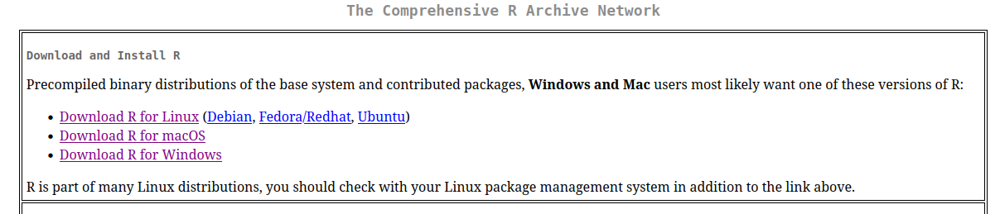
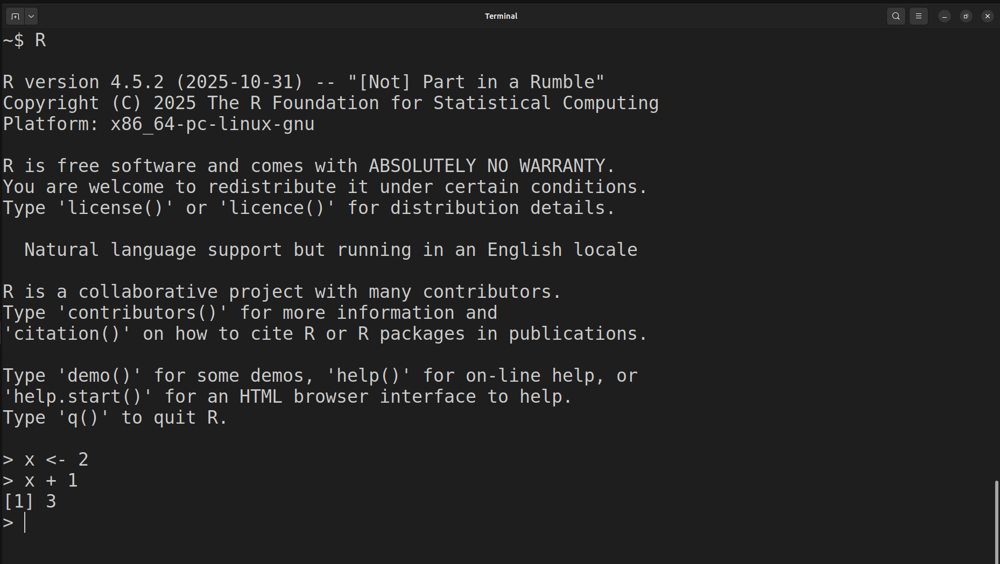
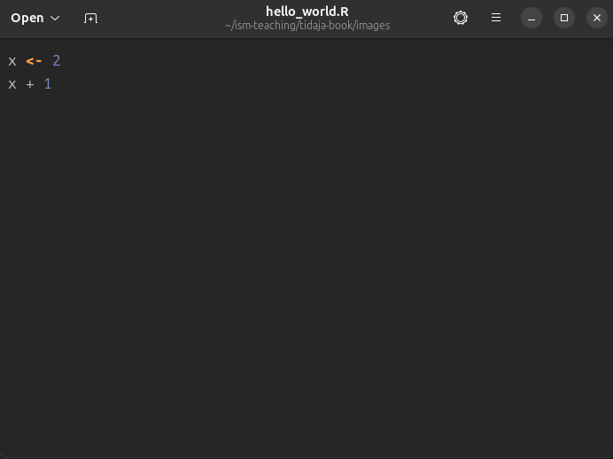
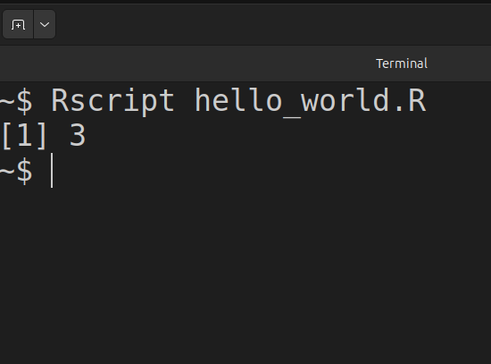
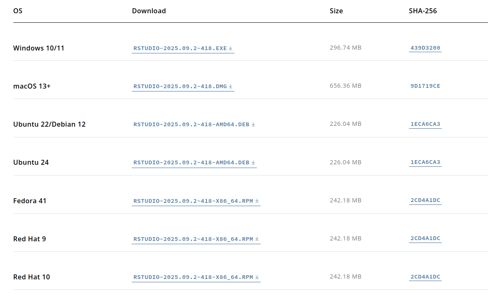
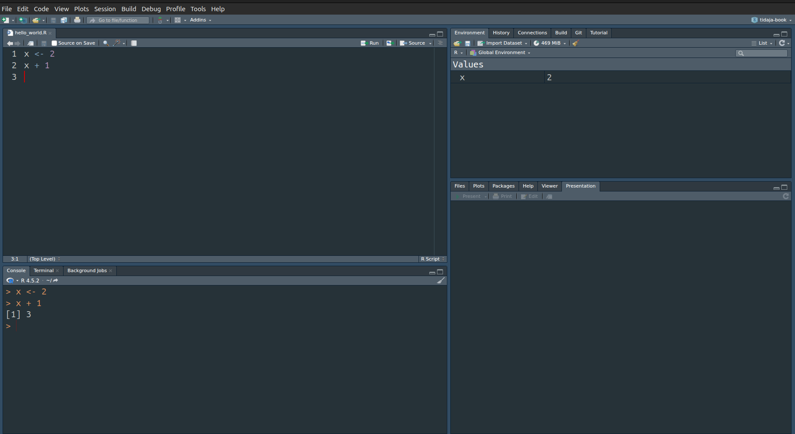
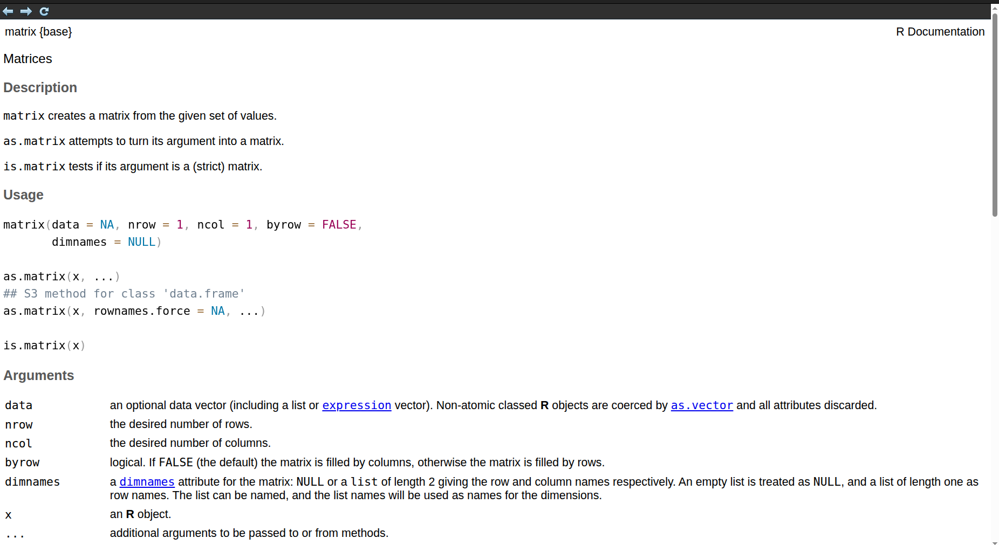

# R ohjelmointikielestä

R on ohjelmointikieli, joka on tarkoitettu erityisesti tilastolliseen analyysiin. R on yksi yleisempiä datatieteen työkaluja niin yliopistoissa kuin yritysmaailmassa. Aloittelijoille R voi kuitenkin vaikuttaa aluksi varsin eksoottiselta vaihtoehdolta. Esimerkiksi Excelin taulukkolaskentaan perustuva käyttöliittymä on aivan eri maailmasta kuin ohjelmointiin perustuva R. Toisaalta puhtaat koodarit voivat ihmetellä, miksi emme käytä Python ohjelmointikieltä. Kun taas matemaatikot ovat ehkä omimmillaan Matlabin tai Julian kanssa. On siis tärkeää perustella, miksi käytämme R ohjelmointikieltä tällä kurssilla lukuisten muiden työkalujen sijasta.

Ennen kuin sukellamme syvemmälle R:n filosofiaan, käymme läpi R ohjelmointikielen ja RStudion asennuksen, sekä RStudion käyttöliittymän perusteet luvussa \@ref(sec:inst). Lisämateriaalia R ohjelmointikielen opetteluun löytyy luvusta \@ref(sec:programming).


## Ohjelmointikieli ja -ympäristö: asennus ja käyttö {#sec:inst}


### R {-}

R on ilmainen ohjelmisto eli kuka tahansa voi ladata R ohjelmointikielen tietokoneelleen missä vain milloin tahansa [CRAN:in sivuilta](https://cran.r-project.org/). Kuten kuvasta \@ref(fig:cran) näkyy, täytyy vain valita oikea asennustapa käyttöjärjestelmän mukaan (Windows, macOS tai Linux). Ohjevideo R ohjelmointikielen asennukseen Windows käyttöjärjestelmälle löytyy MyCourses sivujen osiosta [R-ohjelmointikielen ja RStudion asennus sekä käyttö](https://mycourses.aalto.fi/mod/page/view.php?id=1431515) (katso video *R:n ja RStudion asennus*).

```{r cran, echo=FALSE, fig.cap="R ohjelmointikielen voi asentaa erinäisille käyttöjärjestelmille CRAN:in sivuilta."}

```

Kun R on asennettu, niin komentoja voidaan ajaa komentoriviltä^[Esimerkit komentorivin käytöstä ollaan toteutettu Linux Ubuntu käyttöjärjestelmällä. R ohjelmointikieltä voi käyttää komentorivin kautta myös muissa käyttöjärjestelmissä kuten Windowsissa.]. Kuvassa \@ref(fig:terminal) näkyy esimerkki, jossa kaksi R komentoa ajetaan peräkkäin. Ensin R-konsoli käynnistetään komentoriviltä käyttäen komentoa `R`. Seurauksena näytölle tulostuu perustietoja asennetusta versiosta, lisenssistä jne. Tämän jälkeen

1. ensimmäinen R komento tallentaa arvon 2 muuttujaan `x` käyttäen nuoli `<-` notaatiota,

2. toinen komento laskee summan `x + 1` ja

3. summan tulos, joka on 3, tulostuu näytölle.

Eli R-konsoli on käyttöliittymä, jonka kautta voidaan suorittaa yksittäisiä R komentoja peräkkäin.

```{r terminal, echo=FALSE, fig.cap="Yksittäisiä R komentoja GNOME komentorivillä."}

```

R:n käyttö komentoriviltä suoraan voi olla kätevää, jos halutaan kokeilla jotain nopeasti. Usein tilastollinen analyysi vaatii kuitenkin useita komentoja ja muuttujia, joiden välillä voi olla monimutkaisia riippuvuussuhteita. Tämän vuoksi on hyödyllistä tallentaa tuotettu koodi (peräkkäiset R komennot) omaan tiedostoon. Näitä tekstitiedostoja kutsutaan R ohjelmiksi (*R script*). Vaikka R ohjelmat ovatkin pohjimmiltaan tekstitiedostoja, niin nämä tiedostot on tapana nimetä käyttäen päätettä `.R` päätteen `.txt` sijaan.

Eli edelliset komennot voidaan tallentaa vaikkapa (teksti)tiedostoon `hello_world.R`, joka näkyy kuvassa \@ref(fig:script).

```{r script, echo=FALSE, fig.cap="Aiemmat komennot tallennettuna yhteen tiedostoon."}

```

Tämän jälkeen tiedoston `hello_world.R` komennot voidaan suorittaa komennolla `Rscript hello_world.R` kuvan \@ref(fig:execute) mukaisesti, jolloin lopputulos tulostuu komentoriville.

```{r execute, echo=FALSE, fig.cap="R ohjelman suoritus komentoriviltä."}

```

Monet ohjelmoijat käyttävät pelkästään komentoriviä ja tekstieditoria R ohjelmoimiseen. Yllä myös näytimme, että koodia voidaan ajaa ilman mitään muita lisätyökaluja kunhan R on asennettu. Usein on kuitenkin toivottavaa käyttää ohjelmointiympäristöä (*integrated development environment*, IDE), joka tarjoaa työkaluja esimerkiksi koodin muokkausta, suorittamista ja virheenjäljitystä (*debugging*) varten. IDE:n valintaan on useita vaihtoehtoja (Visual Studio Code, Eclipse, ...). Omalla vastuulla voit käyttää omavalintaista ohjelmointiympäristöä tai tekstieditoria. Tällä kurssilla käytämme kuitenkin RStudiota, joka on R ohjelmointikielelle räätälöity IDE.

### RStudio {-}

RStudion voi asentaa ilmaiseksi [Posit yrityksen](https://posit.co/download/rstudio-desktop/) sivuilta. Kuten kuva \@ref(fig:posit) näyttää, myös RStudion tapauksessa täytyy valita asennus oman käyttöjärjestelmän mukaan. Lisäksi [video](https://mycourses.aalto.fi/mod/page/view.php?id=1431515) *R:n ja RStudion asennus* näyttää RStudion asentamisen Windowsille. Tämä on siis sama video, jossa käydään läpi R ohjelmointikielen asennus.

```{r posit, echo=FALSE, fig.cap="RStudion voi asentaa erinäisille käyttöjärjestelmille Positin sivuilta."}

```

Kun RStudion avaa ensimmäistä kertaa, niin näytöllä näkyy R-konsoli (vertaa kuvaan \@ref(fig:terminal)). [Video](https://mycourses.aalto.fi/mod/page/view.php?id=1431515) *R-konsoli* avaa R-konsolin toimintoja tarkemmin. Kuten todettua, yleensä komennot kuitenkin halutaan tallentaa yksittäiseen R ohjelmaan. Uuden ohjelman voi avata näppäinyhdistelmällä `Ctrl + Shift + N` tai RStudion käyttöliittymää käyttäen navigoimalla `File → New File → R Script`. Uuteen ohjelmaan voi kirjoittaa esimerkiksi kuvan \@ref(fig:script) komennot. Tämän jälkeen ohjelman voi tallentaa uudella nimellä näppäinyhdistelmällä `Ctrl + S` tai käyttäen RStudion käyttöliittymää `File → Save`.

Kun ohjelma on tallennettu esimerkiksi nimellä `hello_world.R`, niin ohjelma täytyy suorittaa. RStudion kautta ohjelman komentoja suoritetaan kahdella eri tavalla:

1. Yksittäinen komento suoritetaan asettamalla kursori vastaavalle riville ja painamalla `Ctrl + Enter`

2. Koko ohjelma suoritetaan näppäinyhdistelmällä `Ctrl + Shift + Enter`

Esimerkiksi tallennetun ohjelman komennot voidaan ajaa peräkkäin asettamalla kursori ensimmäiselle riville ja painamalla `Ctrl + Enter` kaksi kertaa. Tällöin lopputulos näyttää kuvan \@ref(fig:rstudio) kaltaiselta. Eli ohjelman koodi näkyy vasemmalla ylhäällä, suoritetut komennot näkyvät konsolissa vasemmalla alhaalla ja tallennetut muuttujat näkyvät oikealla ylhäällä. Oikealla alhaalla olevassa ikkunassa ei tässä tapauksessa näy mitään mutta esimerkiksi mahdolliset kuvaajat ilmestyvät kyseiseen ikkunaan.

```{r rstudio, echo=FALSE, fig.cap="RStudion käyttöliittymän näkymä yksinkertaisen ohjelman suorituksen jälkeen."}

```

Tarkemmin RStudion toimintoihin voi perehtyä katsomalla [videot](https://mycourses.aalto.fi/mod/page/view.php?id=1431515) *RStudion koodieditori*, *RStudion muut toimintoikkunat* ja *RStudion hallintavalikoita*.

## Ohjelmoinnin opettelu {#sec:programming}

Ohjelmointia oppii kaikista parhaiten tekemällä. Lisäksi ohjelmoinnin opetteluun on olemassa valtava määrä erinomaisia lähteitä, jotka ovat yleensä vielä avoimesti saatavilla. Tämän vuoksi näissä muistiinpanoissa ei ole tarkoitus antaa kaikenkattavaa esittelyä R ohjelmointikieleen. Alla listaamme kuitenkin muutamia avoimesti saatavia lähteitä, jotka saattavat olla hyödyllisiä kurssin kannalta:

- [*R tutuksi*](https://www.mv.helsinki.fi/home/mjxpirin/medstat_course/material/Rmoniste_tiltu1.pdf) on kurssisivuilta saatavissa oleva suomenkielinen luentomoniste R:n opetteluun. Materiaali keskittyy perus-R (*base R*) toimintoihin menemättä syvemmälle R-paketteihin (*R package*) (katso luku \@ref(sec:packages)).

- [*R Programming for Data Science*](https://bookdown.org/rdpeng/rprogdatascience/) on englanninkielinen lähde, joka on samanhenkinen edellä mainitun luentomonisteen kanssa [@peng2016].

- [R for Data Science](https://r4ds.hadley.nz/) tarjoaa vaihtoehtoisen näkökulman kahteen yllä olevaan lähteeseen. Perus-R:n sijaan kyseinen kirja keskittyy pakettikokoelman *Tidyverse* toimintoihin. [Tidyverse](https://tidyverse.org/) antaa vaihtoehtoisia datatieteen työkaluja [@wickham2017]. 

- [*Advanced R*](https://adv-r.hadley.nz/) voi olla erityisen hyödyllinen esimerkiksi kokeneille ohjelmoijille, jotka haluavat perehtyä tarkemmin esimerkiksi oliohjelmointiin, funktionaaliseen ohjelmointiin ja R:n tietorakenteisiin [@wickham2019].

Yllä olevia lähteitä ei välttämättä kannata lukea kannesta kanteen vaan niitä kannattaa kohdella käsikirjoina. Eli kun ongelma tulee vastaan, niin kannattaa tarkistaa, jos vastaus löytyisi yllä olevasta kirjallisuudesta. Lisäksi usein joku muukin on kokenut saman ongelman. Tälllöin suurella todennäköysyydellä vastaus voi löytyä internetin keskustelupalstoilta kuten [Stack Overflowsta](https://stackoverflow.com/collectives/r-language?tab=overview).

Lisäksi R:n dokumentaatio auttaa, kun tiedät R funktion/komennon nimen mutta et muista miten sitä käytetään. Esimerkiksi

```{r, eval=FALSE}
?matrix
```

antaa funktion `matrix()` dokumentaation, jonka alku näkyy kuvassa \@ref(fig:doc).

(ref:captiondoc) Funktion `matrix()` dokumentaatio.

```{r doc, echo=FALSE, fig.cap="(ref:captiondoc)"}

```


## R-paketit {#sec:packages}

Asennettaessa R ohjelmointikieli luvun \@ref(sec:inst) ohjeiden mukaan, tietokoneelle asentuu perus-R (*base-R*) ja muutama suositeltu R-paketti. Perus-R on ikään kuin pienin toimiva tuote (*minimum viable product*), joka sisältää vain vaaditut toiminnot R:n ajamiseen. Toisaalta R-paketit (*R packages*) tarjoavat laajennuksia perustoimintoihin.

R on [*vapaa*](https://en.wikipedia.org/wiki/Free_software) ja [*avoimen*](https://en.wikipedia.org/wiki/Open_source) lähdekoodin ohjelmisto. Tämä mahdollistaa sen, että kuka tahansa voi kehittää uusia ominaisuuksia R-pakettien muodossa. Paketit julkaistaan yleensä [CRAN:in sivuilla](https://cran.r-project.org/web/packages/available_packages_by_name.html) vaikka muitakin julkaisufoorumeita kuten [Bioconductor](https://www.bioconductor.org/packages/release/BiocViews.html#___Software) on olemassa. Alla on muutamia esimerkkejä R-paketeista:

- [ggplot2](https://ggplot2.tidyverse.org/) mahdollistaa laadukkaiden kuvaajien tekemisen, vaikka tietenkin perus-R toiminnallisuuksien avulla voi myös tehdä kuvaajia.

- [dplyr](https://dplyr.tidyverse.org/) antaa työkaluja datan "siivoamiseen" ennen varsinaista analyysiä.

- [tibble](https://tibble.tidyverse.org/) tarjoaa vaihtoehtoisen toteutuksen perus-R:n tietorakenteelle `data.frame`, joka on tarkoitettu datan tallentamiseen.

- [glmnet](https://glmnet.stanford.edu/) paketin avulla voi sovittaa säännellyn lineaarisen regressiomallin (*regularized linear regression*), joka on eräs laajennus perinteisestä lineaarisesta regressiosta.

Kolme ensimmäistä mainituista paketeista kuuluvat [Tidyverse](https://tidyverse.org/) pakettikokoelmaan, joka antaa vaihtoehtoisia datatieteen työkaluja verrattuna perus-R toimintoihin^[Teoriassa kuka tahansa voi ehdottaa muutoksia perus-R:ään mutta käytännössä muutoksia perustoimintoihin hyväksytään erittäin harvoin. Usein vaihtoehtoiset ja uudet toiminnot toteutetaan siis R-pakettien muodossa.]. Toisaalta monet R-paketit kuten `glmnet` tarjoavat toteutuksia tilastollisista menetelmistä, joita ei ole sisällytetty perus-R:ään.

Jotta tietyn R-paketin toimintoja voidaan käyttää, niin kyseinen paketti täytyy ensin asentaa. Käytämme esimerkkinä `dplyr` pakettia, joka asennetaan R-komennolla

```{r, eval=FALSE}
install.packages("dplyr")
```

Huomaa, että yllä paketin nimi täytyy antaa `"` merkkien sisällä. Paketin asennus tarvitsee tehdä vain kerran. Eli esimerkiksi jos asennat paketin, suljet RStudion ja avaat RStudion uudestaan, niin pakettia **ei** tarvitse asentaa uudestaan.

Kun paketti on asennettu niin voit käyttää sen funktioita. Jos kuitenkin yrität esim. käyttää paketin `dplyr`^[Tässä vaiheessa esiteltyjen funktioden toimintaa ei tarvitse ymmärtää. Tarkoitus on esitellä, miten R-paketit toimivat] funktiota `lead` suoraan, niin saat virheilmoituksen

```{r, error=TRUE}
lead(1:3)
```

Yleinen tapa saada paketin sisäiset funktiot käyttöön on kiinnittää (*attach*) se ohjelman alkuun käyttäen `library()` komentoa, jonka jälkeen pakettia voidaan käyttää
```{r, message=FALSE}
library(dplyr)
lead(1:3) # No error message
```

Huomaa, että komennossa `library()` paketin nimeä ei tarvitse sisällyttää merkkien `"` sisään.

Paketin tekijät voivat nimetä funktioden nimet miten haluavat. Tällöin on siis mahdollista, että eri paketeissa on samannimisiä funktioita, jotka toimivat eri tavoin. Jos tälläinen tilanne tulee eteen, niin täytyy tarkentaa kumman paketin funktiota käytetään. Esimerkiksi funktio `lag` on paketeissa `dplyr` ja `stats` (sisältyy perus-R asennukseen). Nämä kaksi erilaista `lag` funktiota erotetaan asettamalla `::` paketin ja funktion väliin.
```{r}
stats::lag(1:3)
dplyr::lag(1:3)
```


## Data-analyysin askeleet {#sec:demo}


Seuraavaksi, yksinkertaisen demon avulla, käymme läpi tyypillisen data-analyysin vaiheet:

1. Datan lukeminen

2. Datan siivoaminen

3. Data-analyysi (visualisointi, mallien sovitus, tulkinta)

Suoritamme data-analyysin ensin perus-R:n ja sitten Tidyversen avulla. Tämä havainnollistaa myös sitä, että R:ssä saman asian voi tehdä useammalla eri tavalla.

Esimerkkinä käytämme kuuluisaa `iris` havaintoaineistoa, joka sisältää mittauksia kukan terälehden ominaisuuksista kolmelle eri kurjenmiekkalajille `setosa`, `versicolor` ja `virginica`. Data-aineisto on saatavilla perus-R asennuksen mukana mutta oppimisen vuoksi luemme datan tiedostosta. Datan siivoamisen jälkeen sovitamme yksinkertaisen lineaarisen regressiomallin. 


### Lineaarinen regressio (perus-R) {-}


```{r}
str(iris)
```


### Lineaarinen regressio (Tidyverse paketit) {-}

## R Markdown

## Miksi R?

Aloittelijoille R voi kuitenkin vaikuttaa aluksi varsin eksoottiselta vaihtoehdolta. Esimerkiksi Excelin taulukkolaskentaan perustuva käyttöliittymä on aivan eri maailmasta kuin ohjelmointiin perustuva R. Toisaalta puhtaat koodarit voivat ihmetellä, miksi emme käytä Python ohjelmointikieltä. Kun taas matemaatikot ovat ehkä omimmillaan Matlabin tai Julian kanssa. On siis tärkeää perustella, miksi käytämme R ohjelmointikieltä tällä kurssilla lukuisten muiden työkalujen sijasta.
