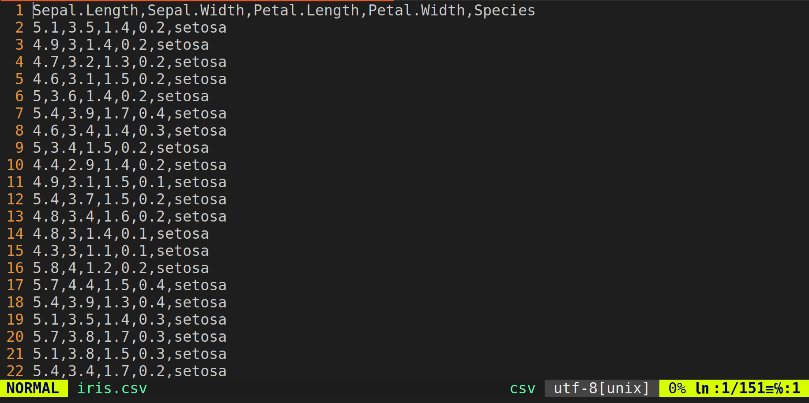

# R ohjelmointikielestä

R on ohjelmointikieli, joka on tarkoitettu erityisesti tilastolliseen analyysiin. R on yksi yleisempiä datatieteen työkaluja niin yliopistoissa kuin yritysmaailmassa. Aloittelijoille R voi kuitenkin vaikuttaa aluksi varsin eksoottiselta vaihtoehdolta. Esimerkiksi Excelin taulukkolaskentaan perustuva käyttöliittymä on aivan eri maailmasta kuin ohjelmointiin perustuva R. R:n tekstipohjaisia ohjelmia on kuitenkin paljon helpompi hallinnoida verrattuna Exceliin, kun data-analyysi vaatii useita ja monimutkaisia askeleita.

Toisaalta puhtaat koodarit voivat ihmetellä, miksi emme käytä Python ohjelmointikieltä. Kun taas matemaatikot ovat ehkä omimmillaan Matlabin tai Julian kanssa. Se voidaan myöntää, että on olemassa muitakin erinomaisia työkaluja tilastollista analyysiä varten. R on kuitenkin verrattain helppo aloittaa verrattuna muihin kieliin, kun kyse on puhtaasta data-analyysistä. Tämän vuoksi tämän kurssin kaikki tietokonetehtävät suoritetaan R ohjelmointikielellä. Jos haluat lukea lisää R kielen filosofiasta ja historiasta, voit vilkaista jossain vaiheessa kurssia [lukua 2](https://bookdown.org/rdpeng/rprogdatascience/history-and-overview-of-r.html) kirjasta *R programming for data science* [@peng2016].

Tämän luvun päämotivaatio onkin esitellä R:n ominaisuuksia ja toivottavasti vakuuttaa lukija siitä, että R voi olla hyödyllinen työkalu. Tarkoitus ei kuitenkaan ole antaa kaikenkattavaa esittelyä R:ään vaan R taidot kehittyvät varmasti kurssin aikana.

Ensin käymme läpi R ohjelmointikielen ja RStudion asennuksen, sekä RStudion käyttöliittymän perusteet luvussa \@ref(sec:inst). Lisämateriaalia R ohjelmointikielen opetteluun löytyy luvusta \@ref(sec:programming). Lisäksi R:ssä on tyypillistä käyttää muiden ohjelmoijien ja tilastotieteilijöiden käyttämiä paketteja. Lyhyt esittely paketteihin annetaan luvussa \@ref(sec:packages). Tämän jälkeen R:n toimintoja esitellään lyhyen data-analyysin kautta luvussa \@ref(sec:demo). Viimeiseksi luvussa \@ref(sec:markdown) sanomme pari sanaa R Markdownista, jonka avulla voi tehdä esimerkiksi raportteja yhdistäen tekstiä ja R koodia. **R Markdownin käyttö kurssilla ei kuitenkaan ole pakollista.**


## Ohjelmointikieli ja -ympäristö: asennus ja käyttö {#sec:inst}


### R {-}

R on ilmainen ohjelmisto eli kuka tahansa voi ladata R ohjelmointikielen tietokoneelleen missä vain milloin tahansa [CRAN:in sivuilta](https://cran.r-project.org/). Kuten kuvasta \@ref(fig:cran) näkyy, täytyy vain valita oikea asennustapa käyttöjärjestelmän mukaan (Windows, macOS tai Linux). Ohjevideo R ohjelmointikielen asennukseen Windows käyttöjärjestelmälle löytyy MyCourses sivujen osiosta [R-ohjelmointikielen ja RStudion asennus sekä käyttö](https://mycourses.aalto.fi/mod/page/view.php?id=1431515) (katso video *R:n ja RStudion asennus*).

```{r cran, echo=FALSE, fig.cap="R ohjelmointikielen voi asentaa erinäisille käyttöjärjestelmille CRAN:in sivuilta."}
knitr::include_graphics("images/cran.png")
```

Kun R on asennettu, niin komentoja voidaan ajaa komentoriviltä^[Esimerkit komentorivin käytöstä ollaan toteutettu Linux Ubuntu käyttöjärjestelmällä. R ohjelmointikieltä voi käyttää komentorivin kautta myös muissa käyttöjärjestelmissä kuten Windowsissa.]. Kuvassa \@ref(fig:terminal) näkyy esimerkki, jossa kaksi R komentoa ajetaan peräkkäin. Ensin R-konsoli käynnistetään komentoriviltä käyttäen komentoa `R`. Seurauksena näytölle tulostuu perustietoja asennetusta versiosta, lisenssistä jne. Tämän jälkeen

1. ensimmäinen R komento tallentaa arvon 2 muuttujaan `x` käyttäen nuoli `<-` notaatiota,

2. toinen komento laskee summan `x + 1` ja

3. summan tulos, joka on 3, tulostuu näytölle.

Eli R-konsoli on käyttöliittymä, jonka kautta voidaan suorittaa yksittäisiä R komentoja peräkkäin.

```{r terminal, echo=FALSE, fig.cap="Yksittäisiä R komentoja GNOME komentorivillä."}
knitr::include_graphics("images/terminal.png")
```

R:n käyttö komentoriviltä suoraan voi olla kätevää, jos halutaan kokeilla jotain nopeasti. Usein tilastollinen analyysi vaatii kuitenkin useita komentoja ja muuttujia, joiden välillä voi olla monimutkaisia riippuvuussuhteita. Tämän vuoksi on hyödyllistä tallentaa tuotettu koodi (peräkkäiset R komennot) omaan tiedostoon. Näitä tekstitiedostoja kutsutaan R ohjelmiksi (*R script*). Vaikka R ohjelmat ovatkin pohjimmiltaan tekstitiedostoja, niin nämä tiedostot on tapana nimetä käyttäen päätettä `.R` päätteen `.txt` sijaan.

Eli edelliset komennot voidaan tallentaa vaikkapa (teksti)tiedostoon `hello_world.R`, joka näkyy kuvassa \@ref(fig:script).

```{r script, echo=FALSE, fig.cap="Aiemmat komennot tallennettuna yhteen tiedostoon."}
knitr::include_graphics("images/script.png")
```

Tämän jälkeen tiedoston `hello_world.R` komennot voidaan suorittaa komennolla `Rscript hello_world.R` kuvan \@ref(fig:execute) mukaisesti, jolloin lopputulos tulostuu komentoriville.

```{r execute, echo=FALSE, fig.cap="R ohjelman suoritus komentoriviltä."}
knitr::include_graphics("images/execute.png")
```

Monet ohjelmoijat käyttävät pelkästään komentoriviä ja tekstieditoria R ohjelmoimiseen. Yllä myös näytimme, että koodia voidaan ajaa ilman mitään muita lisätyökaluja kunhan R on asennettu. Usein on kuitenkin toivottavaa käyttää ohjelmointiympäristöä (*integrated development environment*, IDE), joka tarjoaa työkaluja esimerkiksi koodin muokkausta, suorittamista ja virheenjäljitystä (*debugging*) varten. IDE:n valintaan on useita vaihtoehtoja (Visual Studio Code, Eclipse, ...). Omalla vastuulla voit käyttää omavalintaista ohjelmointiympäristöä tai tekstieditoria. **Tällä kurssilla käytämme kuitenkin RStudiota, joka on R ohjelmointikielelle räätälöity IDE.**

### RStudio {-}

RStudion voi asentaa ilmaiseksi [Posit yrityksen](https://posit.co/download/rstudio-desktop/) sivuilta. Kuten kuva \@ref(fig:posit) näyttää, myös RStudion tapauksessa täytyy valita asennus oman käyttöjärjestelmän mukaan. Lisäksi [video](https://mycourses.aalto.fi/mod/page/view.php?id=1431515) *R:n ja RStudion asennus* näyttää RStudion asentamisen Windowsille. Tämä on siis sama video, jossa käydään läpi R ohjelmointikielen asennus.

```{r posit, echo=FALSE, fig.cap="RStudion voi asentaa erinäisille käyttöjärjestelmille Positin sivuilta."}
knitr::include_graphics("images/posit.png")
```

Kun RStudion avaa ensimmäistä kertaa, niin näytöllä näkyy R-konsoli (vertaa kuvaan \@ref(fig:terminal)). [Video](https://mycourses.aalto.fi/mod/page/view.php?id=1431515) *R-konsoli* avaa R-konsolin toimintoja tarkemmin. Kuten todettua, yleensä komennot kuitenkin halutaan tallentaa yksittäiseen R ohjelmaan. Uuden ohjelman voi avata näppäinyhdistelmällä `Ctrl + Shift + N` tai RStudion käyttöliittymää käyttäen navigoimalla `File → New File → R Script`. Uuteen ohjelmaan voi kirjoittaa esimerkiksi kuvan \@ref(fig:script) komennot. Tämän jälkeen ohjelman voi tallentaa uudella nimellä näppäinyhdistelmällä `Ctrl + S` tai käyttäen RStudion käyttöliittymää `File → Save`.

Kun ohjelma on tallennettu esimerkiksi nimellä `hello_world.R`, niin ohjelma täytyy suorittaa. RStudion kautta ohjelman komentoja suoritetaan kahdella eri tavalla:

1. Yksittäinen komento suoritetaan asettamalla kursori vastaavalle riville ja painamalla `Ctrl + Enter`

2. Koko ohjelma suoritetaan näppäinyhdistelmällä `Ctrl + Shift + Enter`

Esimerkiksi tallennetun ohjelman komennot voidaan ajaa peräkkäin asettamalla kursori ensimmäiselle riville ja painamalla `Ctrl + Enter` kaksi kertaa. Tällöin lopputulos näyttää kuvan \@ref(fig:rstudio) kaltaiselta. Eli ohjelman koodi näkyy vasemmalla ylhäällä, suoritetut komennot näkyvät konsolissa vasemmalla alhaalla ja tallennetut muuttujat näkyvät oikealla ylhäällä. Oikealla alhaalla olevassa ikkunassa ei tässä tapauksessa näy mitään mutta esimerkiksi mahdolliset kuvaajat ilmestyvät kyseiseen ikkunaan.

```{r rstudio, echo=FALSE, fig.cap="RStudion käyttöliittymän näkymä yksinkertaisen ohjelman suorituksen jälkeen."}
knitr::include_graphics("images/rstudio.png")
```

Tarkemmin RStudion toimintoihin voi perehtyä katsomalla [videot](https://mycourses.aalto.fi/mod/page/view.php?id=1431515) *RStudion koodieditori*, *RStudion muut toimintoikkunat* ja *RStudion hallintavalikoita*.

## Ohjelmoinnin opettelu {#sec:programming}

Ohjelmointia oppii kaikista parhaiten tekemällä. Lisäksi ohjelmoinnin opetteluun on olemassa valtava määrä erinomaisia lähteitä, jotka ovat yleensä vielä avoimesti saatavilla. Tämän vuoksi näissä muistiinpanoissa ei ole tarkoitus antaa kaikenkattavaa esittelyä R ohjelmointikieleen. Alla listaamme kuitenkin muutamia avoimesti saatavia lähteitä, jotka saattavat olla hyödyllisiä kurssin kannalta:

- [*R tutuksi*](https://www.mv.helsinki.fi/home/mjxpirin/medstat_course/material/Rmoniste_tiltu1.pdf) on kurssisivuilta saatavissa oleva suomenkielinen luentomoniste R:n opetteluun. Materiaali keskittyy perus-R (*base R*) toimintoihin menemättä syvemmälle R-paketteihin (*R package*) (katso luku \@ref(sec:packages)).

- [*R Programming for Data Science*](https://bookdown.org/rdpeng/rprogdatascience/) on englanninkielinen lähde, joka on samanhenkinen edellä mainitun luentomonisteen kanssa [@peng2016].

- [R for Data Science](https://r4ds.hadley.nz/) tarjoaa vaihtoehtoisen näkökulman kahteen yllä olevaan lähteeseen. Perus-R:n sijaan kyseinen kirja keskittyy pakettikokoelman *Tidyverse* toimintoihin. [Tidyverse](https://tidyverse.org/) antaa vaihtoehtoisia datatieteen työkaluja [@wickham2017]. 

- [*Advanced R*](https://adv-r.hadley.nz/) voi olla hyödyllinen kokeneille ohjelmoijille, jotka haluavat perehtyä tarkemmin esimerkiksi oliohjelmointiin, funktionaaliseen ohjelmointiin ja R:n tietorakenteisiin [@wickham2019].

Yllä olevia lähteitä ei välttämättä kannata lukea kannesta kanteen vaan niitä kannattaa kohdella käsikirjoina. Eli kun ongelma tulee vastaan, niin kannattaa tarkistaa, jos vastaus löytyisi yllä olevasta kirjallisuudesta. Lisäksi usein joku muukin on kokenut saman ongelman. Tälllöin suurella todennäköisyydellä vastaus voi löytyä internetin keskustelupalstoilta kuten [Stack Overflowsta](https://stackoverflow.com/collectives/r-language?tab=overview).

Lisäksi R:n dokumentaatio auttaa, kun tiedät R funktion/komennon nimen mutta et muista miten sitä käytetään. Esimerkiksi

```{r, eval=FALSE}
?matrix
```

antaa funktion `matrix()` dokumentaation, jonka alku näkyy kuvassa \@ref(fig:doc).

(ref:captiondoc) Funktion `matrix()` dokumentaatio.

```{r doc, echo=FALSE, fig.cap="(ref:captiondoc)"}
knitr::include_graphics("images/doc.png")
```


## R-paketit {#sec:packages}

Asennettaessa R ohjelmointikieli luvun \@ref(sec:inst) ohjeiden mukaan, tietokoneelle asentuu perus-R (*base-R*) ja muutama suositeltu R-paketti. Perus-R on ikään kuin pienin toimiva tuote (*minimum viable product*), joka sisältää vain vaaditut toiminnot R:n ajamiseen. Toisaalta R-paketit (*R packages*) tarjoavat laajennuksia perustoimintoihin.

R on [*vapaa*](https://en.wikipedia.org/wiki/Free_software) ja [*avoimen*](https://en.wikipedia.org/wiki/Open_source) lähdekoodin ohjelmisto. Tämä mahdollistaa sen, että kuka tahansa voi kehittää uusia ominaisuuksia R-pakettien muodossa. Paketit julkaistaan yleensä [CRAN:in sivuilla](https://cran.r-project.org/web/packages/available_packages_by_name.html) vaikka muitakin julkaisufoorumeita kuten [Bioconductor](https://www.bioconductor.org/packages/release/BiocViews.html#___Software) on olemassa. Alla on muutamia esimerkkejä R-paketeista:

- [ggplot2](https://ggplot2.tidyverse.org/) mahdollistaa laadukkaiden kuvaajien tekemisen, vaikka tietenkin perus-R toiminnallisuuksien avulla voi myös tehdä kuvaajia.

- [dplyr](https://dplyr.tidyverse.org/) antaa työkaluja datan "siivoamiseen" ennen varsinaista analyysiä.

- [tibble](https://tibble.tidyverse.org/) tarjoaa vaihtoehtoisen toteutuksen perus-R:n tietorakenteelle `data.frame`, joka on tarkoitettu datan tallentamiseen.

- [glmnet](https://glmnet.stanford.edu/) paketin avulla voi sovittaa säännellyn lineaarisen regressiomallin (*regularized linear regression*), joka on eräs laajennus perinteisestä lineaarisesta regressiosta.

Kolme ensimmäistä mainituista paketeista kuuluvat [Tidyverse](https://tidyverse.org/) pakettikokoelmaan, joka antaa vaihtoehtoisia datatieteen työkaluja verrattuna perus-R toimintoihin^[Teoriassa kuka tahansa voi ehdottaa muutoksia perus-R:ään mutta käytännössä muutoksia perustoimintoihin hyväksytään erittäin harvoin. Usein vaihtoehtoiset ja uudet toiminnot toteutetaan siis R-pakettien muodossa.]. Toisaalta monet R-paketit kuten `glmnet` tarjoavat toteutuksia tilastollisista menetelmistä, joita ei ole sisällytetty perus-R:ään.

Jotta tietyn R-paketin toimintoja voidaan käyttää, niin kyseinen paketti täytyy ensin asentaa. Käytämme esimerkkinä `dplyr` pakettia, joka asennetaan R-komennolla

```{r, eval=FALSE}
install.packages("dplyr")
```

Huomaa, että yllä paketin nimi täytyy antaa `"` merkkien sisällä. Paketin asennus tarvitsee tehdä vain kerran. Eli esimerkiksi jos asennat paketin, suljet RStudion ja avaat RStudion uudestaan, niin pakettia **ei** tarvitse asentaa uudestaan.

Kun paketti on asennettu niin voit käyttää sen funktioita. Jos kuitenkin yrität esim. käyttää paketin `dplyr`^[Tässä vaiheessa esiteltyjen funktioden toimintaa ei tarvitse ymmärtää. Tarkoitus on esitellä, miten R-paketit toimivat] funktiota `lead` suoraan, niin saat virheilmoituksen

```{r, error=TRUE}
lead(1:3)
```

Yleinen tapa saada paketin sisäiset funktiot käyttöön on kiinnittää (*attach*) se ohjelman alkuun käyttäen `library()` komentoa, jonka jälkeen pakettia voidaan käyttää
```{r, message=FALSE}
library(dplyr)
lead(1:3) # No error message
```

Huomaa, että komennossa `library()` paketin nimeä ei tarvitse sisällyttää merkkien `"` sisään.

Paketin tekijät voivat nimetä funktioiden nimet miten haluavat. Tällöin on siis mahdollista, että eri paketeissa on samannimisiä funktioita, jotka toimivat eri tavoin. Jos tälläinen tilanne tulee eteen, niin täytyy tarkentaa kumman paketin funktiota käytetään. Esimerkiksi funktio `lag` on paketeissa `dplyr` ja `stats` (sisältyy perus-R asennukseen). Nämä kaksi erilaista `lag` funktiota erotetaan asettamalla `::` paketin ja funktion väliin.
```{r}
stats::lag(1:3)
dplyr::lag(1:3)
```


## Data-analyysin askeleet {#sec:demo}

Seuraavaksi, yksinkertaisen demon avulla, käymme läpi tyypillisen data-analyysin vaiheet:

1. Datan lukeminen

2. Datan siivoaminen

3. Tilastollinen analyysi (visualisointi, mallien sovitus, tulkinta)

Suoritamme data-analyysin ensin perus-R:n ja sitten Tidyversen avulla. Tämä havainnollistaa myös sitä, että R:ssä saman asian voi tehdä useammalla eri tavalla.

Esimerkkinä käytämme kuuluisaa `iris` havaintoaineistoa, joka sisältää mittauksia kukan terälehden ominaisuuksista kolmelle eri kurjenmiekkalajille `setosa`, `versicolor` ja `virginica`. Data-aineisto on saatavilla perus-R asennuksen mukana mutta oppimisen vuoksi luemme datan tiedostosta. Kyseinen tiedosto on näkyvissä  [kurssisivuilla](https://mycourses.aalto.fi/mod/folder/view.php?id=1437133). Datan siivoamisen jälkeen sovitamme yksinkertaisen lineaarisen regressiomallin, joka on tuttu menetelmä kurssilta *tilastotieteen perusteet*.

Ennen kuin jatkamme itse demoon, sanomme pari sanaa työhakemistosta.

::: {.remark}
Demon R syntaksia ei tarvitse ymmärtää täydellisesti kurssin alussa. Demon tarkoitus on näyttää R:n toiminnallisuuksia ja siihen voi palata myöhemmin kun R taidot ovat kehittyneet.
:::

### Työhakemisto {-}

Jotta aineisto voidaan lukea (1. askel), R:n täytyy tietää missä aineisto sijaitsee. Polku aineiston sijainnille kirjoitetaan yleensä työhakemiston (*working directory*) suhteen. Työhakemisto on se hakemisto/kansio, johon ohjelmien tuottama data tallentuu oletuksena. Nykyisen työhakemiston näet komennolla `getwd()` ja voit asettaa työhakemiston komennolla `setwd()`. Kurssia varten voit esimerkiksi tehdä työpöydälle kansion `tidaja`, jonka sisällä on edelleen kansiot viikottain: `1week`, `2week`, ... Tällöin saatat haluta asettaa työhakemistoksi kansion `1week`. Käyttöjärjestelmästä riippuen polku haluttuun kansioon kirjoitetaan hieman eri tavoin. Esimerkiksi Linux Ubuntun tapauksessa voisin asettaa halutun työhakemiston jotakuinkin näin:

```{r, eval=FALSE}
setwd("~/Desktop/tidaja/1week")
```

Windowsin tapauksessa polku oikeaan kansioon voisi näyttää seuraavalta riippuen käyttäjänimestäsi
```{r, eval=FALSE}
setwd("C:\Users\YourUserName\Desktop\tidaja\1week")
```

Eli `setwd()` komentoon polku kirjoitetaan merkkien `"` sisään.

Työhakemiston voi asettaa myös käyttäen RStudion käyttöliittymää. Näppäinyhdistelmällä `Ctrl + Shift + H` saa auki *Choose Working Directory* ikkunan jonka kautta voi navigoida haluttuun kansioon. Saman voi tehdä RStudion valikkojen kautta `Session → Set Working Directory → Choose Directory`. Komennolla `getwd()` voit tarkistaa, että työhakemisto on varmasti asetettu oikein:

```{r, eval=FALSE}
getwd()
```

```{r}
## [1] "/home/perej/Desktop/tidaja/1week"
```


### Perus-R toteutus {-}

Ensimmäinen askel on **datan lukeminen**. Suhteellisen pienet aineistot säilytetään yleensä tekstitiedostoissa^[Vastaavasti suuret aineistot säilytetään usein tietokannoissa. Tällöin haluttu havaintojoukko haetaan esim. SQL-kyselyllä.]. Tässä tapauksessa aineisto on tallennettu tekstitiedostoon `iris.csv`, jonka arvot ollaan erotettu pilkuilla (eng: *comma-separated values*, CSV). Tiedoston `iris.csv` tarkemman rakenteen voit nähdä avaamalla sen valitsemassasi tekstieditorissa. Kuvassa \@ref(fig:vim) näkyy, että tiedoston ensimmäinen rivi koostuu sarakkeiden otsikoista ja seuraavat rivit ovat yksittäisiä havaintoja. Sarakkeet taas vastaavat muuttujia, esimerkiksi viimeinen sarake antaa jokaisen havainnon kurjenmiekkalajin nimen.

(ref:captionvim) Tiedosto `iris.csv` avattuna [vim](https://www.vim.org/) tekstieditorissa.

```{r vim, echo=FALSE, fig.cap="(ref:captionvim)"}

```

Kun työhakemisto on asetettu (katso edellinen luku), niin komennon `read.table()` avulla voit lukea datan. Komento ottaa sisäänsä useita argumentteja^[Tietojenkäsittelytieteessä [*argumentti*](https://en.wikipedia.org/wiki/Parameter_(computer_programming)) tarkoittaa funktion syötettä. Vrt. $x$ ja $f(x)$.] kuten `file` (polku datatiedostoon), `header` (sisältääkö ensimmäinen rivi sarakkeiden otsikot?), `sep` (erotin arvojen välillä), ... Jos tiedosto `iris.csv` on tallennettu työhakemiston sisällä olevaan kansioon `data`, niin havaintoaineisto voidaan lukea seuraavasti

```{r}
iris <- read.table("data/iris.csv", header = TRUE, sep = ",")
```

Havaintoaineiston lukemisen jälkeen kannattaa tarkistaa, että se on luettu oikein. Esimerkiksi jos erotin arvojen välillä on asetettu väärin, niin muuttujaan `iris` tallennettu havaintoaineisto tulee näyttämään oudolta. Tarkistamiseen on monta eri tapaa. Esimerkiksi kirjoittamalla muuttujan `iris` R-konsolille koko datajoukko tulostuu (lukuunottamatta viimeisiä rivejä, jos tiedosto on liian suuri). Toinen tapa nähdä havintoaineisto on `head` komento, joka tulostaa havaintoaineiston ensimmäiset rivit.
```{r}
head(iris)
```

Yllä olevan tulosteen perusteella näyttää siltä, että luimme tiedoston `iris.csv` oikein. Vielä enemmän informaatiota antaa komento `str()`,

```{r}
str(iris)
```

Myös `str()` tulostaa ensimmäiset havainnot sarakkeittain. Lisäksi komento antaa kolumnien tietotyypit. Tässä tapauksessa ensimmäiset neljä kolumnia ovat tyyppiä `numerical`, joka on varattu kokonais- ja desimaaliluvuille. Viimeinen kolumni on tietotyyppiä `character`, joka on tarkoitettu tekstimuotoisille muuttujille. Halutessasi luetun havaintoaineiston näet myös erillisessä ikkunassa käyttäen komentoa `View()` eli `View(iris)`.

Kun havaintoaineisto on luettu, niin yleensä ennen itse tilastollista analyysiä dataa täytyy **siivota**. Tämä voi tarkoittaa muuttujien (eli sarakkeiden) uudelleennimeämistä tai valintaa, havaintojen suodattamista jne. Tässä tapauksessa haluamme sovittaa lineaarisen regressiomallin, jossa lajin `setosa` muuttujaa `Sepal.Length` selitetään muuttujan `Sepal.Width` muuttujan avulla. Lisäksi monessa ohjelmointikielessä on tapana nimetä muuttujat pienellä (esim. katso [Tidyverse tyyliopas](https://style.tidyverse.org/syntax.html)). Tämän vuoksi nimeämme valitut sarakkeet myös pienellä.

Aloitamme valitsemalla halutut rivit ja sarakkeet.
```{r}
iris_filter <- iris[iris$Species == "setosa", c(1,2)]
```

Ensimmäinen indeksi^[R:ssä indeksöinti alkaa luvusta 1.] ennen pilkkua vastaa rivejä ja toinen kolumneja. Ennen pilkkua oleva vertailulauseke kertoo, että valitsemme vain ne rivit jotka vastaavat lajia `setosa`. Sarakkeista valitsemme vain ensimmäisen (`Sepal.Length`) ja toisen (`Sepal.Width`). Komento `c` tulee sanasta *concatenate*. Kyseisellä komennolla voi yhdistää arvoja vektoreiksi. Seuraavaksi nimeämme kolumnit pienellä ja pisteen `.` korvaamme alaviivalla `_`:
```{r}
colnames(iris_filter) <- c("sepal_length", "sepal_width")
```
Sarakkeiden nimet täytyy antaa yhtenä vektorina käyttäen `c` komentoa.

Kun data on siivottu voit vielä tarkistaa sen käyttämällä haluamaasi funktiota
```{r}
str(iris_filter)
```

Nyt olemme valmiita itse **tilastollisen analyysiin**. Ennen tilastollisia menetelmiä on hyödyllistä tarkastella dataa visuaalisesti. Alla symbolin `$` avulla voidaan poimia haluttuja sarakkeita nimien perusteella. Valituista sarakkeista piirretään hajontakuvio funktion `plot` avulla.

```{r base-scatter, fig.cap="Hajontakuvio halutuista muuttujista Sepal Width ja Sepal Length."}
plot(iris_filter$sepal_width, iris_filter$sepal_length,
     xlab = "Sepal Width", ylab = "Sepal Length")
```

Kuvan \@ref(fig:base-scatter) perusteella näyttää, että muuttujien välillä on lineaarinen riippuvuus. Tämän vuoksi lineaarisen regressiomallin

$$
  \mathrm{Sepal\ Length}_i= \beta\cdot \mathrm{Sepal\ Width}_i + \varepsilon_i
$$

sovitus voisi tuntua järkevältä tässä tilanteessa. Voimme sovittaa mallin käyttäen `lm` funktiota,
```{r}
fit_lm <- lm(sepal_length ~ sepal_width, data = iris_filter)
```

Eli vastemuuttuja tulee symbolin `~` vasemmalle puolelle ja selittävät muuttujat oikealle puolelle. Argumentti `data` ottaa sisäänsä muuttujan, joka sisältää havaintoaineiston.

Nyt sovitetun regressioviivan voi piirtää havaintoaineiston kanssa seuraavasti
```{r base-reg, fig.cap="Sovitettu lineaarinen regressiomalli."}
plot(iris_filter$sepal_width, iris_filter$sepal_length,
     xlab = "Sepal Width", ylab = "Sepal Length")
abline(a = fit_lm$coefficients[1], b = fit_lm$coefficients[2])
```

Ensimmäinen komento piirtää saman hajontakuvion kuin kuvassa \@ref(fig:base-scatter). Toinen komento piirtää sovitetun regressiokäyrän. Argumentti `a` ottaa sisään vakiotermin estimaatin ja parametri `b` ottaa sisään kulmakäyrän estimaatin. Kyseiset estimaatit voidaan myös tulostaa:
```{r}
fit_lm$coefficients
```


### Tidyverse toteutus {-}

Seuraavaksi suoritamme täysin saman data-analyysin kuin edellisessä luvussa Tidyverse pakettien avulla. Tämä on myös ensimmäinen esimerkki, jossa käytämme muita ulkoisia paketteja eikä perus-R toimintoja. Kaikki Tidyverse paketit voidaan asentaa komennolla
```{r, eval=FALSE}
install.packages("tidyverse")
```

Kyseistä demoa varten emme kuitenkaan tarvitse kaikkia Tidyverse paketteja, joten tarvittavan osajoukon paketeista voi asentaa seuraavasti:
```{r, eval=FALSE}
install.packages(c("readr", "dplyr", "ggplot2"))
```

Kun tarvittavat paketit ollaan asennettu, voit joko kiinnittää ne `library` komennolla tai viitata suoraan paketin funktiohin käyttäen `::` notaatiota. Pakettien kiinnittäminen on  hyödyllistä, jos käytät sen sisäisiä funktiota toistuvasti samassa ohjelmassa. Tässä tapauksessa kiinnitämme paketit `dplyr` ja `ggplot2`.
```{r}
library(ggplot2)
library(dplyr)
```

Vihdoin kun paketteihin liittyvät esivalmistelut ollaan tehty ja työhakemisto ollaan asetettu, niin olemme valmiita **lukemaan** datan paketin `readr` funktion `read_csv()` avulla. Kyseisen funktion syntaksi on hyvin samankaltainen verrattuna perus-R asennuksen mukana tulevaan `read.csv()` funktioon:
```{r}
iris2 <- readr::read_csv("data/iris.csv", col_names = TRUE,
                         col_types = "ddddc")
```

Ensimmäinen argumentti antaa polun itse tiedostoon, josta data luetaan. Toinen argumentti kertoo, että tiedoston ensimmäinen rivi sisältää muuttujien nimet. Poiketen `read.table()` funktiosta, argumenttia havaintojen erottimelle ei tarvitse antaa, koska `read_csv` olettaa automaattisesti erottimen olevan pilkku. Viimeiseen argumenttiin ohjelmoija antaa sarakkeiden tietotyypit (`d = double` eli desimaaliluku ja `c = character` eli tekstipohjainen muuttuja). Tämän argumentin voit jättää halutessasi pois, jolloin `read_csv()` arvaa sarakkeiden tietotyypit aivan kuten `read.table()`.

Erot funktioden `read.table()` ja `readr::read_csv()` käytössä ovat siis melko minimaaliset. Funktio `readr::read_csv()` on kuitenkin hieman nopeampi ja kannustaa ohjelmoijaa täsmentämään sarakkeiden tietotyypit itse. Lisäksi luettu data tallennetaan erilaisiin tietotyyppeihin:
```{r}
class(iris)
class(iris2)
```

Eli muuttujaan `iris` funktiolla `read.table()` luettu data on tietotyyppiä `data.frame`, joka on perus-R:n tietotyyppi taulukkomuotoisen datan tallentamiseen. Toisaalta `iris2` on tietotyyppiä `tbl_df` eli `tibble`, joka on Tidyverse toteutus tietotyypistä `data.frame`. Ero näkyy esimerkiksi muuttujia `iris` ja `iris2` tulostettaessa. Tibblen tulostus antaa vähemmän rivejä ja kertoo sarakkeiden tietotyypit otsikoiden alapuolella:

```{r}
iris2
```

Muuttujan `iris` voit halutessasi tulostaa itse mutta emme näytä tulostetta tässä luentomonisteessa, koska tuloste on niin pitkä.

Seuraavaksi **siivoamme** datan samaan tyyliin kuin edellisessä luvussa mutta käyttäen Tidyverse paketin `dplyr` funktioita. Ensin suoritamme siivoamisen, jonka jälkeen selitämme askeleet.
```{r}
iris2_filter <- iris2 %>%
  filter(Species == "setosa") %>%
  rename(sepal_width = Sepal.Width, sepal_length = Sepal.Length) %>%
  select(sepal_width, sepal_length)
iris2_filter # Print the outcome of "cleaning"
```

Eli suoritamme yllä olevat operaatiot (`filter()`, `rename()` ja `select()`) järjestyksessä ylhäältä alas käyttäen putki (eng: *pipe*) operaattoria `%>%`:

1. Datasta `iris2` suodatetaan vain ne havainnot, joiden laji on `setosa`.

2. Yllä olevan operaation lopputuloksesta kolumnit `Sepal.Width` ja `Sepal.Length` nimetään uudelleen.

3. Viimeiseksi yllä olevan operaation lopputuloksesta valitaan kolumnit `sepal_width` ja `sepal_length` ja tallennetaan ne muuttujaan `iris2_filter`.

Putki `%>%` tekee siis koodista luettavaa, kun monia yksinkertaisia operaatioita suoritetaan peräkkäin, mikä on tyypillistä datan siivoamisessa. Alla näkyy vielä havainnollistus putken käytöstä.

::: {.example name="Putki operaattori"}
Esimerkiksi pseudokoodin^[Pseudokoodi on eräänlaista "leikkikoodia", jonka tarkoitus on havainnollistaa algoritmiin sisältyviä operaatioita. Itse pseudokoodi itsessään on harvoin toimivaa.]
```
data_transform <- data %>%
  f() %>%
  g() %>%
  h()
```
voisi kirjoittaa myös seuraavasti
```
data_transform <- h(g(f(data)))
```

tai seuraavasti
```
data_transform <- f(data)
data_transform <- g(data_transform)
data_transform <- h(data_transform)
```
:::

Viimeinen askel on **tilastollinen analyysi**. Kuten perus-R toteutuksessa, voimme tarkastella dataa ensin visuaalisesti. Tidyversen toiminnallisuudet kuvaajien tekemiseen tarjotaan `ggplot2` paketissa. Paketin ideana on lisäillä kerroksia kuvaajaan käyttäen `+` merkkiä. Kuvan \@ref(fig:ggplot-scatter) tuottavan koodin ensimmäinen kerros määrittää tarvittavat muuttujat kuvaajaa varten. Toinen kerros kertoo, että kuvaajana käytämme hajontakuviota. Viimeiset kaksi kerrosta nimeävät akselit sopivammin. Myöhempää käyttöä varten tallennamme kuvaajan muuttujaan `gscatter`.


(ref:captionggplot-scatter) Sama hajontakuvio kuin kuvassa \@ref(fig:base-scatter) mutta käyttäen pakettia `ggplot2`.

```{r ggplot-scatter, fig.cap="(ref:captionggplot-scatter)"}
gscatter <- ggplot(iris2_filter, aes(x = sepal_width, y = sepal_length)) +
  geom_point() +
  xlab("Sepal Width") +
  ylab("Sepal Length")
gscatter
```

Regressioviivan voimme tuottaa kuvaan \@ref(fig:ggplot-scatter) kätevästi vain lisäämällä uuden kerroksen. Estimaatit regressiokertoimille kuvaa \@ref(fig:ggplot-regression) varten saamme edellisen luvun muuttujasta `fit_lm`.

(ref:captionggplot-regression) Sovitettu lineaarinen regressiomalli kuten kuvassa \@ref(fig:base-reg) mutta käyttäen pakettia `ggplot2`.

```{r ggplot-regression, fig.cap="(ref:captionggplot-regression)"}
gscatter +
  geom_abline(intercept = fit_lm$coefficients[1],
              slope = fit_lm$coefficients[2])
```


## R Markdown {#sec:markdown}


R Markdownin avulla voi yhdistää koodia, tekstiä ja kaavoja. Eli R Markdownin avulla voit tehdä raportteja, tehdä data-analyysiin liittyviä projekteja tai jopa kirjoittaa kirjoja. Esimerkiksi tämä luentomateriaali on kirjoitettu R Markdownilla. **Halutessasi voit käyttää R Markdownia tehtävien palauttamiseen mutta tämä ei ole missään nimessä pakollista kurssin puitteissa.** Varsinkin jos olet aloitteleva koodari, niin suosittelen tekemään tietokonetehtävät R ohjelmien kautta. Myöhemmin kurssin edetessä, jos innostusta riittää, niin R Markdownin opetteluun voi aina palata.

Kurssisivuilla tarjoamme kuitenkin [R Markdown pohjan](https://mycourses.aalto.fi/mod/folder/view.php?id=1431536) halukkaille. Huomaa, että itse R Markdown pohjan `template.Rmd` tuottama tiedosto `template.pdf` tarjoaa ohjeita R Markdownin käyttöön.