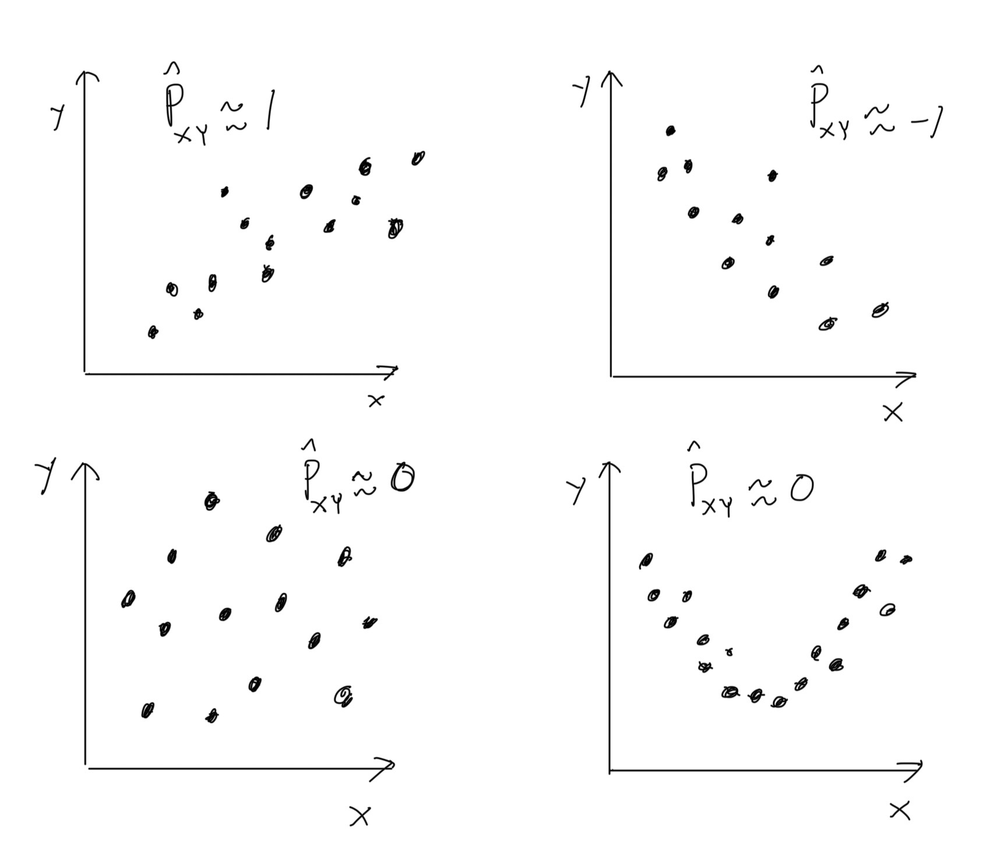
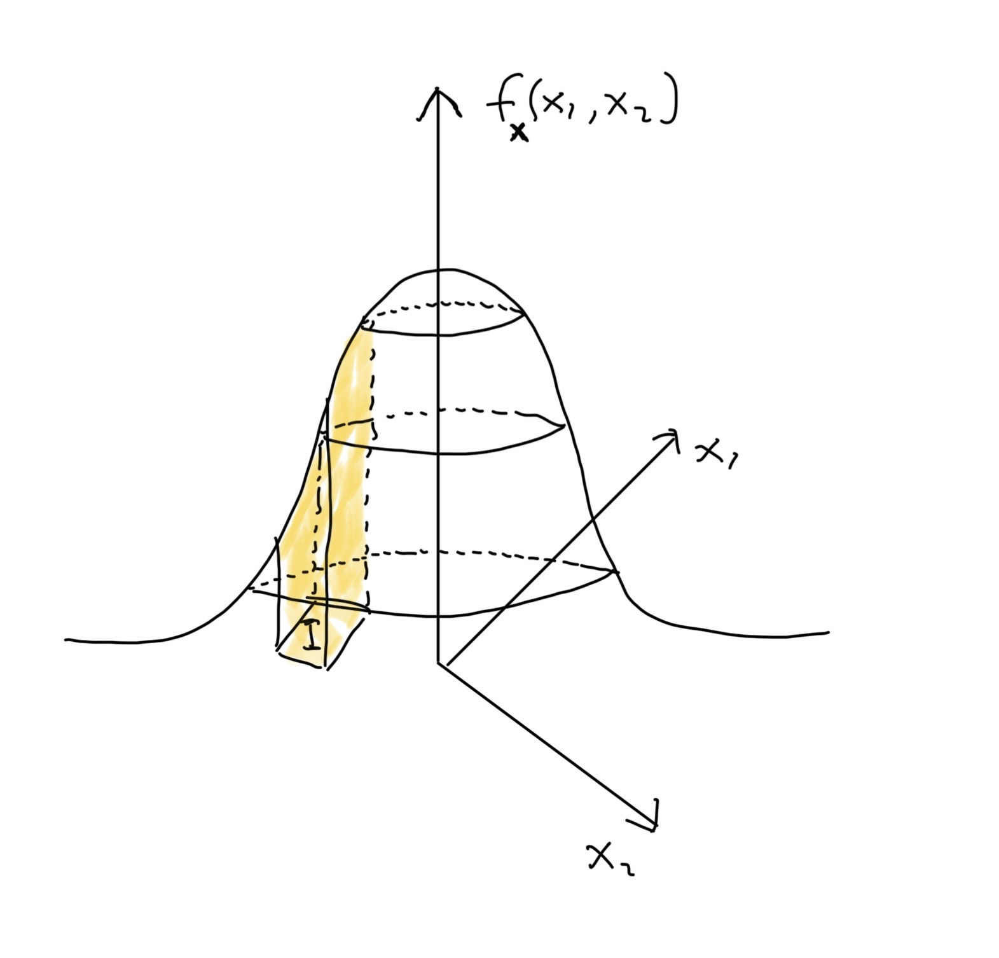
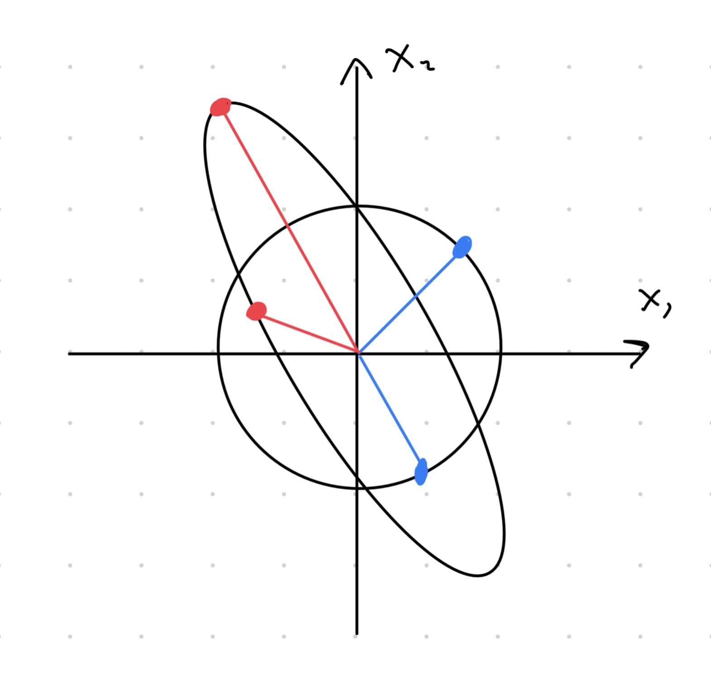

# Moniulotteiset jakaumat

Kurssilla *Tilastotieteen perusteet* käsiteltiin (yksiulotteiset) satunnaismuuttujat. Satunnaismuuttuja on funktio, joka saa lukuarvon (kokonaislukuluku $\mathbb{Z}$, rationaaliluku $\mathbb{Q}$, Reaaliluku $\mathbb{R}$) satunnaisilmiön toteuman perusteella. Satunnaismuuttuja voi olla diskreetti kuten $X_1 = \mathrm{nopanheiton\  tulos}$ tai jatkuva kuten $X_2 = \mathrm{Bussin\ saapumisaika\ pysäkille}$. Satunnaismuuttujan $Y$ käyttäytymistä mallintaa sen jakauma $\mathbb{P}\left(Y\in A\right)$, jossa $\{Y\in A\}$ on mahdollinen tapahtuma. Esimerkiksi tapahtumaa "nopanheiton tulos on 1 tai 5" vastaava todennäköisyys on $\mathbb{P}\left(X_1\in \{2, 5\}\right) = 2/6 = 1/3$, kunhan noppa on reilu. Kaiken informaation satunnaismuuttujan $Y$ jakaumasta sisältää kertymäfunktio $F_Y(y) = \mathbb{P}\left(Y \leq y\right)$. Jos satunnaismuuttuja $Y$ on diskreetti, niin sen kertymäfunktio voidaan kirjoittaa pistetodennäköisyysfunktion $p_Y(x) = \mathbb{P}\left(Y = x\right)$ avulla
\begin{equation}
  (\#eq:discrete-uni-cdf)
  F_Y(y) = \sum_{x\leq y} p_Y(x).
\end{equation}
Jos taas satunnaismuuttuja $Y$ on jatkuva, niin sen kertymäfunktio voidaan kirjoittaa tiheysfunktion $f_Y(x)$ avulla integraalina
\begin{equation*}
  (\#eq:continuous-uni-cdf)
  F_Y(y) = \int_{-\infty}^{y} f_Y(x)\, \mathrm{d}x.
\end{equation*}
Jakauman sijainnnista ja hajonnasta antavat tietoa teoreettiset suureet kuten odotusarvo $\mathbb{E}\left(Y\right)$ ja varianssi
\begin{equation}
  (\#eq:var)
  \mathrm{Var}\left(Y\right) = \mathbb{E}\left(\left(Y - \mathbb{E}\left(Y\right)\right)^2\right).
\end{equation}
Myös muita jakaumaa kuvaavia teoreettisia suureita on olemassa: *vinous*, *huipukkuus*, *kvantiilit*, $\ldots$ Tilastotieteen sovelluksissa on kuitenkin yleensä saatavilla vain otos $y_1,\ldots, y_n$ satunnaismuuttujasta $Y$ eikä satunnaismuuttujan teoreettisia ominaisuuksia tunneta. Tällöin satunnaismuuttujan $Y$ jakaumaa vastaavat teoreettiset suureet täytyy estimoida otoksen avulla. Esimerkiksi odotusarvo voidaan estimoida keskiarvolla
\begin{equation*}
  \bar y = \frac{1}{n}\sum_{i = 1}^n y_i
\end{equation*}
ja varianssi voidaan estimoida otosvarianssilla
\begin{equation*}
  s_Y^2 = \frac{1}{n-1}\sum_{i = 1}^n\left(y_i - \bar  y\right)^2.
\end{equation*}
Kertaa tarvittaessa edellämainittuja asioita kurssilta *Tilastotieteen perusteet*.

Yllä kuvattu asetelma on usein liian yksinkertainen käytännön datatietieteen sovelluksissa, sillä monesti dataa on saatavilla useista eri muuttujista.

(ref:body-caption) Hajontakuviot muuttujista pareittain.

::: {.example #body name="Moniulotteinen aineisto"}

Taulukossa \@ref(tab:body) näkyy neliulotteinen aineisto ihmisen kehon eri osien mittauksista (yksikkö: tuuma). Kaikki mitatut muuttujat `ShoulderWidth`, `Belly`, `ArmLength` ja `TotalHeight` ovat tässä tapauksessa jatkuvia. Tuntuisi luonnolliselta, että muuttujien välillä on riippuvuussuhteita. Esimerkiksi ehkä pidemmällä ihmisellä on pidemmät kädet? Jos näin on, niin menetämme informaatiota analysoidessa muuttujia erikseen.

```{r body, echo=FALSE, message=FALSE}
library(dplyr)
coltypes <- stringr::str_c(rep("i", 13), collapse = "")
body <- readr::read_csv("data/body_measurements.csv", col_names = TRUE,
                        col_types = coltypes) %>%
  select(ShoulderWidth, Belly, ArmLength, TotalHeight)

knitr::kable(head(body), caption = "Neliulotteinen aineisto ihmisen kehon dimensioista. Rivi vastaa yhtä havaintoa (ihmistä) ja sarake vastaa yhtä muuttujaa.")
```

Hyvä vaihtoehto visualisoida dataa voisi olla hajontakuvio. Kuvaajassa olisi kuitenkin tällöin neljä akselia (ulottuvuutta), joten meidän ihmisten (ainakin minun) on mahdoton tulkita hajontakuviota! Vaihtoehtoisesti hajontakuviot voi piirtää pareittain kuten kuvassa \@ref(fig:body-pairs).
```{r body-pairs, fig.cap="(ref:body-caption)"}
pairs(body, lower.panel = NULL)
```

Esimerkiksi kuvan \@ref(fig:body-pairs) alareunassa olevassa hajontakuviossa muuttuja `TotalHeight` on $x$-akselilla ja muuttuja `ArmLength` on $y$-akselilla. Kyseisen hajontakuvion perusteella näyttää, että muuttujien `ArmLength` ja `TotalHeight` välillä tosiaan on lineaarinen riippuvuus -- keskimäärin pidemmällä ihmisellä on pidemmät kädet. Toki hajontakuviossa näkyy myös muutamia oudokkeja (eng: *outlier*), jotka ovat poikkeus säännöstä. Huomaa, että pareittaiset hajontakuviot eivät kerro koko tarinaa. Voi nimittäin olla, että tietynlaiset muuttujien väliset riippuvuudet eivät näy hajontakuvioissa.
:::

Kurssilla käymme läpi perusmenetelmiä, joilla voi tehdä tilastollista analyysiä moniulotteisiin aineistoihin liittyen. Kurssin menetelmät toimivat pohjana vaativimille moniulotteisille data-analyyseille. Moniulotteisen data-analyysin tavoitteena voi esimerkiksi olla

- Muuttujien riippuvuussuhteiden ymmärtäminen
- Yhden muuttujan ennustaminen muilla muuttujilla
- Dimensioiden pienennys (eng: *dimension reduction*) ennen varsinaista analyysiä

Kuitenkin ensin täytyy ymmärtää moniulotteiseen dataan liittyvää todennäköisyyslaskentaa, sillä moniulotteista dataa mallinnetaan  moniulotteisten satunnaismuuttujien eli satunnaisvektoreiden avulla. Luvussa \@ref(sec:dep) määrittelemme stokastisen riippuvuuden käsitteen formaalisti, jotta voimme ymmärtää satunnaismuuttujien välisiä riippuvuussuhteita. Luvussa \@ref(sec:rvec) määrittelemme satunnaisvektorin, ja siihen liittyvät peruskäsitteet. Erittäin tärkeälle jakaumaperheelle eli moniulotteiselle normaalijakaumalle omistetaan oma luku \@ref(sec:normal). Luvussa \@ref(sec:cond) syvennämme satunnaisvektoreihin liittyvää todennäköisyysteoriaa käsittelemällä ehdolliset jakaumat. Tärkeimmät moniulotteista jakaumaa kuvaavat teoreettiset suureet kuten odotusarvo ja kovarianssi määritellään luvussa \@ref(sec:statistic). Samassa luvussa käydään estimoinnin perusteita liittyen moniulotteisiin jakaumiin.

## Stokastinen riippumattomuus {#sec:dep}

Intuitiivisesti ajateltuna kaksi satunnaismuuttujaa $X$ ja $Y$ ovat stokastisesti riippumattomia, jos tieto muuttujan $X$ arvosta ei anna mitään lisätietoa muuttujan $Y$ arvosta ja päinvastoin. Toisaalta satunnaismuuttujat $X$ ja $Y$ ovat stokastisesti riippuvia, jos tieto $X$:n arvosta antaa jotain lisätietoa $Y$:n arvosta ja päinvastoin.

::: {.example #ind name="Riippuvuus intuitiivisesti"}
- Määritellään satunnaismuuttujat $X = \mathrm{Markkinointi\ (euroissa)}$ ja $Y = \mathrm{Myynti\ (euroissa)}$. Todennäköisesti edellä annetut satunnaismuuttujat riippuvat toisistaan. Mitä enemmän yritys markkinoi, sitä enemmän  myynti kasvaa (ainakin johonkin pisteeseen asti).

- Määritellään satunnaismuuttujat $X = \mathrm{kolikonheiton\ tulos}$ ja $Y = \mathrm{nopanheiton\ tulos}$. Muuttujat $X$ ja $Y$ ovat riippumattomia, jos kyseessä on aivan tavallinen noppa ja aivan tavallinen kolikko. Jos heitän ensin kolikko ja saan klaavan, niin tämä tulos ei kerro mitään siitä, minkä silmäluvun tulen saamaan heittämällä seuraavaksi noppaa.

Yllä olevissa esimerkeissä satunnaismuuttujien välinen riippuvuus/riippumattomuus oli helposti pääteltävissä. Aina tilanne ei kuitenkaan ole niin yksinkertainen:

- Olkoon $X_1$ ja $X_2$ riippumattomia $\pm 1$ arvoisia satunnaismuuttujia niin, että
\begin{equation*}
  \mathbb{P}\left(X_i = -1\right) = \mathbb{P}\left(X_i = +1\right)
  = \frac{1}{2}, \quad i\in\{1,2\}.
\end{equation*}
Määritellään satunnaismuuttuja $Y = X_1 X_2$. Ovatko satunnaismuuttujat $Y$ ja $X_1$ stokastisesti riippumattomia?
    -  Intuitiivisesti ajateltuna muuttujat $Y$ ja $X_1$ eivät välttämättä ole riippumattomia, koska $Y$ määritellään muuttujan $X_1$ avulla. Tästä huolimatta muuttujat $Y$ ja $X_1$ ovat  stokastisesti riippumattomia!
:::

Seuraavaksi annamme stokastisen riippumattomuuden/riippuvuuden määritelmän kahden satunnaismuuttujan välillä.

::: {.definition #ind name="Stokastinen riippumattomuus"}
Satunnaismuuttujat $X$ ja $Y$ ovat riippumattomia, jos kaikille $x\in\mathbb{R}$ ja $y\in\mathbb{R}$ pätee
\begin{equation*}
  \mathbb{P}\left(X\leq x \cap Y\leq y\right)
  = \mathbb{P}\left(X\leq x\right) \mathbb{P}\left(Y\leq y\right).
\end{equation*}
Jos jollekin $(x,y)$-yhdistelmälle pätee
\begin{equation*}
  \mathbb{P}\left(X\leq x \cap Y\leq y\right)
  \neq \mathbb{P}\left(X\leq x\right) \mathbb{P}\left(Y\leq y\right),
\end{equation*}
niin satunnaismuuttujat $X$ ja $Y$ ovat riippuvia.
:::

Eli satunnaismuuttujat ovat riippumattomia, jos niitä vastaava "yhteistodennäköisyys" voidaan aina kirjoittaa tulomuodossa. Määritelmä \@ref(def:ind) voidaan antaa myös tapahtumien avulla. Muuttujat $X$ ja $Y$ ovat riippumattomia, jos kaikille tapahtumille $\{X\in A\}$ ja $\{Y\in B\}$ pätee
\begin{equation*}
  \mathbb{P}\left(X\in A \cap Y\in B\right)
  = \mathbb{P}\left(X\in A\right) \mathbb{P}\left(Y\in B\right).
\end{equation*}
Toisaalta määritelmä \@ref(def:ind) yleistyy myös useammalle satunnaismuuttujalle. Eli muuttujat $X_1, \ldots, X_d$ ovat riippumattomia, jos kaikille $x_1\in\mathbb{R}, \ldots, x_d\in\mathbb{R}$ pätee
\begin{equation*}
  \mathbb{P}\left(X_1\leq x_1 \cap \cdots  \cap X_d\leq x_d\right)
  = \mathbb{P}\left(X_1\leq x_1\right) \cdots \mathbb{P}\left(X_d\leq x_d\right).
\end{equation*}
Kuten luvussa \@ref(sec:rvec) tullaan näkemään, niin satunnaisvektoreiden käsittely yksinkertaistuu huomattavasti, jos kaikki vektorin muuttujat ovat riippumattomia.

Seuraavaksi annamme esimerkin, jossa tarkistetaan kahden satunnaismuuttujan välinen riippumattomuus/riippuvuus.

::: {.example #coin name="Kolikonheitto"}
Heitetään kolikkoa kolme kertaa. Yhden kolikonheiton tulos on joko klaava ($T$) tai kruuna ($H$) js kolikko on reilu eli
\begin{equation*}
  \mathbb{P}\left(T\right) = \mathbb{P}\left(H\right) = \frac{1}{2}.
\end{equation*}
Kolikonheitot ovat myös toisistaan riippumattomia.

Määritellään kaksi satunnaismuuttujaa:

- $X = \text{Klaavojen määrä kahdella ensimmäisellä heitolla}$.

- $Y = \text{Klaavojen määrä kahdella viimeisellä heitolla}$.

Tarkoitus on selvittää ovatko muuttujat $X$ ja $Y$ riippumattomia. Tarkastellaan seuraavia tapahtumia:

- Tapahtuma $1$: $\{X = 0\}$

- Tapahtuma $2$: $\{Y = 0\}$

- Tapahtuma $3$: $\{X = 0 \cap Y = 0\}$.

Kaikki mahdolliset heittosarjat ovat
\begin{equation*}
  \{\underbrace{(HHH)}_{s_1}, \underbrace{(HHT)}_{s_2},
  \underbrace{(HTH)}_{s_3}, \underbrace{(THH)}_{s_4},
  \underbrace{(TTH)}_{s_5}, \underbrace{(THT)}_{s_6},
  \underbrace{(HTT)}_{s_7}, \underbrace{(TTT)}_{s_8}\}
\end{equation*}
Jokaisen heittosarjan $s_i$ todennäköisyys on $(1/2)^3 = 1/8$, koska heitot ovat riippumattomia. Tapahtuma $1$ toteutuu heittosarjoilla $s_1$ ja $s_2$. Heittosarjat ovat toisensa poissulkevia, joten $\mathbb{P}\left(X = 0\right) = \mathbb{P}\left(s_1 \cup s_2\right) = \mathbb{P}\left(s_1\right) + \mathbb{P}\left(s_2\right) = 1/8 + 1/8 = 1/4$. Samanlaisella päättelyllä saadaan $\mathbb{P}\left(Y = 0\right) = 1/4$. Toisaalta tapahtuma 3 toteutuu vain heittosarjalla $s_1$, joten $\mathbb{P}\left(X = 0 \cap Y = 0\right) = \mathbb{P}\left(s_1\right) = 1/8$. Saimme siis
\begin{equation*}
\frac{1}{16} =  \left(\frac{1}{4}\right)^2
= \mathbb{P}\left(X = 0\right)\mathbb{P}\left(Y = 0\right)
\neq \mathbb{P}\left(X = 0 \cap Y = 0\right) = \frac{1}{8},
\end{equation*}
joten muuttuvat $X$ ja $Y$ *eivät* ole riippumattomia.
:::

Lineaarinen riippuvuus on tilastotieteessä erityisen tärkeä riippuvuuden muoto. Kahden satunnaismuuttujan $X$ ja $Y$ välistä lineaarista riippuvuutta mittaa kovarianssi,
\begin{equation}
  (\#eq:cov)
  \mathrm{Cov}\left(X, Y\right) =
  \mathbb{E}\left(\left(X - \mathbb{E}\left(X\right)\right)
  \left(Y - \mathbb{E}\left(Y\right)\right)\right).
\end{equation}
Jos satunnaismuuttujista $X$ ja $Y$ on otokset $x_1, \ldots, x_n$ ja $y_1, \ldots, y_n$, niin kovarianssia voidaan estimoida otoskovarianssilla
\begin{equation*}
  s_{XY} = \frac{1}{n - 1}\sum_{i = 1}^n\left(x_i - \bar x\right)
  \left(y_i - \bar y\right),
\end{equation*}
jossa $\bar y$ on otosta $y_1, \ldots, y_n$ vastaava keskiarvo. Kovarianssia voidaan tulkita seuraavasti:

- Kun $\mathrm{Cov}\left(X, Y\right) > 0$, niin muuttujien $X$ ja $Y$ välillä on kasvava lineaarinen riippuvuus

- Kun $\mathrm{Cov}\left(X, Y\right) < 0$, niin muuttujien $X$ ja $Y$ välillä on vähenevä lineaarinen riippuvuus

Kovarianssin suuruuteen vaikuttaan muuttujien $X$ ja $Y$ skaalat, joten kovarianssin suuruutta $\left|\mathrm{Cov}\left(X, Y\right)\right|$ on vaikea tulkita. Tämän vuoksi kovarianssi usein normalisoidaan jakamalla satunnaismuuttujia vastaavilla keskihajonnoilla, jolloin päädytään (Pearsonin) korrelaatiokertoimeen,
\begin{equation*}
  \mathrm{Cor}\left(X, Y\right) = \frac{\mathrm{Cov}\left(X, Y\right)}
  {\sqrt{\mathrm{Var}\left(X\right)\mathrm{Var}\left(Y\right)}}.
\end{equation*}
Korrelaatiokertoimen estimaattori on
\begin{equation*}
  \hat\rho_{XY} = \frac{s_{XY}}{\sqrt{s_X^2s_Y^2}},
\end{equation*}
jossa $s_Y^2$ on otosta $y_1, \ldots, y_n$ vastaava otosvarianssi. Korrelaation $\mathrm{Cor}\left(X, Y\right)$ arvo on aina välillä $[-1, 1].$ Kuten kovarianssin tapauksessa, korrelaation merkki kertoo siitä, onko lineaarinen riippuvuus kasvava vai vähenevä ja korrelaation suuruus $\left|\mathrm{Cor}\left(X, Y\right)\right|$ kertoo lineaarisen riippuvuuden vahvuudesta. On mahdollista, että satunnaismuuttujat *eivät* ole riippumattomia ja $\mathrm{Cov}\left(X, Y\right) = 0$. Esimerkiksi satunnaismuuttujien välillä voi epälineaarinen suhde, kuten kuvan \@ref(fig:cor) oikean alalaidan havaintoaineistossa, jolloin otoskorrelaatio on likimain nolla. Ilmiöön liittyen on myös harjoitustehtävä.

::: {.exercise #cov name="Viikko 2, tehtävä 2"}
Olkoon $X\sim \mathrm{Tas}\left([-1,1]\right)$ eli $X$ on satunnaismuuttuja, joka noudattaa tasajakaumaa välillä $[-1, 1]$. Määritellään toinen satunnaismuuttuja muunnoksen $Y = X^2$ mukaan. Tällöin satunnaismuuttujat $X$ ja $Y$ *eivät* ole riippumattomia mutta $\mathrm{Cov}\left(X, Y\right) = 0$.
:::

(ref:cor-cap) Otoskorrelaation $\hat\rho_{XY}$ suuruusluokka erilaisille havaintoaineistoille.

```{r cor, echo=FALSE, fig.cap="(ref:cor-cap)"}

```


::: {.remark}
Vapaaehtoisena lisätehtävänä voit määritelmän \@ref(def:ind) avulla tarkistaa, että esimerkin \@ref(exm:ind) viimeinen väite pätee.
:::


## Perusteet {#sec:rvec}

Moniulotteisia satunnaismuuttujia mallinnetaan satunnaisvektoreina. Muista, että vektori ($d$-ulotteinen) on **järjestetty** lista lukuja $(x_1, x_2, \ldots, x_d)$, $x_i\in\mathbb{R}$. Eli vektori voidaan tulkita avaruuden $\mathbb{R}^d$ alkiona. Vektoreilla on suuruus ja suunta. Kurssin kannalta tarpeelliset esitiedot vektoreista ja vektoreihin liittyvät notaatiot voit kerrata liitteiden kappaleesta \@ref(sec:vector).

::: {.example name="Havaintoaineisto ja vektorit"}
- Esimerkin \@ref(exm:body) aineiston havainnot (rivit) voidaan tulkita $4$-ulotteisina vektoreina eli pisteinä avaruudessa $\mathbb{R}^4$. Teoriassa havaintoaineistoa vastaava hajontakuvio voitaisiin piirtää neljässä ulottuvuudessa. Käytännössä ihmiset eivät kuitenkaan voi tämäntyyppistä kuvaajaa tehdä tai tulkita.
:::

Nyt olemme valmiita määrittelemään satunnaisvektorit.

::: {.definition #rvec name="Satunnaisvektori ja sen yhteiskertymäfunktio"}
Olkoon $X_1, X_2, \ldots, X_d$ satunnaismuuttujia. Tällöin $\boldsymbol X = (X_1, X_2, \ldots, X_d)^T$ on $d$-ulotteinen satunnaisvektori. Satunnaisvektorin yhteiskertymäfunktio $F_{\boldsymbol X}(\boldsymbol x):\mathbb{R}^d\to[0,1]$ kohdassa $\boldsymbol x = (x_1, x_2, \ldots, x_d)$ määritellään seuraavasti,
\begin{equation*}
  \begin{split}
    F_{\boldsymbol X}(\boldsymbol x)
    = \mathbb{P}\left(X_1\leq x_1, X_2\leq x_2, \ldots, X_d\leq x_d\right),
  \end{split}
\end{equation*}
jolle voidaan käyttää myös tiiviimpää notaatiota $F_{\boldsymbol X}(\boldsymbol x) = \mathbb{P}\left(\boldsymbol X \leq \boldsymbol x\right)$.
:::

Yksiulotteisen satunnaismuuttujan $X$ tapauksessa kertymäfunktio $F_X(x), x\in\mathbb{R}$ antaa kaiken informaation kyseisen satunnaismuuttujan jakaumasta $\mathbb{P}\left(X\in A\right), A\subset\mathbb{R}$. Samoin moniulotteisen satunnaisvektorin tapauksessa yhteiskertymäfunktio $F_{\boldsymbol X}(\boldsymbol x)$ antaa kaiken informaation kyseisen satunnaisvektorin jakaumasta $\mathbb{P}\left(\boldsymbol X\in B\right), B\subset\mathbb{R}^d$. Sanomme siis, että kaksi satunnaisvektoria $\boldsymbol X$ ja $\boldsymbol Y$ ovat samoin jakautuneet, jos $F_{\boldsymbol X}(\boldsymbol x) = F_{\boldsymbol Y}(\boldsymbol x)$ pätee kaikille $\boldsymbol x\in\mathbb{R}^d$.

Huomautamme jo tässä kohtaa, että usein informaatio yksittäisistä komponenttimuuttujista $X_1, \ldots, X_d$ kertoo varsin vähän satunnaisvektorista $\boldsymbol X = (X_1, \ldots, X_d)$ -- yleisesti ottaen satunnaismuuttujien $X_i$ kertymäfunktioista $F_{X_i}$ **ei** voida päätellä satunnaisvektorin $\boldsymbol X$ yhteiskertymäfunktiota $F_{\boldsymbol X}$. Sääntöön löytyy kuitenkin yksi poikkeus.

::: {.theorem name="Riippumattomat komponenttivektorit"}
Olkoon $\boldsymbol X = (X_1, X_2, \ldots, X_d)$ satunnaisvektori niin, että satunnaismuuttujat $X_1, X_2, \ldots, X_d$ ovat riippumattomia. Tällöin riippumattomuuden määritelmästä seuraa, että kohdassa $\boldsymbol x = (x_1, x_2,\ldots, x_d)$ satunnaisvektorin $\boldsymbol X$ kertymäfunktio voidaan kirjoittaa muodossa
\begin{equation*}
  F_{\boldsymbol X}(\boldsymbol x) = F_{X_1}(x_1)F_{X_2}(x_2)\cdots F_{X_d}(x_d)
  = \prod_{i = 1}^d F_{X_1}(x_i).
\end{equation*}
Eli satunnaisvektoria vastaava yhteiskertymäfunktio $F_{\boldsymbol X}(\boldsymbol x)$ on tulo komponenttimuuttujien $X_i$ kertymäfunktioista $F_{X_i}(x_i)$. 
:::

::: {.remark}
Yllä puhumme satunnaisvektorin $\boldsymbol X$ *yhteis*jakaumasta, *yhteis*kertymäfunktiosta jne. Tästä eteenpäin tiputamme etuliitteen "yhteis", kun on selkeää mistä puhutaan.
:::

Seuraavaksi käsittelemme konkreettisempia esimerkkejä satunnaisvektoreista. Aloitamme diskreeteistä moniulotteisista satunnaismuuttujista, minkä jälkeen sanomme muutaman sanan jatkuvista moniulotteisista satunnaismuuttujista.


### Diskreetti satunnaisvektori {-}

Diskreetit satunnaisvektorit tarjoavat todennäköisyysteoreettisen mallin monille yksinkertaisille sekä monimutkaisille moniulotteisille ilmiölle:

- Peräkkäiset kolikonheitot

- Jonotusmallit
    - esim.\ asiakkaiden määrät useammassa jonossa

- Luonnollisen kielen prosessointi (eng: *natural language processing*)
    - esim.\ tilastollinen malli (tai teköälymalli) saattaa ottaa sisäänsä vektoreita, joiden alkiot kuvaavat sanojen lukumääriä dokumentissa (eng: *bag-of-words model*)

::: {.definition #discrete name="Diskreetti satunnaisvektori"}
Olkoon $\boldsymbol X = (X_1, X_2, \ldots, X_d)^T$ satunnaisvektori. Satunnaisvektori $\boldsymbol X$ on diskreetti, jos sen arvojoukko on $\mathbb{Z}^d$ eli $X_i\in\mathbb{Z}$ kaikilla $i$. Diskreetin satunnaisvektorin $\boldsymbol X$ yhteispistetodennäköisyysfunktio $p_{\boldsymbol X}:\mathbb{Z}^d\to[0,1]$ määritellään kaavan
\begin{equation*}
  p_{\boldsymbol X}(x_1, x_2,\ldots, x_d)
  = \mathbb{P}\left(X_1 = x_1, X_2 = x_2, \ldots, X_d = x_d\right)
\end{equation*}
mukaan.
:::

Alla on pari esimerkkiä diskreeteistä satunnaisvektoreista. Huomaa, että diskreetin satunnaisvektorin arvojoukko ei tarvitse olla $\mathbb{Z} = \{\ldots,-2, -1, 0, 1, 2,\ldots\}$ kokonaisuudessaan vaan se voi olla myös joukon $\mathbb{Z}$ osajoukko.

::: {.example name="Diskreetti satunnaisvektori"}
- Olkoon $X$ ja $Y$ kuten esimerkissä \@ref(exm:coin). Tällöin $(X, Y)^T$ on $2$-ulotteinen diskreetti satunnaisvektori, jonka arvojoukko on
\begin{equation*}
  \{(0, 0), (0, 1), (0, 2), (1, 0), (1, 1), (1, 2), (2, 0), (2, 1), (2, 2)\}
  \subset \mathbb{Z}.
\end{equation*}

- Heitetään noppaa viisi kertaa peräkkäin ($X_i = \mathrm{Heiton}\ i\ \mathrm{tulos}$, $i\in\{1,2,3,4,5\}$). Tällöin $(X_1, X_2, X_3, X_4, X_5)^T$ on $5$-ulotteinen diskreetti satunnaisvektori, jonka arvojoukko on $\{(j_1, j_2, j_3, j_4, j_5) : j_i\in\{1,2,3,4,5,6\}\}$.
:::

Määritelmässä \@ref(def:discrete) annettu pistetodennäköisyysfunktio on tärkeä työkalu diskreetin satunnaisvektorin jakauman tutkimisessa. Alla annamme pistetodennäköisyysfunktion ominaisuudet (epänegatiivisuus ja summautuminen ykköseen). Huomaa myös että jos joku mielivaltainen funktio $g$ toteuttaa pistetodennäköisyysfunktion ehdot, niin $g = g_{\boldsymbol Y}$ tosiaan on jonkin satunnaisvektorin $\boldsymbol Y$ pistetodennäköisyysfunktio.

::: {.theorem #pointmass name="Pistetodennäköisyysfunktion ominaisuudet"}
Olkoon $\boldsymbol X = (X_1, X_2, \ldots, X_d)^T$ diskreetti satunnaisvektori, jolla on pistetodennäköisyysfunktio $p_{\boldsymbol X}$.
Pistetodennäköisyysfunktio $p_{\boldsymbol X}$ toteuttaa seuraavat ehdot:

1. $p_{\boldsymbol X}(x_1, x_2,\ldots, x_d) \geq 0$ kaikille vektoreille $(x_1, x_2, \ldots, x_d)\in\mathbb{Z}^d$ (epänegatiivisuus)

2. $\sum_{x_1, x_2, \ldots, x_d} p_{\boldsymbol X}(x_1, x_2,\ldots, x_d) = \sum_{x_1\in\mathbb{Z}}\sum_{x_2\in\mathbb{Z}} \cdots \sum_{x_d\in\mathbb{Z}} p_{\boldsymbol X}(x_1, x_2,\ldots, x_d) = 1$ (summautuu ykköseen)

Vastaavasti, jos joku mielivaltainen funktio $g:\mathbb{Z}^d\to[0,1]$ toteuttaa ehdot 1 ja 2, niin se on jonkin diskreetin satunnaisvektorin pistetodennäköisyysfunktio.
:::

Alla on esimerkki pistetodennäköisyysfunktion ehtojen 1 ja 2 tarkistamisesta.

::: {.example name="Pistetodennäköisyysfunktion ehdot"}
Olkoon $C > 0$ ja määritellään funktio $f:\mathbb{Z}^2\to \mathbb{R}$ kaavalla
\begin{equation*}
  f(x,y) =
  \begin{cases}
    \frac{1}{5}C, & x = 1, y = 1, \\
    \frac{1}{3}C, & x = 1, y = 2, \\
    \frac{2}{5}C, & x = 2, y = 1, \\
    \frac{1}{2}C, & x = 2, y = 2, \\
    0, & \text{muulloin}.
  \end{cases}
\end{equation*}
Määritetään vakio $C$ siten, että $f$ on diskreetin satunnaisvektorin pistetodennäköisyysfunktio. Eli vakio $C$ tulee valita niin, että faktan \@ref(thm:pointmass) ehdot 1 ja 2 täyttyvät. Kunhan $C \geq 0$, niin ehto 1 täyttyy selvästi. Tarkistetaan siis ehto 2. Sievennetään ensin summa $\sum_{x,y} f(x,y)$,
\begin{equation*}
  \begin{split}
    \sum_{x\in\mathbb{Z}}\sum_{y\in\mathbb{Z}} f(x,y)
    &= \sum_{x\in\{1, 2\}}\sum_{y\in\{1, 2\}} f(x,y) \\
    &= \sum_{x\in\{1, 2\}} f(x, 1) + f(x, 2) \\
    &= f(1,1) + f(1,2) + f(2,1) + f(2,2) \\
    &= C\left(\frac{1}{5} + \frac{1}{3} + \frac{2}{5} + \frac{1}{2}\right) \\
    &= \frac{43}{30} C.
  \end{split}
\end{equation*}
Ehdon 2 yhtälö $\sum_{x,y} f(x,y) = 1$ voidaan siis kirjoittaa muodossa $\frac{43}{30} C = 1$, josta saadaan $C = \frac{30}{43}$.

Tämä pistetodennäköisyysfunktio sopisi vaikka kuvaamaan yrityksen yksinkertaistettua asiakastyytyväisyyskartoituksen tulosta, jossa ensimmäinen komponenttimuuttuja $X$ kuvaa asiakkaan tekemien ostotapahtumien yleisyyttä (harvoin / usein) ja toinen komponenttimuuttuja $Y$ kuvaa
asiakastyytyväisyyttä (tyytymätön / tyytyväinen). Nyt voimme esimerkiksi laskea
\begin{equation*}
  \mathbb{P}\left(X = 1, Y = 2\right) = f(1,2)
  = \frac{1}{3}\cdot \frac{30}{43} \approx 0.23.
\end{equation*}
:::

::: {.remark}
Huomaa, että esimerkiksi notaatiolla $\mathbb{P}\left(X = i, Y = j, Z = k\right)$ tarkoitamme todennäköisyyttä $\mathbb{P}\left(X = i\ \text{ja}\ Y = j\ \text{ja}\ Z = k\right)$.
:::

Seuraavaksi jatkamme esimerkkiä \@ref(exm:coin). Kyseisen esimerkin tapauksessa määritämme satunnaisvektorin pistetodennäköisyysfunktion.

::: {.example #coincont name="Pistetodennäköisyysfunktion määrittäminen"}
Oletetaan sama asetelma kuin esimerkissä \@ref(exm:coin). Tarkoitus on nyt määrittää satunnaisvektorin $(X,Y)^T$ yhteisjakauma kun satunnaismuuttujat $X$ ja $Y$ määriteltiin seuraavasti:

- $X = \mathrm{Klaavojen\ määrä\ kahdella\ ensimmäisellä\ heitolla}$ ja

- $Y = \mathrm{Klaavojen\ määrä\ kahdella\ viimeisellä\ heitolla}$.

Muistakaamme, että kaikki mahdolliset kolmen kolikonheiton ($T = \text{klaava}$ ja $H = \text{kruuna}$) sarjat ovat
\begin{equation*}
  \{\underbrace{(HHH)}_{s_1}, \underbrace{(HHT)}_{s_2},
  \underbrace{(HTH)}_{s_3}, \underbrace{(THH)}_{s_4},
  \underbrace{(TTH)}_{s_5}, \underbrace{(THT)}_{s_6},
  \underbrace{(HTT)}_{s_7}, \underbrace{(TTT)}_{s_8}\}
\end{equation*}
ja että jokaisen sarjan $s_i$ todennäköisyys on $1/8$. Nähdään, että jos esimerkiksi $X = 2$, niin silloin $Y\in\{1,2\}$ (ainakin 1 klaava viimeisen kahden heiton aikana). Esimerkiksi jos $s_8$ tapahtuu, niin tällöin
$X = Y = 2$. Toisaalta jos $s_5$ tapahtuu, niin $X = 2$ ja $Y = 1$. Siten
satunnaisvektorin $\boldsymbol Z = (X, Y)^T$ saamat kaikki mahdolliset arvot ovat
\begin{equation*}
  (0, 0), (0, 1), (0, 2), (1, 0), (1, 1), (1, 2), (2, 0), (2, 1), (2, 2) 
\end{equation*}
ja tällöin pistetodennäköisyysfunktion $p_{\boldsymbol Z}(x,y) = \mathbb{P}\left(X = x, Y = y\right)$ saamat arvot ovat
\begin{align*}
    p_{\boldsymbol Z}(0,0) &= 1/8,& p_{\boldsymbol Z}(0,1) &= 1/8,& p_{\boldsymbol Z}(0,2) &= 0,& p_{\boldsymbol Z}(1,0) &= 1/8,
    & p_{\boldsymbol Z}(1,1) = 1/4 \\
    p_{\boldsymbol Z}(1,2) &= 1/8,& p_{\boldsymbol Z}(2,0) &= 0,& p_{\boldsymbol Z}(2,1) &= 1/8,& p_{\boldsymbol Z}(2,2) &= 1/8.
\end{align*}

Pistetodennäköisyysfunktion arvot voidaan myös taulukoida kuten taulukossa \@ref(tab:coinxy).
```{r coinxy, echo=FALSE}
tab <- data.frame(
  X = c("$0$", "$1$", "$2$"),
  Y0 = c("$1/8$", "$1/8$", "$0$"),
  Y1 = c("$1/8$", "$1/4$", "$1/8$"),
  Y2 = c("$0$", "$1/8$", "$1/8$")
)
names(tab) <- c("$X$" ,"$Y = 0$", "$Y = 1$", "$Y = 2$")

knitr::kable(
  tab,
  caption = "Pistetodennäköisyysfunktion $p_{\\boldsymbol Z}$ arvot taulukoituna."
)
```

Yksittäisten satunnaismuuttujien $X$ ja $Y$ pistetodennäköisyysfunktiot $p_{X}(x) = \mathbb{P}\left(X = x\right)$ ja $p_{X}(x) = \mathbb{P}\left(X = x\right)$ saadaan myös pääteltyä heittosarjojen $s_1, \ldots, s_8$ avulla. Esimerkiksi $X = 1$ heittosarjojen $s_3$, $s_4$, $s_6$ ja $s_7$ toteutuessa eli $p_{X}(1) = 1/8 + 1/8 + 1/8 + 1/8 = 1/4$.  Samalla päättelyketjulla saadaan
\begin{equation*}
  p_{X}(0) = p_{Y}(0) = 1/4,\quad p_{X}(1) = p_{Y}(1) = 1/2,\quad p_{X}(2) = p_{Y}(2) = 1/4.
\end{equation*}
Myös yksittäisten satunnaismuuttujien pistetodennäköisyysfunktiot voidaan taulukoida. Taulukossa \@ref(tab:coinx) näkyy muuttujan $X$ pistetodennäköisyysfunktion arvot.
```{r coinx, echo=FALSE}
tab <- data.frame(
  X0 = c("$1/4$"),
  X1 = c("$1/2$"),
  X2 = c("$1/4$")
)
names(tab) <- c("$X = 0$", "$X = 1$", "$X = 2$")

knitr::kable(
  tab,
  caption = "Pistetodennäköisyysfunktion $p_{X}$ arvot taulukoituna. Muuttujaa $Y$ vastaava taulukko näyttää täysin samanlaiselta."
)
```

Koska muuttujat $X$ ja $Y$ **eivät** ole riippumattomia, niin pistetodennäköisyysfunktiosta $p_{X}$ ja $p_{Y}$ ei voi päätellä pistetodennäköisyysfunktion $p_{\boldsymbol Z}$ arvoa.
:::

Kuten yksiulotteisten diskreettien satunnaismuuttujien tapauksessa, myös diskreettien satunnaisvektorien kertymäfunktio (ja jakauma) saadaan pistetodennäköisyysfunktion avulla.

::: {.theorem #discretecdf name="Pistetodennäköisyys- ja kertymäfunktion yhteys"}
Olkoon $\boldsymbol X = (X_1, X_2, \ldots, X_d)^T$ satunnaisvektori, jolla on pistetodennäköisyysfunktio $p_{\boldsymbol X}$. Pistetodennäköisyys- ja kertymäfunktiolla on seuraava yhteys. Kaikille $\boldsymbol x = (x_1, x_2, \ldots, x_d)\in\mathbb{R}^d$ pätee 
\begin{equation}
  \begin{split}
    F_{\boldsymbol X}\left(\boldsymbol x\right)
    &:= \mathbb{P}\left(X_1\leq x_1, X_2\leq x_2, \ldots, X_d\leq x_d\right) \\
    &= \sum_{u_1\leq x_1} \sum_{u_2\leq x_2} \cdots \sum_{u_d\leq x_d}
    p_{\boldsymbol X}(u_1, u_2,\ldots, u_d).
  \end{split}
  (\#eq:discrete-multi-cdf)
\end{equation}
:::

Kaava \@ref(eq:discrete-multi-cdf) näyttää siis hyvin samankaltaiselta kuin \@ref(eq:discrete-uni-cdf) -- yhden summan sijasta on $d$ summaa.

::: {.example name="Pistetodennäköisyysfunktiosta kertymäfunktioon"}
Vakuutusyritys tarjoaa asiakkailleen sekä ajoneuvo- että kotivakuutusta. Molemmille vakuutustyypeille asiakkaan tulee valita omavastuu. Ajoneuvovakuutuksen omavastuu on joko $100$ tai $250$ euroa. Kotivakuutuksen omavastuu on joko $0$, $100$ tai $200$ euroa. Valitaan asiakas umpimähkään, ja merkitään

- $X_1 = \mathrm{asiakkaan\ omavastuun\ määrä\ autovakuutuksessa}$,

- $X_2 = \mathrm{asiakkaan\ omavastuun\ määrä\ kotivakuutuksessa}$,

ja tarkastellaan näiden yhteisjakaumaa eli satunnaisvektoria $\boldsymbol X = (X_1,  X_2)^T$. Taulukossa \@ref(tab:insurance) näkyy satunnaismuuttujan $\boldsymbol X$ pistetodennäköisyysfunktio taulukoituna.

```{r insurance, echo=FALSE}

tab <- data.frame(
  X = c("$100$", "$250$"),
  Y0 = c("$0.20$", "$0.05$"),
  Y1 = c("$0.10$", "$0.15$"),
  Y2 = c("$0.20$", "$0.30$")
)
names(tab) <- c("$X_1$" ,"$X_2 = 0$", "$X_2 = 100$", "$X_2 = 200$")

knitr::kable(
  tab,
  caption = "Pistetodennäköisyysfunktion $p_{\\boldsymbol X}$ arvot taulukoituna."
)
```

Todennäköisyys, että satunnaisesti valitun asiakkaan autovakuutuksen omavastuun määrä on $250$ euroa ja kotivakuutuksen omavastuun määrä on $100$ euroa, on
\begin{equation*}
  \mathbb{P}\left(X_1 = 250, X_2 = 100\right) = 0.15.
\end{equation*}
Todennäköisyys, että satunnaisesti valitulla asiakkaalla on autovakuutuksen omavastuu $250$ euroa tai vähemmän, ja kotivakuutuksen omavastuu
$100$ euroa tai vähemmän on
\begin{equation*}
  \begin{split}
    \mathbb{P}\left(X_1\leq 250, X_2\leq 100\right)
    &= \sum_{u_1\leq 250} \sum_{u_2\leq 100} p_{\boldsymbol X}\left(u_1, u_2\right) \\
    &= \sum_{u_1\leq 250} p_{\boldsymbol X}\left(u_1, 0\right) + p_{\boldsymbol X}\left(u_1, 100\right) \\
    &= p_{\boldsymbol X}\left(100, 0\right) + p_{\boldsymbol X}\left(100, 100\right) + p_{\boldsymbol X}\left(250, 0\right) + p_{\boldsymbol X}\left(250, 100\right) \\
    &= 0.20 + 0.10 + 0.05 + 0.15 = 0.50.
  \end{split}
\end{equation*}
:::


### Jatkuva satunnaisvektori {-}

Kuten diskreetit muuttujat, myös jatkuvat muuttujat voidaan yleistää useampaan ulottuvuuteen. Jatkuvia moniulotteisia satunnaismuuttujia käsitellään samaan tapaan kuin diskreettejä mutta summat $\left(\sum\right)$ täytyy korvata integraaleilla $\left(\int\right)$. Jatkuvien jakaumien todennäköisyysteorian rajoitamme kahteen ulottuvuuteen $d = 2$, vaikka alla olevat määritelmät ja faktat yleistyvät suoraviivaisesti kun ulottuvuuksia on enemmän  kuin kaksi $d > 2$ (täytyy vain integroida useamman dimension yli).

::: {.definition #continuous name="Jatkuva satunnaisvektori"}
Olkoon $\boldsymbol X = (X_1, X_2)^T$ satunnaisvektori. Satunnaisvektori $\boldsymbol X = (X_1, X_2)^T:S\times S\to \mathbb{R}^2$ on jatkuva, jos on olemassa funktio $f_{\boldsymbol X}:\mathbb{R}^2\to\mathbb{R}$  siten, että mille tahansa tarpeeksi "kivalle"^[Tässä "kiva" tarkoittaa *mitattavaa* joukkoa. Tämäntyyppisten yksityiskohtien hallinta vaatii edistyneempää matematiikkaa (mittateoriaa), joka on täysin kurssin ulkopuolella.] joukolle $I\subset\mathbb{R}^2$, todennäköisyys, että $\boldsymbol X$ saa arvonsa joukossa $I$ saadaan integroimalla funktiota $f_{\boldsymbol X}$  joukon $I$ yli eli
\begin{equation}
  \mathbb{P}\left(\boldsymbol X\in I\right) = \int_I  f_{\boldsymbol X}(x_1, x_2) \,\mathrm{d}\boldsymbol x
  (#eq:density)
\end{equation}
Tällöin funktiota $f_{\boldsymbol X}$ kutsutaan satunnaisvektorin $\boldsymbol X$ tiheysfunktioksi.
:::

Esimerkiksi, jos joukko $I$ on suorakaide eli $I = [a,b]\times[c,d]$, niin kaava \@ref(eq:density) voidaan kirjoittaa muodossa
\begin{equation*}
  \mathbb{P}\left(\boldsymbol X\in I\right)
  = \mathbb{P}\left(a\leq X_1\leq b, c\leq X_2\leq d\right)
  = \int_a^b\int_c^d  f_{\boldsymbol X}(x_1, x_2) \,\mathrm{d}x_2 \,\mathrm{d}x_1.
\end{equation*}
Todennäköisyyttä $\mathbb{P}\left(\boldsymbol X\in I\right)$ vastaava integraali voidaan tulkita eräänlaisen kappaleen tilavuutena. Kahdessa ulottuvuudessa kappaleen pohjan muodostaa joukko $I$ ja katon joukko $\{f_{\boldsymbol X}(x): x\in I\}$. Havainnollistus todennäköisyyden tulkinnasta tilavuuden kautta näkyy kuvassa \@ref(fig:mvnormal).

Jatkuville jakaumille tiheysfunktio ajaa saman asian kuin diskreettien jakaumien pistetodennäköisyysfunktio. Tällöin luonnollisesti tiheysfunktio täyttää samantyyppiset ehdot kuin pistetodennäköisyysfunktio mutta summat täytyy korvata integraaleilla.

::: {.theorem #density name="Tiheysfunktion ominaisuudet"}
Olkoon $\boldsymbol X = (X_1, X_2)^T$ jatkuva satunnaisvektori, jolla on tiheysfunktio $f_{\boldsymbol X}$. Tiheysfunktio toteuttaa seuraavat ehdot:

1. $f_{\boldsymbol X}\left(x_1, x_2\right)  \geq 0$ kaikilla $(x_1, x_2)^T\in\mathbb{R}^2$ (epänegatiivisuus)

2. $\int_\mathbb{R}\int_\mathbb{R} f_{\boldsymbol X}(x_1,  x_2)\,\mathrm{d}x_1 \,\mathrm{d}x_2 = 1$ (integroituu ykköseen)

Vastaavasti, jos joku mielivaltainen funktio $g:\mathbb{R}^2\to \mathbb{R}$ toteuttaa ehdot 1 ja 2, niin se on jonkin jatkuvan satunnaismuuttujan tiheysfunktio.
:::

Kuten yksiulotteisten jatkuvien satunnaismuuttujien tapauksessa, myös jatkuvien satunnaisvektorien kertymäfunktio (ja jakauma) saadaan tiheysfunktion avulla.

::: {.theorem #continuouscdf name="Tiheys- ja kertymäfunktion yhteys"}
Olkoon $\boldsymbol X = (X_1, X_2)^T$ jatkuva satunnaisvektori, jolla on tiheysfunktio $f_{\boldsymbol X}$. Tiheys- ja kertymäfunktiolla on seuraava yhteys. Kaikille $\boldsymbol x = (x_1, x_2)\in\mathbb{R}^2$ pätee
\begin{equation}
  \begin{split}
    F_{\boldsymbol X}\left(\boldsymbol x\right)
    &:= \mathbb{P}\left(X_1\leq x_1, X_2\leq x_2\right) \\
    &= \int_{-\infty}^{x_1}\int_{-\infty}^{x_2}  f(x_1, x_2) \,\mathrm{d}x_2 \,\mathrm{d}x_1.
  \end{split}
  (\#eq:continuous-multi-cdf)
\end{equation}
:::

Kaava \@ref(eq:continuous-multi-cdf) näyttää siis hyvin samankaltaiselta kuin \@ref(eq:continuous-uni-cdf) -- yhden integraalin sijasta on $d = 2$ integraalia.

Integrointi ei sisälly tälle kurssille, joten emme sisällytä yhtä paljon esimerkkejä jatkuvista satunnaisvektoreista kuin diskreeteistä. Integrointi käydään tarkemmin kurssilla *Mathematical tools for analytics*. Jatkuvien (ja diskreettien) muuttujien tapauksissa todennäköisyyksiä voidaan kuitenkin estimoida empiirisen todennäköisyyden avulla kunhan otos on tarpeeksi suuri.

(ref:outlier-cap) Hajontakuvio muuttujaa $(X, Y)^T$ vastaavasta otoksesta. Havainnot jotka sisältyvät joukkoon $A$ ollaan merkitty suurilla punaisilla pisteillä. 

::: {.example name="Empiirinen todennäköisyys"}
Käsittelemme esimerkin \@ref(exm:body) havaintoaineistoa
```{r}
body
```

Merkitään $X = \texttt{TotalHeight}$ ja $Y = \texttt{ArmLength}$. Havaintoaineiston avulla haluamme estimoida todennäköisyyden $\mathbb{P}\left(X \leq 40, Y\geq 30\right)$ muuttujasta `body` saatavan otoksen $(x_1, y_1), (x_2, y_2)\ldots, (x_{716}, y_{716})$ avulla. Kyseessä on jonkinlainen ääritapahtuma (eng: *extreme event*), koska tarkastelemme ihmisiä, jotka ovat lyhyitä mutta heillä on pitkät kädet. Kyseisen todennäköisyyden voi estimoida empiirisellä jakaumalla eli
\begin{equation*}
  \mathbb{P}\left(X \leq 40, Y\geq 30\right)\approx \frac{\#\overbrace{\left\{(x_i, y_i) : x_i\leq 40\ \text{ja}\ y_i\geq 30\right\}}^{=A}}{716},
\end{equation*}
jossa notaatio $\# A$ tarkoittaa joukon $A$ alkioiden lukumäärää. Nyt kaavan oikeanpuoleinen lauseke tarvitsee vain kirjoittaa R:llä.
```{r}
condition <- (body$TotalHeight <= 40 & body$ArmLength >= 30)
p_empirical <- sum(condition) / nrow(body)
p_empirical
```
Saamme siis estimoitua, että $\mathbb{P}\left(X \leq 40, Y\geq 30\right)\approx `r round(p_empirical, 4)`$. Huomaa kuitenkin, että estimaatti on epäluotettava joukon $A$ pienuuden vuoksi. Kuva \@ref(fig:outlier) näyttää, että vain kaksi ihmistä  (väritetty punaisella) sisältyy joukkoon $A$.
```{r outlier, fig.cap="(ref:outlier-cap)"}
plot(body$TotalHeight,
     body$ArmLength,
     col = c("skyblue", "tomato4")[condition + 1], # Point color according to condition
     pch = c(4, 16)[condition + 1], # Point type according to condition
     cex = c(1, 2)[condition + 1], # Point size according to condition
     xlab = "Height",
     ylab = "Arm Length")
abline(h = 30, v = 40)
```
Selitämme vielä hieman kuvan \@ref(fig:outlier) tuottavan koodinpätkän logiikasta. Argumenteilla `col`, `pch` ja `cex` voidaan muokata hajontakuvion väriä, pistetyyppiä ja pisteiden kokoa. Esimerkiksi `pch = 4` vastaa rastia. Haluamme asettaa joukon $A$  alkioille oman värin `tomato4`, pistetyypin `16` ja pistekoon `2`. Vektori `condition` on `TRUE/FALSE` vektori, jossa arvo `TRUE` on asetettu vain joukon $A$ havainnoille. Huomaa myös, että R tulkitsee `TRUE = 1` ja `FALSE = 0` tehdessä operaatioita lukujen ja totuusarvojen välillä. Esimerkiksi
```{r}
TRUE + FALSE + FALSE + 2
```
Nyt siis `condition  + 1` on kokonaislukuvektori, jossa kaikki alkiot ovat ykkösiä paitsi joukon $A$ havaintoja vastaavat alkiot ovat kakkosia. Eli komento `c(4, 16)[condition + 1]` valitsee vektorista $(4,  16)$ alkioita $4$ ja $16$ riippuen siitä, onko havainto joukossa $A$ vai ei.
:::


## Moniulotteinen normaalijakauma {#sec:normal}

Seuraavaksi perehdymme tarkemmin moniulotteiseen normaalijakaumaan, jonka voidaan sanoa olevan yksi tärkeimmistä moniulotteisista jatkuvista jakaumista. Moniulotteinen normaalijakauma on tärkeä todennäköisyysteorian näkökulmasta. Esimerkiksi *Tilastotieteen perusteista* tuttu keskeinen raja-arvolause (eng: *central limit theorem*) sanoo, että suurella otoskoolla $n$, riippumattomien ja samoin jakautuneiden satunnaismuuttujien $X_1, \ldots, X_n$ summan $\sum_{i=1}^n X_i$ jakaumaa  voidaan approksimoida normaalijakauman avulla. Tulos voidaan yleistää satunnaisvektoreille -- suurella otoskoolla $n$, riippumattomien ja samoin jakautuneiden satunnaisvektoreiden $\boldsymbol X_1, \ldots, \boldsymbol X_n$ summan^[Muista, että vektoreiden $\boldsymbol a = (a_1, \ldots, a_d)$ ja $\boldsymbol b  = (b_1, \ldots, b_d)$ summa suoritetaan alkioittain $\boldsymbol a + \boldsymbol b  = (a_1 + b_1, \ldots, a_d + b_d)$.] $\sum_{i=1}^n \boldsymbol X_i$ jakaumaa voidaan approksimoida moniulotteisella normaalijakaumalla.

Lisäksi moniulotteisella normaalijakaumalla on kivoja teoreettisia ominaisuuksia, joista on hyötyä myös käytännön laskuissa. Tämän vuoksi monissa sovelluksissa ja malleissa oletetaan (moniulotteinen) normaalijakautuneisuus tai havaintoaineistolle tehdään jokin muunnos niin, että muunnettu havaintoaineisto toivottavasti noudattaisi normaalijakaumaa. Huomioi kuitenkin, että data-analyysi voi mennä kriittisesti pieleen, jos normaalijakaumaoletus ei päde. Esimerkiksi vuosien 2007--2009 finanssikriisin eräs juurisyy oli se, että asuntolainojen riskimalleissa oli vääränlaiset jakaumaoletukset, jotka aliarvioivat suurien tappioiden todennäköisyydet [@taleb2012].

Esitys- ja kirjoitusteknisistä syistä rajoitamme tarkastelun $2$-ulotteisiin normaalijakaumiin, vaikka $d$-uloitteisen tapauksen voisi käsitellä samaan tyyliin kuin alla. Ennen $2$-ulotteisen normaalijakauman määrittelemistä voit tarvittaessa kerrata kurssilla *Johdatus data-analytiikkaan* käytyjä perusasioita matriiseista. Esimerkiksi kaksiulotteisen normaalijakauman määritelmä sisältää $2\times 2$ matriisin determinantin, käänteismatriisin ja matriisikertolaskuja. Kurssin kannalta tarpeelliset esitiedot matriiseista ja matriiseihin liittyvät notaatiot voit kerrata liitteiden luvusta \@ref(sec:matrix).


::: {.definition #bvnormal name="Kaksiulotteinen normaalijakauma"} 
Satunnaisvektori $\boldsymbol X = (X_1,  X_2)^T$ noudattaa kaksiulotteista normaalijakaumaa (eng: *bivariate normal distribution*) sijantiparametrilla $\boldsymbol\mu\in\mathbb{R}^2$ ja hajontaparametrilla $\boldsymbol\Sigma\in\mathbb{R}^{2\times 2}$, jos sen yhteisjakauman tiheysfunktio on muotoa
\begin{equation*}
  f_{\boldsymbol X}\left(\boldsymbol x\right)
  = \frac{1}{2\pi\sqrt{\mathrm{Det}\left(\boldsymbol\Sigma\right)}}
  \exp\left(-\frac{1}{2}
  \left(\boldsymbol x - \boldsymbol\mu\right)^T
  \boldsymbol\Sigma^{-1}
  \left(\boldsymbol x - \boldsymbol\mu\right)\right),
  \quad \boldsymbol x\in\mathbb{R}^2.
\end{equation*}
Tällöin käytämme notaatiota $\boldsymbol X\sim N\left(\boldsymbol\mu, \boldsymbol\Sigma\right)$.
:::

Sijainti(parametri) $\boldsymbol\mu$, joka on vektori, antaa yksittäisiä satunnaismuuttujia $X_i$ vastaavat odotusarvot eli
\begin{equation*}
  \boldsymbol\mu
  = \left(\mathbb{E}\left(X_1\right), \mathbb{E}\left(X_2\right)\right)^T.
\end{equation*}
Toisaalta hajontaparametri, joka on matriisi, kuvaa yksittäisten satunnaismuuttujien $X_i$ hajontaa ja muuttujien $X_1$ sekä $X_2$  välistä riippuvuutta, sillä
\begin{equation*}
  \boldsymbol\Sigma =
  \begin{pmatrix}
    \mathrm{Var}\left(X_1\right)  & \mathrm{Cov}\left(X_1,  X_2\right) \\
    \mathrm{Cov}\left(X_2,  X_1\right) & \mathrm{Var}\left(X_2\right) \\
  \end{pmatrix}.
\end{equation*}
Varianssin ja kovarianssin määritelmät näet kaavoista \@ref(eq:var) ja \@ref(eq:cov). Kovarianssi on  symmetrinen eli $\mathrm{Cov}\left(X_1,  X_2\right) = \mathrm{Cov}\left(X_2,  X_1\right)$. Tästä voimme päätellä, että

- $\boldsymbol\Sigma_{11} = \mathrm{Var}\left(X_1\right)$ kertoo satunnaismuuttujan $X_1$ hajonnasta,

- $\boldsymbol\Sigma_{22} = \mathrm{Var}\left(X_2\right)$ kertoo satunnaismuuttujan $X_2$ hajonnasta ja

- $\boldsymbol\Sigma_{12} = \boldsymbol\Sigma_{21} = \mathrm{Cov}\left(X_1,  X_2\right)$ kertovat satunnaismuuttujien $X_1$  ja $X_2$ välisestä riippuvuudesta.

Tehtävässä \@ref(exr:cov) huomautimme, että satunnaismuuttujat $X_1$ ja $X_2$ voivat olla riippuvaisia, vaikka $\mathrm{Cov}\left(X_1,  X_2\right) = 0$. Normaalijakauma on kuitenkin erityistapaus.

::: {.theorem #normalcov}
Olkoon $X = (X_1, X_2)^T \sim N\left(\boldsymbol\mu, \boldsymbol\Sigma\right)$. Tällöin $X_1$ ja $X_2$ ovat riippumattomia, jos $\mathrm{Cov}\left(X_1,  X_2\right) = 0$.
:::

Faktasta \@ref(thm:normalcov) seuraa, että hajonta $\boldsymbol\Sigma$ tosiaan sisältää kaiken informaation yksittäisten komponenttien $X_i$ hajonnasta ja niiden välisistä riippuvuuksista.

Jos lokaatio on nollavektori $\boldsymbol\mu = \boldsymbol 0 = (0,  0)^T$ ja hajonta on identiteettimatriisi $\boldsymbol\Sigma = \boldsymbol I = \begin{pmatrix} 1 & 0  \\ 0 & 1  \end{pmatrix}$, niin jakaumaa $N(\boldsymbol  0,  \boldsymbol I)$ kutsutaan standardinormaalijakaumaksi. Kuvassa \@ref(fig:mvnormal) näkyy havainnollistus standardinormaalijakauman tiheysfunktion muodosta, joka on kumpu. Tapauksessa $\boldsymbol\mu = \boldsymbol 0$ kummun keskikohta on origossa ja tapauksessa $\boldsymbol\Sigma = \boldsymbol I$ kummun muoto on symmetrinen.

(ref:mvnormal-cap) Havainnollistus standardinormaalijakauman $N\left(\boldsymbol  0, \boldsymbol I\right)$ tiheysfunktiosta $f_{\boldsymbol X}(x)$. Kuvassa näkyy myös todennäköisyyden $\mathbb{P}\left(\boldsymbol X\in I\right)$ tulkinta keltaisen kappaleen tilavuutena. Eli keltaisen kappaleen tilavuus saadaan laskemalla integraali $\int_I  f_{\boldsymbol X}(x_1, x_2) \,\mathrm{d}\boldsymbol x$.

```{r mvnormal, echo=FALSE, fig.cap="(ref:mvnormal-cap)"}

```

Jakauman sijainnin $\boldsymbol\mu$ muuttaminen siirtää tiheysfunktiota vastaavan kummun paikkaa. Hajonnan $\boldsymbol\Sigma$ muuttaminen taas vaikuttaa kummun muotoon mutta tiheysfunktion muodon päättely ei ole yksinkertaista, jos $\boldsymbol\Sigma\neq \boldsymbol I$. Esimerkiksi jos $\boldsymbol\Sigma_{12} = \boldsymbol\Sigma_{21}\neq 0$ eli satunnaismuuttujien $X_1$ ja $X_2$ välillä on riippuvuutta, niin kummun orientaatio $xy$-koordinaatistossa muuttuu ja kumpu litistyy. Tällöin tiheysfunktiota vastaava kumpu on ellipsin muotoinen ylhäältä katsottuna. Kuvassa \@ref(fig:scatters-normal) näkyy tiheysfunktion korkeuskäyriä ja generoidut otokset normaalijakaumasta erilaisilla parametreilla $\boldsymbol\mu$ ja $\boldsymbol\Sigma$.

Vaikka kuvan \@ref(fig:scatters-normal) tuottava koodi on melko monimutkainen, niin huomio kannattaa kiinnittää muutamaan valittuun kohtaan. Rivillä `25` generoidaan otos kaksiulotteisesta standardinormaalijakaumasta paketin `mvtnorm` funktiolla `rmvnorm`. Lisäksi toinen otos normaalijakaumasta eri parametreilla generoidaan rivillä `29`. Toisin sanoen paketti `mvtnorm` on hyödyllinen, jos täytyy esimerkiksi simuloida otoksia moniulotteisesta normaalijakaumasta.

(ref:scatters-normal-caption) Vasemmanpuoleisessa kuvassa näkyy satunnaisvektoria $\boldsymbol X\sim N(\boldsymbol 0, \boldsymbol I)$ vastaavan tiheysfunktion korkeuskäyriä. Saman kuvan pisteet ovat satunnaisvektorista $\boldsymbol X$ generoituja havaintoja. Oikeanpuoleisessa kuvassa näkyy satunnaisvektoria $\boldsymbol Y\sim N(\boldsymbol\mu, \boldsymbol\Sigma)$ vastaavan tiheysfunktion korkeuskäyriä. Saman kuvan pisteet ovat satunnaisvektorista $\boldsymbol Y$ generoituja havaintoja. Simulaatioissa asetettiin $\boldsymbol\mu = (10,  -10)^T$ ja $\boldsymbol\Sigma = \begin{pmatrix}5 & -3 \\ -3 & 5\end{pmatrix}$.

```{r, echo=FALSE}
set.seed(123)
```

```{r scatters-normal, attr.source='.numberLines', fig.show="hold", out.width="50%", fig.cap="(ref:scatters-normal-caption)"}
library(ggplot2)

# Set marginals for figs in the pdf
par(mar = c(4, 4, .1, .1))

# Global parameters
n <-  100
grid1 <-  tidyr::expand_grid(x = seq(-5, 5, length.out = 1000), y = x)
mu <- c(10, -10)
sigma <- matrix(c(5, -3, -3, 5), byrow = TRUE, ncol = 2)
grid2 <-  tidyr::expand_grid(x = seq(mu[1] - 5, mu[1]  + 5, length.out =  1000),
                             y = seq(mu[2] - 5, mu[2]  + 5, length.out =  1000))

#  Compute values of density on a grid
dens_spherical <- mvtnorm::dmvnorm(grid1, sigma = diag(2))
dens_elliptical <- mvtnorm::dmvnorm(grid2, mean = mu, sigma = sigma)
dens_spherical <- tibble::tibble(x = grid1$x,
                                 y = grid1$y,
                                 dens = dens_spherical)
dens_elliptical <- tibble::tibble(x = grid2$x,
                                  y = grid2$y,
                                  dens = dens_elliptical)

# Generate samples
data_spherical <- mvtnorm::rmvnorm(n,  sigma = diag(2))
colnames(data_spherical) <- c("x",  "y")
data_spherical <- tibble::as_tibble(data_spherical)

data_elliptical <- mvtnorm::rmvnorm(n, mean = mu, sigma = sigma)
colnames(data_elliptical) <- c("x",  "y")
data_elliptical <- tibble::as_tibble(data_elliptical)

# Plot density contours and sample for spherical distribution
data_spherical |>
  ggplot(aes(x = x, y = y)) +
  geom_point() +
  geom_contour(data = dens_spherical,
               mapping = aes(x = x,  y = y, z = dens),
               color = "black",
               alpha = 0.5,
               linetype = "dashed") +
  coord_fixed()  +
  labs(x = expression(X[1]), y = expression(X[2]))

# Plot density contours and sample for elliptical distribution
data_elliptical |>
  ggplot(aes(x = x, y = y)) +
  geom_point() +
  geom_contour(data = dens_elliptical,
               mapping = aes(x = x,  y = y, z = dens),
               color = "black",
               alpha = 0.5,
               linetype = "dashed") +
  coord_fixed() +
  labs(x = expression(X[1]), y = expression(X[2]))
```

Kaksiulotteisen normaalijakauman tiheysfunktio voidaan kirjoittaa muodossa
\begin{equation*}
  f_{\boldsymbol X}\left(\boldsymbol x\right)
  = C_{2, \boldsymbol\Sigma}
  \exp\left(-\frac{1}{2}\|\boldsymbol x  - \boldsymbol\mu\|_{\boldsymbol\Sigma}\right),
  \quad \boldsymbol x\in\mathbb{R}^2,
\end{equation*}
jossa

-  vakio $C_{2, \boldsymbol\Sigma}$ riippuu dimensiosta $d = 2$ ja hajonnasta $\boldsymbol\Sigma$,
    - Kyseisen vakion rooli ei ole kovin oleellinen normaalijakauman määritelmässä -- vakio $C_{d, \boldsymbol\Sigma}$  ollaan valittu siten, että faktan \@ref(thm:density) ehto 2 (integroituvuus ykköseen) täyttyy.
    
- normi $\|\boldsymbol x  - \boldsymbol\mu\|_{\boldsymbol\Sigma} = \left(\boldsymbol x - \boldsymbol\mu\right)^T\boldsymbol\Sigma^{-1}\left(\boldsymbol x - \boldsymbol\mu\right)$ mittaa vektorin $\boldsymbol x$ ja $\boldsymbol\mu$ välistä etäisyyttä, joka syötetään funktioon $\exp(z) = e^z$.
    -  Tosiaan matriisikertolaskujen $\left(\boldsymbol x - \boldsymbol\mu\right)^T\boldsymbol\Sigma^{-1}\left(\boldsymbol x - \boldsymbol\mu\right)$ tulos tulee olemaan reaaliluku. Tämä luku kuvaa vektoreiden $\boldsymbol x$ ja $\boldsymbol\mu$ etäisyyttä niin, että vektoreiden komponentteja on painotettu eri tavoin. Esimerkiksi jos $\boldsymbol\Sigma = \begin{pmatrix}c_1 & 0 \\ 0 & c_2\end{pmatrix}$, niin
\begin{equation*}
  \|\boldsymbol x  - \boldsymbol\mu\|_{\boldsymbol\Sigma}
  = \sqrt{\sum_{i=1}^2 \frac{(x_i  - \mu_i)^2}{c_i}},
\end{equation*}
joka on vektoria $\boldsymbol x - \boldsymbol\mu$ vastaava painotettu Euklidinen normi (vertaa yhtälöön \@ref(eq:euclidean)).

Normin $\|\boldsymbol x\|_{\boldsymbol\Sigma}$ tulkintaan auttaa kuva \@ref(fig:maha). Eli vektoreille $\boldsymbol x$ ja $\boldsymbol y$ pätee $\|\boldsymbol x\|_{\boldsymbol\Sigma} = \|\boldsymbol y\|_{\boldsymbol\Sigma}$, jos molemmat vektorit sijaitsevat samalla ellipsillä, jonka muodon määrää matriisi $\boldsymbol\Sigma$. Tästä tulkinnasta seuraa myös se, että normaalijakauman korkeuskäyrät ovat ympyrän tai ellipsin muotoisia. Samoin jakaumasta $N(\boldsymbol\mu, \boldsymbol\Sigma)$ generoitu otos muodostaa ellipsin muotoisen hajontakuvion. Ellipsin sijainnin määrää $\boldsymbol\mu$ ja muodon määrää $\boldsymbol\Sigma$. Tätä ilmiötä havainnollistaa kuva \@ref(fig:scatters-normal).

```{r maha, echo=FALSE, fig.cap="(ref:maha-cap)"}

```

(ref:maha-cap) Punaisia pisteitä vastaavat normit $\|\boldsymbol x\|_{\boldsymbol\Sigma}$  ovat yhtäsuuria jollekin hajontamatriisille $\boldsymbol\Sigma$. Sinisten pisteiden Euklidiset normit (katso kaava \@ref(eq:euclidean)) ovat yhtäsuuria.

## Ehdolliset jakaumat ja reunajakaumat {#sec:cond}

### Diskreetit jakaumat {-}

### Jatkuvat jakaumat {-}

## Tunnusluvuista {#sec:statistic}

Usein lähtökohtana data-analyysissä on se, että saatavilla on otos tai havaintoaineisto -- tämän luvun moniulotteisessa viitekehyksessä havaintoaineisto koostuu $d$-ulotteisista vektoreista $\boldsymbol x^{(1)}, \ldots, \boldsymbol x^{(n)}$. Sitten havaintoaineiston perusteella on tarkoitus selvittää datan generoivan mallin ominaisuuksia. Esimerkiksi jos oletamme, että data generoidaan moniulotteisesta normaalijakaumasta $N(\boldsymbol\mu, \boldsymbol\Sigma)$, niin tavoitteena voi olla parametrien $\boldsymbol\mu$ ja $\boldsymbol\Sigma$ estimointi saatavilla olevan otoksen avulla. Huomioi siis, että vaikka käytännön sovelluksissa oletettaisiin joku tietty jakauma, niin jakauman parametrit ovat käytännössä tuntemattomat. Toisaalta vaikka datalle ei oletettaisi mitään tiettyä jakaumaa, niin esimerkiksi datan sijaintia tai hajontaa kuvaavat tunnusluvut tarjoavat arvokasta informaatiota.

Formaalisti tunnusluku (eng: *statistic*) $T = T\left(\mathcal{X}\right)$ on funktio saatavilla olevasta otoksesta $\mathcal{X} = \{\boldsymbol x^{(1)}, \ldots, \boldsymbol x^{(n)}\}$. Tässä luvussa olemme kiinnostuneita niistä tunnusluvuista, jotka kuvaavat moniulotteisen datan sijaintia, hajontaa ja riippuvuussuhteita. Tässä $\boldsymbol x^{(1)}, \ldots, \boldsymbol x^{(n)}$ tarkoittaa kooltaan $n$ otosta $d$-ulotteisia vektoreita, jotka ollaan generoitu jostain tuntemattomasta satunnaisvektorista $\boldsymbol X = \left(X_1, \ldots, X_d\right)^T$. Havainnon $i$ alkioille $j$ käytämme merkintää $\boldsymbol x_j^{(i)}$ eli esimerkiksi $\boldsymbol x^{(3)} = \left(x_1^{(3)}, x_2^{(3)}, \ldots, x_d^{(3)}\right)^T$.

### Jakauman sijainti {-}


Yksi yleisimpiä sijaintia kuvaavia tunnuslukuja on komponenttikohtainen (eng: *componentwise*) keskiarvo
\begin{equation*}
  \bar{\boldsymbol x} = \frac{1}{n} \sum_{i = 1}^n \boldsymbol x^{(i)}
  = \left(\frac{1}{n} \sum_{i = 1}^n x_1^{(i)},
  \frac{1}{n} \sum_{i = 1}^n x_2^{(i)}, \ldots,
  \frac{1}{n} \sum_{i = 1}^n x_d^{(i)}\right)^T \in\mathbb{R}^d.
\end{equation*}
Teoreettinen peruste komponenttikohtaisen keskiarvon käytölle on suurten lukujen laki. Eli lievien oletusten alla suurelle otoskoolle $n$ pätee
\begin{equation*}
  \bar{\boldsymbol x}\approx \mathbb{E}\left(\boldsymbol X\right)
  = \left(\mathbb{E}\left(X_1\right), \mathbb{E}\left(X_2\right),
  \ldots, \mathbb{E}\left(X_d\right)\right)^T.
\end{equation*}


::: {.example name="Komponenttikohtaisen keskiarvon laskeminen"}
Käsittelemme esimerkin \@ref(exm:body) dataa.
```{r}
body
```

Komponenttikohtaisen keskiarvon saa kätevästi laskettua komennolla `colMeans()`.
```{r}
body_mean <- colMeans(body)
body_mean
```

Saman tuloksen saa monella muulla tavalla.
```{r}
colSums(body) / nrow(body)
apply(body, 2, mean)

body_mean2 <- rep(NA, ncol(body))
for (j in 1:ncol(body)) {
  body_mean2[j] <- mean(body[[j]]) # Extract column j, compute mean
}
body_mean2
```

Viimeisessä `for`-silmukka toteutuksessa käytämme tuplahakasulkeita `[[`, joilla voi eristää listan (`list`) alkion. Tietotyyppiä `data.frame` ja `tibble` olevat muuttujat ovat eritystapauksia listoista, joten syntaksi `[[` toimii. 

Huomaa, että komponenttikohtainen keskiarvo on erittäin epävakaa (eng:*(non)robust*). Tämä tarkoittaa sitä, poikkeavat havainnot vaikuttavat merkittävästi keskiarvoon. Voimme havainnollistaa tätä saastuttamalla alkuperäisen datan `body` lisäämällä oudokin $(10000, 43564, 3452, 75656)$ ja laskemalla keskiarvon uudestaan.
```{r}
body |>
  tibble::add_row(
    ShoulderWidth = 10000,
    Belly = 43564,
    ArmLength = 3452,
    TotalHeight = 75656
    ) |>
  colMeans()
```
Keskiarvo oudokin lisäämisen jälkeen poikkeaa merkittävästi alkuperäisestä keskiarvosta.
:::

Joissain tilanteissa oudokkien vaikutus sijaintitunnuslukuun halutaan poistaa tai vaimentaa. Eli on tarve vakaille tunnusluvuille, joiden arvo muuttuu vain vähän tai ei lainkaan muutaman poikkeavan havainnon vaikutuksesta. Yksiulotteisessa tapauksessa mediaani on esimerkki vakaasta sijainnin tunnusluvusta. Muista, että mediaani on suuruusjärjestetyn otoksen keskimmäinen luku (tai keskiarvo kahdesta keskimmäisestä luvusta jos otoskoko on parillinen). Esimerkiksi otosta $\{2, 5, 1, 2, -100\}$ vastaava mediaani on
\begin{equation*}
  \mathrm{Median}\left(\{2, 5, 1, 2, -100\}\right) = 2
\end{equation*}
ja otosta $\{2, 5, 1, 2, -100, 1\}$ vastaava mediaani on
\begin{equation*}
  \mathrm{Median}\left(\{2, 5, 1, 2, -100, 1\}\right) = \frac{1 + 2}{2} = 1.5.
\end{equation*}
Määritellään
\begin{equation*}
  \mathrm{Median}_j = \mathrm{Median}\left(\{x_j^{(1)}, x_j^{(2)},
  \ldots, x_j^{(n)}\}\right)\in\mathbb{R}, \quad j\in\{1,2, \ldots, d\}.
\end{equation*}
Tällöin tuntuisi luonnolliselta käyttää komponenttikohtaista mediaania
\begin{equation*}
  \mathrm{Median} = \left(\mathrm{Median}_1, \mathrm{Median}_2, \ldots, \mathrm{Median}_d\right)\in\mathbb{R}^d
\end{equation*}
moniulotteisen datan sijainnin kuvaamiseen. **Komponenttikohtaisen mediaanin käyttö ei kuitenkaan ole teoreettisesti perusteltua. Esimerkiksi tietyissä erityistapauksissa komponettikohtainen mediaani voi olla itse havaintoaineiston ulkopuolella (viikko 3, tehtävä 5).** Vakaa sijainnin tunnusluvun kehittäminen moniulotteiselle aineistolle ei siis ole yksinkertaista, vaikka erilaisia kehitelmiä on olemassa. Nämä tunnusluvut ovat kuitenkin kurssin ulkopuolista asiaa.


### Jakauman hajonta ja riippuvuussuhteet {-}

