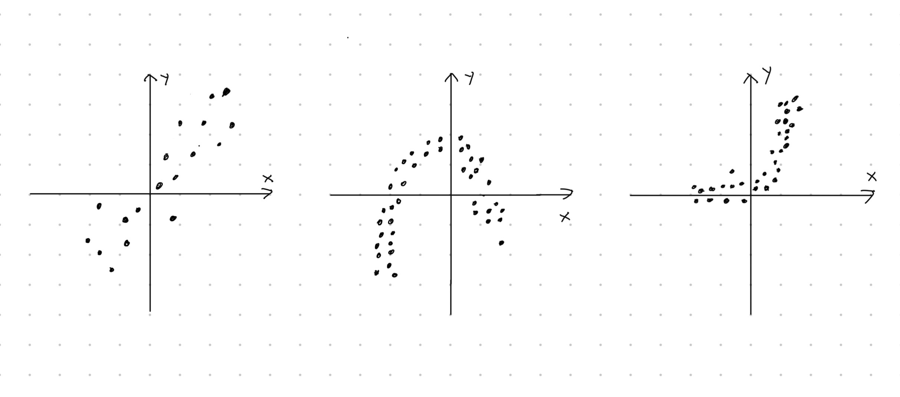
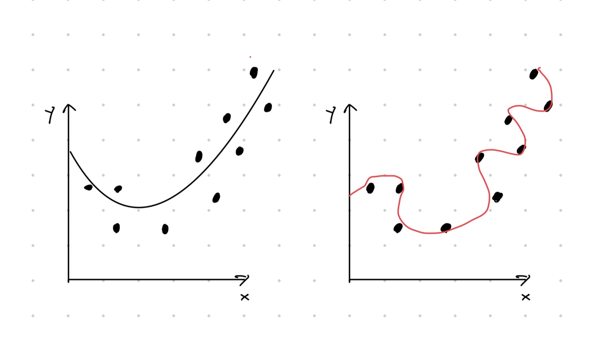

# Moniulotteinen lineaarinen regressio

(ref:regression) Kolmen $2$-ulotteisen havaintoaineiston hajontakuviot. Hajontakuvioiden muotojen perusteilla selitettävän muuttujan $y$ ja selittävän muuttujan $x$ riippuvuus on erilainen jokaisessa tapauksessa. Vasemmalla riippuvuus lineaarinen, keskellä neliöllinen ja oikealla eksponentiaalinen.

(ref:height-scatter) Hajontakuvio muuttujista `TotalHeight` ja `ArmLength`.

(ref:height-reg) Hajontakuvio muuttujista `TotalHeight` ja `ArmLength` sekä sovitettu regressiosuora.

(ref:3dreg) Kolmiulotteinen hajontakuvio esimerkkidatasta ja sovitettu regressiotaso.

(ref:overfit) Havainnekuva ylisovittamisesta. Vasemman kuvan sovitteessa otetaan huomioon aineistossa näkyvä neliöllinen riippuvuus. Oikeassa kuvassa liikasovitetaan satunnaisvirheeseen.

Regressiomallit ovat eräitä tärkeimpiä ja eniten käytettyjä tilastollisia malleja. Regressioanalyysin tavoitteena on mallintaa selitettävän muuttujan (eng: *response variable*, *outcome variable*) riippuvuutta selittävistä muuttujista (eng: *explanatory variable*). Esimerkiksi selitettävä muuttuja voisi olla yrityksen voittojen suuruus ja selittäviä muuttujia voisivat olla markkinointi ja työntekijöiden määrä. Regressioanalyysi pyrkisi tässä tapauksessa vastaamaan seuraavanlaisiin kysymyksiin:

- Kuinka paljon voitot kasvavat/vähenevät euroissa, kun markkinointiin investoidaan $r$ euroa?

- Entä kuinka paljon voitot kasvavat/vähenevät euroissa, jos palkkaamme $m$ työntekijää lisää?


Tilanne regressioanalyysissä on yleensä seuraavanlainen. Saatavilla on $n$ kappaletta $(d + 1)$-ulotteisia havaintoja
\begin{equation*}
  \left\{\underbrace{(y_1, x_{11}, x_{12}, \ldots, x_{1d})}_{\text{$d$-uloinen havainto nro $1$}}, \ldots, \underbrace{(y_n, x_{n1}, x_{n2}, \ldots, x_{nd})}_{\text{$d$-uloinen havainto nro $n$}}\right\}
\end{equation*}
satunaisvektorista $(Y, X_1, \ldots, X_d)$, jossa ensimmäinen komponentti kuvaa selitettävää muuttujaa ja muut komponentit antavat selittävät muuttujat. Havaintoaineiston avulla sovitetaan regressiomalli, joka yleisesti ottaen voi olla muotoa
\begin{equation}
  (\#eq:reggen)
  y_i = f(x_{i1}, x_{i2}, \ldots, x_{id}) + \varepsilon_i,
  \quad i\in\{1, 2,\ldots, n\},
\end{equation}
jossa $f$ mallintaa selittävän muuttujan ja selitettävien muuttujien välistä systemaattista suhdetta ja $\varepsilon_i$ on satunnainen virhetermi. Tästä johtuen yleensä selitettävän muuttujan arvo ei määräydy suoraan selittävistä muuttujista, vaan virhetermin vuoksi suhde on likimääräinen $y_i \approx f(x_{i1}, x_{i2}, \ldots, x_{i2})$. Virhetermit $\varepsilon_i$ voivat kuvata esimerkiksi mittausvirheitä tai ilmiöön liittyvää satunnaisuutta.

Perinteisessä regressioanalyysissä analyytikko päättää funktion $f$ muodon ennen mallin sovittamista. Kuvassa \@ref(fig:regression) näkyy kolmen $2$-ulotteisen kuvitteellisen havaintoaineiston
\begin{equation*}
  \left\{(y_1, x_1), \ldots, (y_n, x_n)\right\}
\end{equation*}
hajontakuviot.

```{r regression, echo=FALSE, fig.cap="(ref:regression)"}

```

Vasemmanpuoleisimpaan havaintoaineistoon voisi sopia yksiulotteinen lineaarinen regressiomalli, jossa funktio $f$ on muotoa
\begin{equation*}
  f(x_{i}) = \beta_0 + \beta_1 x_i.
\end{equation*}
Toisaalta keskimmäiseen havaintoaineistoon sopisi ehkäpä neliöllinen regressiomalli, jolloin
\begin{equation*}
  f(x_i) = \alpha_0 + \alpha_1 x_i + \alpha_2 x_i^2.
\end{equation*}
Oikeanpuoleiseen havaintoaineistoon voisi vastaavasti sovittaa eksponentiaalisen mallin
\begin{equation}
  (\#eq:exp)
  f(x_i) = \gamma_1 e^{\gamma_2 x_i}
\end{equation}
hajontakuvion muodon perusteella.

Kun mallin muoto on päätetty (lineaarinen, neliöllinen, ...), niin mallin parametrit estimoidaan annetun otoksen avulla. Esimerkiksi sovitettaessa lineaarista regressiomallia
\begin{equation*}
  y_i = \beta_0 + \beta_1 x_i + \varepsilon_i
\end{equation*}
tavoitteena on estimoida parametrit $\beta_0$ ja $\beta_1$ datan avulla. **Huomaa, että estimaatti tarkoittaa datan perusteella laskettua parasta arvausta tietylle parametrille**. Tämän vuoksi lasketut estimaatit erotetaan parametreista myös notaation kautta -- yksiulotteisen lineaarisen regressiomallin parametrit ovat $\beta_0$ ja $\beta_1$ sekä niitä vastaavat estimaatit ovat $\hat\beta_0$ ja $\hat\beta_1$.

Kun malli on sovitettu, niin estimaatteja $\hat\beta_0$ ja $\hat\beta_1$ voidaan tulkita. Mallin avulla voidaan tehdä myös ennustuksia tyyliin
\begin{equation*}
  \tilde y = \hat\beta_0 + \hat\beta_1 \tilde x,
\end{equation*}
jossa $\tilde y_i$ on mallin antama ennustus selittävän muuttujan arvolla $\tilde x$.

Seuraavassa esimerkissä suoritetaan regressioanalyysin päävaiheet R:llä yksiulotteisen lineaarisen regression kautta. Eli samalla esimerkki toimii minimaalisena kertauksena yksiulotteisesta lineaarisesta regressiosta, joka käytiin kurssilla *Tilastotieteen perusteet*. Jos haluat kerrata yksiulotteisen lineaarisen regression teoriaa tarkemmin (pienimmän neliösumman estimointi, mallin selitysaste jne), niin palaa *Tilastotieteen perusteiden materiaaleihin*.

::: {.example #simplereg name="Yksiulotteinen lineaarinen regressio"}
Käsitellään jo tuttua aineistoa kehon dimensioiden mittauksista (katso esimerkki \@ref(exm:body)). Tässä tapauksessa olemme kiinnostuneita vain muuttujista `TotalHeight` ja `ArmLength`. Tarkkaan ottaen haluamme ennustaa $35$ tuumaa ($\approx 90\text{cm}$ vastaa suurinpiirtein $2\text{v}$ taaperoa) pituisen ihmisen käsien pituuden.
```{r, echo=FALSE, message=FALSE}
library(dplyr)
coltypes <- stringr::str_c(rep("i", 13), collapse = "")
body <- readr::read_csv("data/body_measurements.csv", col_names = TRUE,
                        col_types = coltypes) %>%
  select(ArmLength, TotalHeight)
```

Siivottu havaintoaineisto ollaan jo tallennettu muuttujaan `body`.
```{r}
body
```
Aineisto siis sisältää $n = 716$ kappaletta $2$-ulotteisia havaintoja $(y_i, x_i) = (\texttt{ArmLength}_i, \texttt{TotalHeight}_i)$, $i\in\{1, 2, \ldots, n\}$. Kuvan \@ref(fig:height-scatter) hajontakuvion muodon perusteella yksiulotteisen lineaarisen regressiomallin
\begin{equation*}
  y_i = \beta_0 + \beta_1 x_i + \varepsilon_i
\end{equation*}
sovitus voisi olla järkevää.

```{r height-scatter, fig.cap="(ref:height-scatter)"}
plot(body[, 2:1])
```

R:ssä lineaarisen regressiomallin voi sovittaa komennolla `lm()`. Kommennossa notaatiolla `y ~ x` (tilde) erotetaan havainnot selitettävästä muuttujasta ja selittävästä muuttujasta. Tulostamalla muuttujan, johon malli ollaan tallennettu, voi nähdä parametreja $\beta_0$ ja $\beta_1$ vastaavat pienimmän neliösumman estimaatit.
```{r}
body_lm <- lm(ArmLength ~ TotalHeight, data = body)
body_lm
```
Tulostuksen perusteella estimaateiksi saatiin $\hat\beta_0\approx 7.65$ ja $\hat\beta_1\approx 0.23$. Tulkinnat parametreille ovat seuraavat:

- $\hat\beta_0\approx 7.65$ (vakiotermi): Kun lapsen pituus on nolla, niin käsien pituus on keskimäärin $7.65$ tuumaa. Huomaa tässä tulkinnan epärealistisuus. On hyvä muistaa, että mikään malli ei ole täydellinen.

- $\hat\beta_1\approx 0.23$ (kulmakerroin): Kun ihmisen pituus kasvaa yhden tuuman, niin käsien pituus kasvaa keskimäärin $0.23$ tuumaa. Tässä tapauksessa kulmakertoimen merkki on luonnollinen, koska pidemmällä ihmisellä on yleensä myös pidemmät kädet.

Regressiosuoran voi myös piirtää hajontakuvioon. Tätä varten täytyy päästä käsiksi regressiokertoimien arvoihin komennolla `body_lm$coefficients`. Kuvan \@ref(fig:height-reg) perusteella regressionmallin sovitus on hyvä visuaalisesti.
```{r height-reg, fig.cap="(ref:height-reg)"}
plot(body[, 2:1])
abline(a = body_lm$coefficients[1], b = body_lm$coefficients[2])
```

Mallin selitysaste $R^2$ kuvaa sovitteen hyvyyttä numeerisesti. Selitysaste on välillä $0\leq R^2 \leq 1$ ja mitä lähempänä $R^2$ arvo on lähellä ykköstä, sitä parempi sovite. Yhden muuttujan lineaarisen regression tapauksessa selitysaste on $\hat\rho_{\texttt{ArmLength}, \texttt{TotalHeight}}^2$, eli otoskorrelaatio potenssiin kaksi, kun otoskorrelaatio ollaan laskettu havaintojen $y_i = \texttt{ArmLength}_i$ ja $x_i = \texttt{TotalHeight}_i$ avulla. Mallin selitysasteen näkee käyttämällä komentoa `summary()` (katso tulosteessa `Multiple R-squared`).
```{r}
summary(body_lm)
```

Selityste ei ole kovin korkea ($R^2\approx 0.28$), mikä todennäköisesti johtuu havaintoaineiston muutamasta poikkeavasta havainnosta -- lineaarinen regressio pienimmän neliösumman kautta on erittäin herkkä poikkeavien havaintojen suhteen. Tästä huolimatta mallin avulla ennustamme käsien pituuden, kun henkilön pituus on $35$ tuumaa. Ennustuksen voi suorittaa kätevästi saatujen estimaattien $\hat\beta_0$ ja $\hat\beta_0$ arvoja käyttäen.
```{r}
x_tilde <- 35
body_lm$coefficients[1] + body_lm$coefficients[2] * x_tilde
```
Eli $35$ tuuman pituisen ihmisen käsien pituudeksi ennustetaan $15.77$ tuumaa.
:::

Tämän kurssin kannalta tärkein regressiomenetelmä on nimenomaan lineaarinen regressio. Laajennamme kuitenkin esimerkissä \@ref(exm:simplereg) käsiteltyä yksiulotteista lineaarista regressiota (eng: *simple linear regression*) monen selittävän muuttujan tapaukseen. Vaikka lineaarinen regressio saattaa alkusilmäyksellä vaikuttaa liian yksinkertaiselta mallilta käytännön sovelluksiin, niin näin ei kuitenkaan ole:

- Ensinnäkin monet epälineaariset mallit kuten eksponentiaalinen ja neliöllinen malli voidaan sovittaa lineaarisen regression avulla.

    - Jo kurssilla *Johdatus data-analytiikkaan* todettiin, että eksponentiaalisen mallin parametrit (kaavan \@ref(eq:exp) parametrit $\gamma_1$ ja $\gamma_2$) voidaan estimoida sovittamalla yksiulotteinen lineaarinen regressiomalli muunnetulle datalle.
    
    - Lisäksi viikon 4 tehtävässä 3 näemme kuinka neliöllinen malli voidaan sovittaa moniulotteisen lineaarisen regression avulla.

- Usein tavoitteena on löytää mahdollisimman yksinkertainen malli, joka kuitenkin mallintaa alla olevaa ilmiötä mahdollisimman hyvin (eng: *parsimonious model*). Tämän vuoksi lineaarinen regressio on käytännön kannalta erittäin hyödyllinen monessa eri sovelluksessa. Esimerkkinä voimme mainita viikon 4 tehtävän 2, jossa tuottoja mallinetaan muilla taustatekijöillä.

Lisäksi tilastollisen mallintamisen opettelun näkökulmasta lineaarinen regressio on erinomainen lähtökohta -- monet monimutkaisemmat mallit (aikasarjamallinnus, neuroverkot, ...) on vaikea ymmärtää ilman perustaitoja.

## Määritelmä ja oletukset

Kuten luvun esittelyssä, oletetaan että saatavilla on $n$ kappaletta $(d+1)$-ulotteisia havaintoja
\begin{equation*}
  \left\{\underbrace{(y_1, x_{11}, x_{12}, \ldots, x_{1d})}_{\text{$d$-uloinen havainto nro $1$}}, \ldots, \underbrace{(y_n, x_{n1}, x_{n2}, \ldots, x_{nd})}_{\text{$d$-uloinen havainto nro $n$}}\right\}
\end{equation*}
satunaisvektorista $(Y, X_1, \ldots, X_d)$, jossa ensimmäinen komponentti antaa selitettävän muuttujan havainnot ja muut komponentit antavat selittävien muuttujien havainnot. Selittäviä muuttujia on siis $d$ kappaletta. Moniulotteisessa lineaarisessa regressiossa oletetaan seuraavanlainen suhde selitettävän ja selittävien muuttujien välillä,
\begin{equation}
  (\#eq:regression)
  \begin{split}
    y_i &= \beta_0 + \beta_1 x_{i1} + \beta_2 x_{i2} + \cdots + \beta_d x_{id} + \varepsilon_i \\
    &= \beta_0 + \left(\sum_{j = 1}^d \beta_j x_{ij}\right) + \varepsilon_i,
    \quad i\in\{1, 2,\ldots, n\},
  \end{split}
\end{equation}
jossa $\varepsilon_i$ ovat satunnaisia virhetermejä. Yllä oleva malli seuraa siis yhtälön \@ref(eq:reggen) yleisestä regressiomallista valinnalla $f(x_{i1}, x_{i2}, \ldots, x_{id}) = \beta_0 + \sum_{j = 1}^d \beta_j x_{ij}$.

Tähän mennessä emme ole käsitelleet virhetermeihin $\varepsilon_i$ liittyviä oletuksia sen tarkemmin. Tästä eteenpäin kuitenkin oletamme, että lineaarisen regressiomallin virhetermit ovat valkoista kohinaa ellei toisin sanota.

::: {.definition #whitenoise name="Valkoinen kohina"}
Satunnaismuuttujat $\varepsilon_1, \varepsilon_2, \ldots, \varepsilon_n$ ovat valkoista kohinaa, jos

1. jokainen satunnaismuuttuja $\varepsilon_i$ noudattaa normaalijakaumaa $\varepsilon_i\sim N(0, \sigma^2)$ odotusarvolla $0$ ja varianssilla $\sigma^2 > 0$, ja

2. satunnaismuuttujat $\varepsilon_1, \varepsilon_2, \ldots, \varepsilon_n$ ovat riippumattomia.
:::

Yllä olevan määritelmän oletuksia voidaan monissa tapauksissa lieventää. Esimerkiksi oletus normaalijakautuneisuudesta ei ole aina tarpeen tai edes realistinen. Kuitenkin mukavuussyistä rajoitumme määritelmän \@ref(def:whitenoise) mukaisiin oletuksiin virhetermeille $\varepsilon_i$. Virhetermien oletuksista seuraa esimerkiksi seuraavaa:

1. Virhetermin $\varepsilon_i$ varianssi ei riipu selittävien muuttujien havainnoista $(x_{i1}, x_{i2}, \ldots, x_{id})$. Jos näin kuitenkin olisi, niin mallia kutsuttaisiin heteroskedastiseksi tai erivarianssiseksi (eng: *heteroskedastic*).

2. Mille tahansa parille virhetermejä $\varepsilon_i$ ja $\varepsilon_j$ pätee $\mathrm{Cov}\left(\varepsilon_i, \varepsilon_j\right) = 0$, kun $i\neq j$.

Toinen tärkeä oletus liittyy selittäviin muuttujiin $X_1, X_2, \ldots, X_d$. Yleensä nimittäin oletetaan, että selittävät muuttujat ovat korreloimattomia. Lyhyesti sanottuna, lineaarisesta regressiomallista tulee epävakaa, jos siihen sisällytetään korreloituneita selittäviä muuttujia. Tilastollisessa mallintamisessa onkin aina tärkeää miettiä ennen itse analyysiä, pätevätkö mallin oletukset. Tätä kutsutaan mallidiagnostiikaksi, jota käsitellään tarkemmin luvussa \@ref(sec:diagnostic).

Lineaarisen regressiomallin määritelmä voidaan myös kirjoittaa hyödyntäen matriisinotaatiota. Ensin kerätään havainnot selitettävästä muuttujasta omaan vektoriinsa, havainnot selittävistä muuttujista omaan matriisiin (jossa 1. sarake on vain ykkösiä), parametrit $\beta_j$ omaan vektoriinsa ja virhetermit omaan vektoriinsa
\begin{equation*}
\begin{split}
  &\boldsymbol y =
  \begin{pmatrix}
    y_1 \\ y_2 \\ \vdots \\ y_n
  \end{pmatrix}\in\mathbb{R}^n, \quad
  \boldsymbol X =
  \begin{pmatrix}
    1 & x_{11} & x_{12} & \cdots & x_{1d} \\
    1 & x_{21} & x_{22} & \cdots & x_{2d} \\
    \vdots & \vdots & \ddots & \vdots \\
    1 & x_{n1} & x_{n2} & \cdots & x_{nd}
  \end{pmatrix} \in\mathbb{R}^{n\times (d+1)}, \\
  &\boldsymbol\beta =
  \begin{pmatrix}
    \beta_0 \\ \beta_1 \\ \vdots \\ \beta_d
  \end{pmatrix}\in\mathbb{R}^{d+1},\ \text{ja}\quad
  \boldsymbol\varepsilon =
  \begin{pmatrix}
    \varepsilon_1 \\ \varepsilon_2 \\ \vdots \\ \varepsilon_n
  \end{pmatrix}\in\mathbb{R}^n.
  \end{split}
\end{equation*}
Eli matriisin $\boldsymbol X$ sarake $j+1$ antaa havainnot selitettävästä muuttujasta $X_j$, $j\in\{1,\ldots, d\}$. Matriisin $\boldsymbol X$ ensimmäinen sarake ykkösiä ottaa huomioon sen, että parametri $\beta_0$ otetaan huomioon oikealla tavalla suoritettaessa matriisikertolaskut. Yhtälön \@ref(eq:regression) määritelmä voidaan siis kirjoittaa matriisikertolaskuilla muodossa
\begin{equation}
(\#eq:regmatrix)
  \boldsymbol y = \boldsymbol X \boldsymbol\beta + \boldsymbol\varepsilon,
\end{equation}
jossa oletuksesta \@ref(def:whitenoise) seuraa, että $\boldsymbol\varepsilon$ noudattaa $n$-ulotteista normaalijakaumaa tietyillä sijainti- ja hajontaparametreilla $\boldsymbol\varepsilon\sim N(\boldsymbol 0, \sigma^2 \boldsymbol I)$ -- sijainti on nollavektori ja hajontaparametri on diagonaalimatriisi. 

Alla on vielä käytännönläheinen esimerkki siitä, miten yrityksen data-analyytikko voisi muotoilla lineaarisen regressiomallinnustehtävän.

::: {.example #regconstruction name="Mallinnustehtävän muotoilu"}
Oletetaan, että yritys haluaa mallintaa tuotteen myynnistä saatavaa kuukausittaista voittoa $Y$ (tuhansissa euroissa) kahden keskeisen tekijän perusteella. Yrityksen aiempien analyysien mukaan voittoon vaikuttavat erityisesti
seuraavat muuttujat:

- $X_1 = \text{Mainosbudjetti kuukaudessa (tuhansina euroina)}$

- $X_2 = \text{Tuotteen hinta (tuhansina euroina)}$

Yrityksellä on kymmenen eri kuukauden myyntidata
\begin{equation*}
  \begin{split}
  &(y_i, x_{i1}, x_{i2}) = (\text{voitto $i.$kk}, \text{mainosbudjetti $i.$kk}, \text{tuotteen hinta $i.$kk}), \\
  &i\in\{1,2, \ldots, 10\}
  \end{split}
\end{equation*}
liittyen satunnaisvektoriin $(Y, X_1, X_2)$. Yrityksen data-analyytikko haluaa siis sovittaa lineaarisen regressiomallin
\begin{equation*}
  y_i = \beta_0 + \beta_1 x_{i1} + \beta_2 x_{i2} + \varepsilon_i
\end{equation*}
tai vielä monisanaisemmin
\begin{equation*}
  \texttt{voitto}_i = \beta_0 + \beta_1 \texttt{mainostus}_i + \beta_2 \texttt{hinta}_i + \varepsilon_i.
\end{equation*}
Mallinsovitustehtävän voisi muotoilla yhtälön \@ref(eq:regmatrix) mukaan määrittelemällä oikeanlaiset matriisit ja vektorit, kun otoskoko on $n = 10$ ja selittäviä muuttujia on $d = 2$,
\begin{equation*}
\begin{split}
  &\boldsymbol y =
  \begin{pmatrix}
    y_1 \\ y_2 \\ \vdots \\ y_{10}
  \end{pmatrix}\in\mathbb{R}^{10}, \quad
  \boldsymbol X =
  \begin{pmatrix}
    1 & x_{11} & x_{12} \\
    1 & x_{21} & x_{22} \\
    \vdots & \vdots & \vdots \\
    1 & x_{n1} & x_{n2} \\
  \end{pmatrix} \in\mathbb{R}^{10\times 3}, \\
  &\boldsymbol\beta =
  \begin{pmatrix}
    \beta_0 \\ \beta_1 \\ \beta_2
  \end{pmatrix}\in\mathbb{R}^{3},\ \text{ja}\quad
  \boldsymbol\varepsilon =
  \begin{pmatrix}
    \varepsilon_1 \\ \varepsilon_2 \\ \vdots \\ \varepsilon_{10}
  \end{pmatrix}\in\mathbb{R}^{10}.
  \end{split}
\end{equation*}
:::

## Mallin sovittaminen ja tulkinta

Olettaessa lineaarisen regressiomallin $\boldsymbol y = \boldsymbol X \boldsymbol\beta + \boldsymbol\varepsilon$ data-analyytikko tietää ainoastaan otoksen selitettävästä muuttujasta (vektori $\boldsymbol y$) ja otokset selittävistä muuttujista (matriisi $\boldsymbol X$). Sekä parametrivektori $\boldsymbol\beta$ että virhetermi $\boldsymbol\varepsilon$ ovat tuntemattomia. Tavoitteena on yleensä siis estimoida parametrivektori $\boldsymbol\beta$ ja virhetermin $\boldsymbol\varepsilon$ varianssi $\sigma^2$ datan perusteella. Tässä keskitymme erityisesti parametrivektorin estimointiin.

Perinteisesti parametrivektori $\boldsymbol\beta$ estimoidaan pienimmän neliösumman menetelmällä (PNS) (eng: *method of least squares*). Tarkemmin sanottuna tavoite on löytää sellainen vektori $\hat{\boldsymbol\beta} = (\hat\beta_0, \hat\beta_1, \ldots, \hat\beta_d)$, joka minimoi neliövirheiden summaa
\begin{equation*}
  SSE = \sum_{i = 1}^n \left(y_i - \hat y_i\right)^2,
\end{equation*}
jossa
\begin{equation}
  (\#eq:fit) 
  \begin{split}
  \hat y_i &= \hat\beta_0 + \hat\beta_1 x_{i1} + \hat\beta_2 x_{i2} + \cdots + \hat\beta_d x_{id} \\
    &= \hat\beta_0 + \left(\sum_{j = 1}^d \hat\beta_j x_{ij}\right).
    \end{split}
\end{equation}
Eli lopullisen estimaattorin $\hat{\boldsymbol\beta}$ antama "arvaus" $\hat y_i$ oikealle arvolle $y_i$ on mahdollisimman hyvä ($SSE$ mielessä). Edellä määritellylle PNS estimaattorille $\hat{\boldsymbol\beta}$ on kaava datamatriisin $\boldsymbol X$ ja datavektorin $\boldsymbol y$ suhteen
\begin{equation*}
  \hat{\boldsymbol\beta} = \left(\boldsymbol X^T \boldsymbol X\right)^{-1}\boldsymbol X^T\boldsymbol y.
\end{equation*}
PNS estimaattorin $\hat{\boldsymbol\beta}$ avulla annettuja kaavan \@ref(eq:fit) arvauksia $\hat y_i$ kutsutaan sovitteiksi (eng: *fitted value*).

Estimaattien $\hat\beta_0, \hat\beta_1, \ldots, \hat\beta_d$ arvoja tulkitaan samaan tyyliin kuin yksiulotteisessa lineaarisessa regressiossa.

- **Vakiotermi**: estimaatti $\hat\beta_0$ kertoo selitettävän muuttujan $y_i$ keskimääräisen arvon, kun selittävien muuttujien arvot asetetaan nollaan $x_{i1} = x_{i2} = \cdots = x_{id} = 0$. 

- **Kulmakertoimet**: oletetaan, että selittävän muuttujan $j$ arvo kasvaa yhdellä yksiköllä ($x_{ij}\rightarrow x_{ij} + 1$) ja muiden selittävien muuttujien arvot pysyvät samoina. Tällöin regressiokertoimen estimaatti $\hat\beta_j$ kertoo keskimääräisen muutoksen selitettävässä muuttujassa ($y_i\rightsquigarrow y_i + \hat\beta_j$)

Alla oleva esimerkki valottaa lineaarisen mallin sovitusta ja tulkintaa käytännössä.
```{r echo=FALSE}
# Simulate dummy data for linear regression
set.seed(123)
n <- 10

# constant, advertisement, price
b <- c(0, 2, -5.4)


constant <- rep(1, n)
advertisement <- runif(n, 0, 10)
price <- runif(n, 0, 5)
epsilon <- rnorm(n, 0, 4)

xmat <- matrix(c(constant, advertisement, price), ncol = 3, byrow = FALSE)
profit <- xmat %*% b + epsilon

sale <- tibble::tibble(profit = profit[,1], advertisement = advertisement,
                       price = price)
```


::: {.example #fitreg name="Moniulotteisen lineaarisen mallin sovitus ja tulkinta"}
Jatkamme esimerkkiä \@ref(exm:regconstruction). Eli meillä on kuvitteellinen $n = 10$ kokoinen havaintoaineisto. Havainnot ovat toteumia satunnaisvektorista $(Y, X_1, X_2)$, jossa

- $Y = \text{voitto kuukaudessa (tuhansina euroina)}$,

- $X_1 = \text{mainosbudjetti kuukaudessa (tuhansina euroina)}$ ja

- $X_2 = \text{tuotteen hinta (tuhansina euroina)}$.

```{r}
sale
```

Lineaarisen regressiomallin
\begin{equation*}
  \texttt{voitto}_i = \beta_0 + \beta_1 \texttt{mainostus}_i + \beta_2 \texttt{hinta}_i + \varepsilon_i
\end{equation*}
voi sovittaa `lm()` funktiolla. Selitettävä muuttuja asetetaan tilden `~` vasemmalle puolelle ja selittävät muuttujat asetetaan tilden `~` oikealle puolelle. Tulostamalla mallin sovitteen sisältävän muuttujan näemme estimaatit $\hat\beta_0$, $\hat\beta_1$ ja $\hat\beta_2$.

```{r}
sale_lm <- lm(profit ~ advertisement + price, data = sale)
sale_lm
```

Mallin sovitus on siis muotoa
\begin{equation*}
  \widehat{\texttt{voitto}}_i = `r round(sale_lm$coef[1], 3)` + `r round(sale_lm$coef[2], 3)`\cdot \texttt{mainostus}_i `r round(sale_lm$coef[3], 3)`\cdot \texttt{hinta}_i
\end{equation*}

ja estimaattien tulkinnat ovat seuraavat:

- $\hat\beta_0 = `r round(sale_lm$coef[1], 3)`$: Kun mainostukseen panostetaan nolla euroa ja tuotteen hinta on nolla euroa, niin voitot ovat $5886$ euroa (tässä mallissa vakiotermin estimaatin $\hat\beta_0$ tulkinta ei ole kovin luontevaa).
    - *Huomio*: Itseasiassa esimerkin data on simuloitu mallista, jossa $\beta_0 = 0$. Eli estimaatti on tässä tapauksessa melko kaukana parametrin oikeasta arvosta, joka johtuu siitä, että havaintoja on hyvin vähän kuvan \@ref(fig:3dreg) tason $(\texttt{advertisement}, \texttt{price})$ origon lähellä -- seurauksena estimaattorin $\hat\beta_0$ varianssi on melko suuri.

- $\hat\beta_1 = `r round(sale_lm$coef[2], 3)`$: Kun mainostukseen panostetaan $1000$ euroa lisää tuotteen hinnan pysyessä ennallaan, niin voitot **kasvavat** keskimäärin $1032$ euroa.

- $\hat\beta_2 = `r round(sale_lm$coef[3], 3)`$: Kun tuotteen hinta kasvaa $1000$ euroa mainosbudjetin pysyessä ennallaan, niin voitot **vähenevät** keskimäärin $5191$ euroa. Tämä voi johtua esimerkiksi siitä, että kysyntä pienenee kun hinta kasvaa liian suureksi.

Tässä tapauksessa datan ja sovitetun mallin voi visualisoida kolmessa ulottuvuudessa. Kuva \@ref(fig:3dreg) näyttää seuraavan faktan. Kun selittäviä muuttujia on kaksi, niin sovitettu regressiomalli vastaa tasoa kolmessa ulottuvuudessa.

```{r 3dreg, echo=FALSE, message = FALSE, fig.cap="(ref:3dreg)"}
library(plotly)

# Sample data
x <- sale$advertisement
y <- sale$price
z <- sale$profit

model <- lm(z ~ x + y)

# Create grid for the plane
x_grid <- seq(min(x), max(x), length.out = 10)
y_grid <- seq(min(y), max(y), length.out = 10)
surface <- expand.grid(x = x_grid, y = y_grid)
z_surface <- predict(model, newdata = surface)

plot_ly() %>%
  add_trace(data = sale, x = ~advertisement, y = ~price, z = ~profit, 
            type = "scatter3d", mode = "markers", name = "Data") %>%
  add_trace(x = surface$x, y = surface$y, z = z_surface, type = "mesh3d",
            opacity = 0.5)
```
:::

## Sovitteen hyvyys ja ennustaminen

Kuten yhden selittäjän lineaarisessa regressiossa myös moniulotteisessa lineaarisessa regressiossa mallin sovituksen hyvyyttä voidaan arvioida selitysasteen $R^2$ avulla. Moniulotteisen lineaarisen regression tapauksessa selitysaste määritellään
\begin{equation*}
  R^2 = 1 - \frac{\sum_{i = 1}^n\left(y_i - \hat y_i\right)^2}{\sum_{i = 1}^n\left(y_i - \bar y\right)^2} = 1 - \frac{SSE}{SST},
\end{equation*}
jossa $\hat y_i$ ovat kaavan \@ref(eq:fit) mukaiset sovitteet ja $\bar y = \frac{1}{n}\sum_{i = 1}^n y_i$. Selitysasteen tulkinta on samanlainen kuin yhden selittäjän lineaarisessa regressiossa -- selitysaste $R^2\in[0,1]$ kertoo, kuinka hyvin selittävät muuttujat kuvaavat selitettävän muuttujan vaihtelua. Mitä lähempänä selitysasteen arvo on ykköstä, niin sitä parempi mallin sovitus on.

On matemaattinen fakta, että mitä monimutkaisempi malli dataan sovitetaan sitä parempi sovituksesta tulee tai sovite pysyy ainakin yhtä hyvänä. Kuitenkin mallin monimutkaisuuden kasvaessa usein aletaan selittämään satunnaisvirhettä systemaattisen osuuden lisäksi (vertaa yhtälöön \@ref(eq:reggen)). Ilmiötä kutsutaan liikasovitukseksi (eng: *overfitting*). **Liikasovitettu malli on yleensä täysin hyödytön, koska malli ei yleisty millään tavalla sovitetun datan ulkopuolelle. Esimerkiksi liikasovitetun mallin ennustukset tulevat olemaan todennäköisesti täysin pielessä.** Kuvan \@ref(fig:overfit) oikea havainnekuva näyttää aivan äärimmäisen tapauksen liikasovitteesta.

```{r overfit, echo=FALSE, fig.cap="(ref:overfit)"}

```

Lineaarisen regression tapauksessa liikasovitus on myös mahdollista, sillä lisättäessä uusi selittävä muuttuja malliin, selitysasteen $R^2$ arvo nousee tai pysyy samana. Näin tapahtuu aina, vaikka itse selittävällä muuttujalla ei olisi mitään tekemistä mallinnettavan ilmiön kanssa. Tämän vuoksi tuijotettaessa pelkästään selitysasteen $R^2$ arvoa voidaan vahingossa syyllistyä liikasovittamiseen.

Ylisovittamisen välttämiseksi selitysasteen sijasta käytetään yleensä muokattua selitysastetta $R_{adj}^2$ (eng: *adjusted $R^2$*), joka rankaisee mallin monimutkaisuudesta eli lineaarisen regression tapauksessa selittävien muuttujien määrästä $d$,
\begin{equation*}
  R_{adj}^2 = 1 - \left(1 - R^2\right)\frac{n-1}{n-d-1}.
\end{equation*}

(ref:rsq) Arvojen $R^2$ ja $R_{adj}^2$ laskeminen

R ohjelmointikieli laskee molemmat arvot $R^2$ ja $R_{adj}^2$ valmiiksi.

::: {.example name="(ref:rsq)"}
Jatketaan esimerkkiä \@ref(exm:fitreg), jossa saimme sovitteeksi
\begin{equation*}
  \widehat{\texttt{voitto}}_i = `r round(sale_lm$coef[1], 3)` + `r round(sale_lm$coef[2], 3)`\cdot \texttt{mainostus}_i `r round(sale_lm$coef[3], 3)`\cdot \texttt{hinta}_i.
\end{equation*}
Mallin sovite on tallennettu muuttujaan `sale_lm` mutta selitysastetta ei näe suoraan kyseisestä muuttujasta. Arvot $R^2$ ja $R_{adj}^2$ näkee käyttämällä `summary()` funktiota. Tulosteen kohdista `Multiple R-squared` ja `Adjusted R-squared` näemme, että $R^2\approx 0.95$ ja $R_{adj}^2\approx 0.93$. Erityisesti $R_{adj}^2$ on lähellä ykköstä, joten voimme päätellä mallin sovitteen olevan hyvä ja sopiva esimerkin ilmiön mallintamiseen.
```{r}
summary(sale_lm)
```

Funktio `summary()` antaa paljon informaatiota, jonka tulkitsemista käydään läpi myöhemmissä luvuissa. Halutessasi voit tulostaa pelkät arvot $R^2$ ja $R_{adj}^2$ seuraavasti.
```{r}
summary(sale_lm)$r.squared
summary(sale_lm)$adj.r.squared
```
:::

Sovitetun moniulotteisen lineaarisen regressiomallin avulla voi laskea ennustuksia aivan kuten yhden muuttujan lineaarisen regression tapauksessa. Eli selitettävän muuttujan ennuste $\tilde y$ selittävien muuttujien arvoilla $\tilde x_1, \ldots, \tilde x_d$ saadaan kaavasta
\begin{equation*}
  \tilde y_i = \hat\beta_0 + \sum_{j = 1}^d \hat\beta_j \tilde x_j.
\end{equation*}
Ennustuksiin liittyy epävarmuutta, joka kvantifioidaan tarkemmin luvussa \@ref(sec:interval). Tässä kohtaa tyydymme näyttämään, miten ennustuksia lasketaan R:llä.

::: {.example name="Ennustusten laskeminen"}
Jatketaan esimerkkiä \@ref(exm:fitreg), jossa saimme sovitteeksi
\begin{equation*}
  \widehat{\texttt{voitto}}_i = `r round(sale_lm$coef[1], 3)` + `r round(sale_lm$coef[2], 3)`\cdot \texttt{mainostus}_i `r round(sale_lm$coef[3], 3)`\cdot \texttt{hinta}_i.
\end{equation*}
Voisimme eristää estimaatit $\hat\beta_0, \hat\beta_1, \hat\beta_2$ komennolla `sale_lm$coefficients` ja laskea ennustuksia mekaanisesti. R:ssä on kuitenkin myös oma funktio `predict()` ennustusten laskemiseen. Funktio ottaa sisäänsä itse sovitetun mallin `sale_lm` ja halutut selittävien muuttujien arvot `data.frame` tietotyyppinä. Alla laskemme ennustukset arvoilla $(\texttt{mainostus}, \texttt{hinta}) = (6, 3)$ ja $(\texttt{mainostus}, \texttt{hinta}) = (8, 2.4)$.
```{r}
# Define data.frame corresponding the values of the explanatory variables
newdata <- data.frame(advertisement = c(6, 8), price = c(3, 2.4))

# Compute predictions
preds <- predict(sale_lm, newdata)
preds
```
Esimerkiksi selitettävien muuttujien arvoilla $(\texttt{mainostus}, \texttt{hinta}) = (8, 2.4)$ saamme ennustuksen $\tilde y \approx 1.68$ (tuhatta euroa).
:::

Ennustuksien tekeminen sovitetun mallin ulkopuolelle on usein kyseenalaista, koska tällöin oletamme, että ilmiö käyttäytyy lineaarisesti myös havaintoaineiston ulkopuolella. Tämä ei kuitenkaan päde moninaisissa sovelluksissa. Esimerkiksi startup yrityksen tuotot saattavat kasvaa alussa lineaarisesti markkinoinnin suhteen. Kuitenkin kun yrityksestä tulee tunnetumpi, niin markkinoinnin vaikutus pienenee.

## Mallin ja regressiokertoimien merkitsevyys

## Luottamus- ja ennustevälit {#sec:interval}

## Mallidiagnostiikka {#sec:diagnostic}
