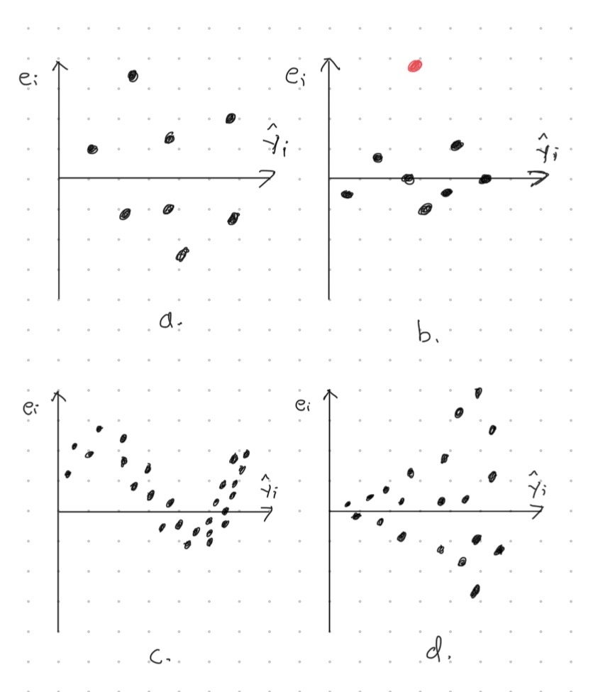
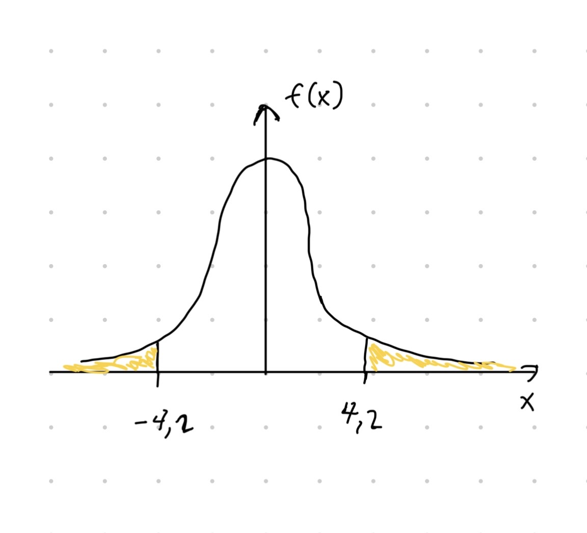

# Moniulotteinen lineaarinen regressio

(ref:regression) Kolmen kaksiulotteisen havaintoaineiston hajontakuviot. Hajontakuvioiden muotojen perusteilla selitettävän muuttujan ja selittävän muuttujan riippuvuus on erilainen jokaisessa tapauksessa. Vasemmalla riippuvuus lineaarinen, keskellä neliöllinen ja oikealla eksponentiaalinen.

(ref:height-scatter) Hajontakuvio muuttujista `TotalHeight` ja `ArmLength`.

(ref:height-reg) Hajontakuvio muuttujista `TotalHeight` ja `ArmLength` sekä sovitettu regressiosuora.

(ref:3dreg) Kolmiulotteinen hajontakuvio esimerkkidatasta ja sovitettu regressiotaso.

(ref:overfit) Havainnekuva ylisovittamisesta. Vasemman kuvan sovitteessa otetaan huomioon aineistossa näkyvä neliöllinen riippuvuus. Oikeassa kuvassa liikasovitetaan satunnaisvirheeseen.

Regressiomallit ovat eräitä tärkeimpiä ja eniten käytettyjä tilastollisia malleja. Regressioanalyysin tavoitteena on mallintaa selitettävän muuttujan (eng: *response variable*, *outcome variable*) riippuvuutta selittävistä muuttujista (eng: *explanatory variable*). Esimerkiksi selitettävä muuttuja voisi olla yrityksen voittojen suuruus ja selittäviä muuttujia voisivat olla markkinointi ja työntekijöiden määrä. Regressioanalyysi pyrkisi tässä tapauksessa vastaamaan seuraavanlaisiin kysymyksiin:

- Kuinka paljon voitot kasvavat/vähenevät euroissa, kun markkinointiin investoidaan $r$ euroa?

- Entä kuinka paljon voitot kasvavat/vähenevät euroissa, jos palkkaamme $m$ työntekijää lisää?


Tilanne regressioanalyysissä on yleensä seuraavanlainen. Saatavilla on $n$ kappaletta $(d + 1)$-ulotteisia havaintoja
\begin{equation*}
  \left\{\underbrace{(y_1, x_{11}, x_{12}, \ldots, x_{1d})}_{\text{$(d+1)$-ulotteinen havainto nro $1$}}, \ldots, \underbrace{(y_n, x_{n1}, x_{n2}, \ldots, x_{nd})}_{\text{$(d+1)$-ulotteinen havainto nro $n$}}\right\}
\end{equation*}
satunaisvektorista $(Y, X_1, \ldots, X_d)$, jossa ensimmäinen komponentti kuvaa selitettävää muuttujaa ja muut komponentit antavat selittävät muuttujat. Havaintoaineiston avulla sovitetaan regressiomalli, joka yleisesti ottaen voi olla muotoa
\begin{equation}
  (\#eq:reggen)
  y_i = f(x_{i1}, x_{i2}, \ldots, x_{id}) + \varepsilon_i,
  \quad i\in\{1, 2,\ldots, n\},
\end{equation}
jossa $f$ mallintaa selitettävän muuttujan ja selittävien muuttujien välistä systemaattista suhdetta ja $\varepsilon_i$ on satunnainen virhetermi. Tästä johtuen yleensä selitettävän muuttujan arvo ei määräydy suoraan selittävistä muuttujista, vaan virhetermin vuoksi suhde on likimääräinen $y_i \approx f(x_{i1}, x_{i2}, \ldots, x_{i2})$. Virhetermit $\varepsilon_i$ voivat kuvata esimerkiksi mittausvirheitä tai ilmiöön liittyvää satunnaisuutta.

Perinteisessä regressioanalyysissä analyytikko päättää funktion $f$ muodon ennen mallin sovittamista. Kuvassa \@ref(fig:regression) näkyy kolmen $2$-ulotteisen kuvitteellisen havaintoaineiston $\left\{(y_1, x_1), \ldots, (y_n, x_n)\right\}$ hajontakuviot.

```{r regression, echo=FALSE, fig.cap="(ref:regression)"}
knitr::include_graphics("images/regression.jpg")
```

Vasemmanpuoleisimpaan havaintoaineistoon voisi sopia yksiulotteinen lineaarinen regressiomalli, jossa funktio $f$ on muotoa
\begin{equation*}
  f(x_{i}) = \beta_0 + \beta_1 x_i.
\end{equation*}
Toisaalta keskimmäiseen havaintoaineistoon sopisi ehkäpä neliöllinen regressiomalli, jolloin
\begin{equation*}
  f(x_i) = \alpha_0 + \alpha_1 x_i + \alpha_2 x_i^2.
\end{equation*}
Oikeanpuoleiseen havaintoaineistoon voisi vastaavasti sovittaa eksponentiaalisen mallin
\begin{equation}
  (\#eq:exp)
  f(x_i) = \gamma_1 e^{\gamma_2 x_i}
\end{equation}
hajontakuvion muodon perusteella.

Kun mallin muoto on päätetty (lineaarinen, neliöllinen, ...), niin mallin parametrit estimoidaan annetun otoksen avulla. Esimerkiksi sovitettaessa lineaarista regressiomallia
\begin{equation*}
  y_i = \beta_0 + \beta_1 x_i + \varepsilon_i
\end{equation*}
tavoitteena on estimoida parametrit $\beta_0$ ja $\beta_1$ datan avulla. **Huomaa, että estimaatti tarkoittaa datan perusteella laskettua parasta arvausta tietylle parametrille**. Tämän vuoksi lasketut estimaatit erotetaan parametreista myös notaation kautta -- yksiulotteisen lineaarisen regressiomallin parametrit ovat $\beta_0$ ja $\beta_1$ sekä niitä vastaavat estimaatit ovat $\hat\beta_0$ ja $\hat\beta_1$.

Kun malli on sovitettu, niin estimaatteja $\hat\beta_0$ ja $\hat\beta_1$ voidaan tulkita. Mallin avulla voidaan tehdä myös ennustuksia tyyliin
\begin{equation*}
  \tilde y = \hat\beta_0 + \hat\beta_1 \tilde x,
\end{equation*}
jossa $\tilde y_i$ on mallin antama ennustus selittävän muuttujan arvolla $\tilde x$.

Seuraavassa esimerkissä suoritetaan regressioanalyysin päävaiheet R:llä yksiulotteisen lineaarisen regression kautta. Eli samalla esimerkki toimii minimaalisena kertauksena yksiulotteisesta lineaarisesta regressiosta, joka käytiin kurssilla *Tilastotieteen perusteet*. Jos haluat kerrata yksiulotteisen lineaarisen regression teoriaa tarkemmin (pienimmän neliösumman estimointi, mallin selitysaste jne), niin palaa *Tilastotieteen perusteiden materiaaleihin*.

::: {.example #simplereg name="Yksiulotteinen lineaarinen regressio"}
Käsitellään jo tuttua aineistoa kehon dimensioiden mittauksista (katso esimerkki \@ref(exm:body)). Tässä tapauksessa olemme kiinnostuneita vain muuttujista `TotalHeight` ja `ArmLength`. Tarkkaan ottaen haluamme ennustaa $35$ tuumaa ($\approx 90\text{cm}$ vastaa suurinpiirtein $2\text{v}$ taaperoa) pituisen ihmisen käsien pituuden.
```{r, echo=FALSE, message=FALSE}
library(dplyr)
coltypes <- stringr::str_c(rep("i", 13), collapse = "")
body <- readr::read_csv("data/body_measurements.csv", col_names = TRUE,
                        col_types = coltypes) %>%
  select(ArmLength, TotalHeight)
```

Siivottu havaintoaineisto ollaan jo tallennettu muuttujaan `body`.
```{r}
body
```
Aineisto siis sisältää $n = 716$ kappaletta $2$-ulotteisia havaintoja $(y_i, x_i) = (\texttt{ArmLength}_i, \texttt{TotalHeight}_i)$, $i\in\{1, 2, \ldots, n\}$. Kuvan \@ref(fig:height-scatter) hajontakuvion muodon perusteella yksiulotteisen lineaarisen regressiomallin
\begin{equation*}
  y_i = \beta_0 + \beta_1 x_i + \varepsilon_i
\end{equation*}
sovitus voisi olla järkevää.

```{r height-scatter, fig.cap="(ref:height-scatter)"}
plot(body[, 2:1])
```

R:ssä lineaarisen regressiomallin voi sovittaa komennolla `lm()`. Kommennossa notaatiolla `y ~ x` (tilde) erotetaan havainnot selitettävästä muuttujasta ja selittävästä muuttujasta. Tulostamalla muuttujan, johon malli ollaan tallennettu, voi nähdä parametreja $\beta_0$ ja $\beta_1$ vastaavat pienimmän neliösumman estimaatit.
```{r}
body_lm <- lm(ArmLength ~ TotalHeight, data = body)
body_lm
```
Tulostuksen perusteella estimaateiksi saatiin $\hat\beta_0\approx 7.65$ ja $\hat\beta_1\approx 0.23$. Tulkinnat parametreille ovat seuraavat:

- $\hat\beta_0\approx 7.65$ (vakiotermi): Kun lapsen pituus on nolla, niin käsien pituus on keskimäärin $7.65$ tuumaa. Huomaa tässä tulkinnan epärealistisuus. On hyvä muistaa, että mikään malli ei ole täydellinen.

- $\hat\beta_1\approx 0.23$ (kulmakerroin): Kun ihmisen pituus kasvaa yhden tuuman, niin käsien pituus kasvaa keskimäärin $0.23$ tuumaa. Tässä tapauksessa kulmakertoimen merkki on luonnollinen, koska pidemmällä ihmisellä on yleensä myös pidemmät kädet.

Regressiosuoran voi myös piirtää hajontakuvioon. Tätä varten täytyy päästä käsiksi regressiokertoimien arvoihin komennolla `body_lm$coefficients`. Kuvan \@ref(fig:height-reg) perusteella regressionmallin sovitus on hyvä visuaalisesti.
```{r height-reg, fig.cap="(ref:height-reg)"}
plot(body[, 2:1])
abline(a = body_lm$coefficients[1], b = body_lm$coefficients[2])
```

Mallin selitysaste $R^2$ kuvaa sovitteen hyvyyttä numeerisesti. Selitysaste on välillä $0\leq R^2 \leq 1$ ja mitä lähempänä $R^2$ arvo on lähellä ykköstä, sitä parempi sovite. Yhden muuttujan lineaarisen regression tapauksessa selitysaste on $\hat\rho_{\texttt{ArmLength}, \texttt{TotalHeight}}^2$, eli otoskorrelaatio potenssiin kaksi, kun otoskorrelaatio ollaan laskettu havaintojen $y_i = \texttt{ArmLength}_i$ ja $x_i = \texttt{TotalHeight}_i$ avulla. Mallin selitysasteen näkee käyttämällä komentoa `summary()` (katso tulosteessa `Multiple R-squared`).
```{r}
summary(body_lm)
```

Selityste ei ole kovin korkea ($R^2\approx 0.28$), mikä todennäköisesti johtuu havaintoaineiston muutamasta poikkeavasta havainnosta -- lineaarinen regressio pienimmän neliösumman kautta on erittäin herkkä poikkeavien havaintojen suhteen. Tästä huolimatta mallin avulla ennustamme käsien pituuden, kun henkilön pituus on $35$ tuumaa. Ennustuksen voi suorittaa kätevästi saatujen estimaattien $\hat\beta_0$ ja $\hat\beta_0$ arvoja käyttäen.
```{r}
x_tilde <- 35
body_lm$coefficients[1] + body_lm$coefficients[2] * x_tilde
```
Eli $35$ tuuman pituisen ihmisen käsien pituudeksi ennustetaan $15.77$ tuumaa.
:::

Tämän kurssin kannalta tärkein regressiomenetelmä on nimenomaan lineaarinen regressio. Laajennamme kuitenkin esimerkissä \@ref(exm:simplereg) käsiteltyä yksiulotteista lineaarista regressiota (eng: *simple linear regression*) monen selittäjän tapaukseen. Vaikka lineaarinen regressio saattaa alkusilmäyksellä vaikuttaa liian yksinkertaiselta mallilta käytännön sovelluksiin, niin näin ei kuitenkaan ole:

- Ensinnäkin monet epälineaariset mallit kuten eksponentiaalinen ja neliöllinen malli voidaan sovittaa lineaarisen regression avulla.

    - Jo kurssilla *Johdatus data-analytiikkaan* todettiin, että eksponentiaalisen mallin parametrit (kaavan \@ref(eq:exp) parametrit $\gamma_1$ ja $\gamma_2$) voidaan estimoida sovittamalla yksiulotteinen lineaarinen regressiomalli muunnetulle datalle.
    
    - Lisäksi viikon 4 tehtävässä 3 näemme kuinka neliöllinen malli voidaan sovittaa moniulotteisen lineaarisen regression avulla.

- Usein tavoitteena on löytää mahdollisimman yksinkertainen malli, joka kuitenkin mallintaa alla olevaa ilmiötä mahdollisimman hyvin (eng: *parsimonious model*). Tämän vuoksi lineaarinen regressio on käytännön kannalta erittäin hyödyllinen monessa eri sovelluksessa. Esimerkkinä voimme mainita viikon 4 tehtävän 2, jossa tuottoja mallinetaan muilla taustatekijöillä.

Lisäksi tilastollisen mallintamisen opettelun näkökulmasta lineaarinen regressio on erinomainen lähtökohta -- monet monimutkaisemmat mallit (aikasarjamallinnus, neuroverkot, ...) on vaikea ymmärtää ilman perustaitoja.

## Määritelmä ja oletukset {#sec:regdef}

Kuten luvun esittelyssä, oletetaan että saatavilla on $n$ kappaletta $(d+1)$-ulotteisia havaintoja
\begin{equation*}
  \left\{\underbrace{(y_1, x_{11}, x_{12}, \ldots, x_{1d})}_{\text{$(d+1)$-ulotteinen havainto nro $1$}}, \ldots, \underbrace{(y_n, x_{n1}, x_{n2}, \ldots, x_{nd})}_{\text{$(d+1)$-ulotteinen havainto nro $n$}}\right\}
\end{equation*}
satunnaisvektorista $(Y, X_1, \ldots, X_d)$, jossa ensimmäinen komponentti antaa selitettävän muuttujan havainnot ja muut komponentit antavat selittävien muuttujien havainnot. Selittäviä muuttujia on siis $d$ kappaletta. Moniulotteisessa lineaarisessa regressiossa oletetaan seuraavanlainen suhde selitettävän ja selittävien muuttujien välillä,
\begin{equation}
  (\#eq:regression)
  \begin{split}
    y_i &= \beta_0 + \beta_1 x_{i1} + \beta_2 x_{i2} + \cdots + \beta_d x_{id} + \varepsilon_i \\
    &= \beta_0 + \left(\sum_{j = 1}^d \beta_j x_{ij}\right) + \varepsilon_i,
    \quad i\in\{1, 2,\ldots, n\},
  \end{split}
\end{equation}
jossa $\varepsilon_i$ ovat satunnaisia virhetermejä. Yllä oleva malli seuraa siis yhtälön \@ref(eq:reggen) yleisestä regressiomallista valinnalla $f(x_{i1}, x_{i2}, \ldots, x_{id}) = \beta_0 + \sum_{j = 1}^d \beta_j x_{ij}$.

Tähän mennessä emme ole käsitelleet virhetermeihin $\varepsilon_i$ liittyviä oletuksia sen tarkemmin. Tästä eteenpäin kuitenkin oletamme, että lineaarisen regressiomallin virhetermit ovat valkoista kohinaa ellei toisin sanota.

::: {.definition #whitenoise name="Valkoinen kohina"}
Satunnaismuuttujat $\varepsilon_1, \varepsilon_2, \ldots, \varepsilon_n$ ovat valkoista kohinaa, jos

1. jokainen satunnaismuuttuja $\varepsilon_i$ noudattaa normaalijakaumaa $\varepsilon_i\sim N(0, \sigma^2)$ odotusarvolla $0$ ja varianssilla $\sigma^2 > 0$, ja

2. satunnaismuuttujat $\varepsilon_1, \varepsilon_2, \ldots, \varepsilon_n$ ovat riippumattomia.
:::

Yllä olevan määritelmän oletuksia voidaan monissa tapauksissa lieventää. Esimerkiksi oletus normaalijakautuneisuudesta ei ole aina tarpeen tai edes realistinen. Kuitenkin mukavuussyistä rajoitumme määritelmän \@ref(def:whitenoise) mukaisiin oletuksiin virhetermeille $\varepsilon_i$. Virhetermien oletuksista seuraa esimerkiksi seuraavaa:

1. Virhetermin $\varepsilon_i$ varianssi ei riipu selittävien muuttujien havainnoista $(x_{i1}, x_{i2}, \ldots, x_{id})$. Jos näin kuitenkin olisi, niin mallia kutsuttaisiin heteroskedastiseksi tai erivarianssiseksi (eng: *heteroskedastic*).

2. Mille tahansa parille virhetermejä $\varepsilon_i$ ja $\varepsilon_j$ pätee $\mathrm{Cov}\left(\varepsilon_i, \varepsilon_j\right) = 0$, kun $i\neq j$.

Myös selittäviin muuttujiin $X_1, X_2, \ldots, X_d$ liittyy oletuksia. Esimerkiksi yleensä oletetaan, että selittävät muuttujat eivät ole täysin lineaarisesti riippuvia keskenään. Lyhyesti sanottuna, lineaarisesta regressiomallista tulee epävakaa, jos siihen sisällytetään korreloituneita selittäviä muuttujia. Tilastollisessa mallintamisessa onkin aina tärkeää miettiä ennen itse analyysiä, pätevätkö mallin oletukset. Tätä kutsutaan mallidiagnostiikaksi, jota käsitellään tarkemmin luvussa \@ref(sec:diagnostic).

Lineaarisen regressiomallin määritelmä voidaan myös kirjoittaa hyödyntäen matriisinotaatiota. Ensin kerätään havainnot selitettävästä muuttujasta omaan vektoriinsa, havainnot selittävistä muuttujista omaan matriisiin (jossa 1. sarake on vain ykkösiä), parametrit $\beta_j$ omaan vektoriinsa ja virhetermit omaan vektoriinsa
\begin{equation}
(\#eq:data)
\begin{split}
  &\boldsymbol y =
  \begin{pmatrix}
    y_1 \\ y_2 \\ \vdots \\ y_n
  \end{pmatrix}\in\mathbb{R}^n, \quad
  \boldsymbol X =
  \begin{pmatrix}
    1 & x_{11} & x_{12} & \cdots & x_{1d} \\
    1 & x_{21} & x_{22} & \cdots & x_{2d} \\
    \vdots & \vdots & \ddots & \vdots \\
    1 & x_{n1} & x_{n2} & \cdots & x_{nd}
  \end{pmatrix} \in\mathbb{R}^{n\times (d+1)}, \\
  &\boldsymbol\beta =
  \begin{pmatrix}
    \beta_0 \\ \beta_1 \\ \vdots \\ \beta_d
  \end{pmatrix}\in\mathbb{R}^{d+1},\ \text{ja}\quad
  \boldsymbol\varepsilon =
  \begin{pmatrix}
    \varepsilon_1 \\ \varepsilon_2 \\ \vdots \\ \varepsilon_n
  \end{pmatrix}\in\mathbb{R}^n.
  \end{split}
\end{equation}
Eli matriisin $\boldsymbol X$ sarake $j+1$ antaa havainnot selitettävästä muuttujasta $X_j$, $j\in\{1,\ldots, d\}$. Matriisin $\boldsymbol X$ ensimmäinen sarake ykkösiä ottaa huomioon sen, että parametri $\beta_0$ otetaan huomioon oikealla tavalla suoritettaessa matriisikertolaskut. Yhtälön \@ref(eq:regression) määritelmä voidaan siis kirjoittaa matriisikertolaskuilla muodossa
\begin{equation}
(\#eq:regmatrix)
  \boldsymbol y = \boldsymbol X \boldsymbol\beta + \boldsymbol\varepsilon,
\end{equation}
jossa oletuksesta \@ref(def:whitenoise) seuraa, että $\boldsymbol\varepsilon$ noudattaa $n$-ulotteista normaalijakaumaa tietyillä sijainti- ja hajontaparametreilla $\boldsymbol\varepsilon\sim N(\boldsymbol 0, \sigma^2 \boldsymbol I)$ -- sijainti on nollavektori ja hajontaparametri on diagonaalimatriisi. 

Alla on vielä käytännönläheinen esimerkki siitä, miten yrityksen data-analyytikko voisi muotoilla lineaarisen regressiomallinnustehtävän.

::: {.example #regconstruction name="Mallinnustehtävän muotoilu"}
Oletetaan, että yritys haluaa mallintaa tuotteen myynnistä saatavaa kuukausittaista voittoa $Y$ (tuhansissa euroissa) kahden keskeisen tekijän perusteella. Yrityksen aiempien analyysien mukaan voittoon vaikuttavat erityisesti
seuraavat muuttujat:

- $X_1 = \text{Mainosbudjetti kuukaudessa (tuhansina euroina)}$

- $X_2 = \text{Tuotteen hinta (tuhansina euroina)}$

Yrityksellä on kymmenen eri kuukauden myyntidata
\begin{equation*}
  \begin{split}
  &(y_i, x_{i1}, x_{i2}) = (\text{voitto $i.$kk}, \text{mainosbudjetti $i.$kk}, \text{tuotteen hinta $i.$kk}), \\
  &i\in\{1,2, \ldots, 10\}
  \end{split}
\end{equation*}
liittyen satunnaisvektoriin $(Y, X_1, X_2)$. Yrityksen data-analyytikko haluaa siis sovittaa lineaarisen regressiomallin
\begin{equation*}
  y_i = \beta_0 + \beta_1 x_{i1} + \beta_2 x_{i2} + \varepsilon_i
\end{equation*}
tai vielä monisanaisemmin
\begin{equation*}
  \texttt{voitto}_i = \beta_0 + \beta_1 \texttt{mainostus}_i + \beta_2 \texttt{hinta}_i + \varepsilon_i.
\end{equation*}
Mallinsovitustehtävän voisi muotoilla yhtälön \@ref(eq:regmatrix) mukaan määrittelemällä oikeanlaiset matriisit ja vektorit, kun otoskoko on $n = 10$ ja selittäviä muuttujia on $d = 2$,
\begin{equation*}
\begin{split}
  &\boldsymbol y =
  \begin{pmatrix}
    y_1 \\ y_2 \\ \vdots \\ y_{10}
  \end{pmatrix}\in\mathbb{R}^{10}, \quad
  \boldsymbol X =
  \begin{pmatrix}
    1 & x_{11} & x_{12} \\
    1 & x_{21} & x_{22} \\
    \vdots & \vdots & \vdots \\
    1 & x_{n1} & x_{n2} \\
  \end{pmatrix} \in\mathbb{R}^{10\times 3}, \\
  &\boldsymbol\beta =
  \begin{pmatrix}
    \beta_0 \\ \beta_1 \\ \beta_2
  \end{pmatrix}\in\mathbb{R}^{3},\ \text{ja}\quad
  \boldsymbol\varepsilon =
  \begin{pmatrix}
    \varepsilon_1 \\ \varepsilon_2 \\ \vdots \\ \varepsilon_{10}
  \end{pmatrix}\in\mathbb{R}^{10}.
  \end{split}
\end{equation*}
:::

## Mallin sovittaminen ja tulkinta {#sec:fitting}

Olettaessa lineaarisen regressiomallin $\boldsymbol y = \boldsymbol X \boldsymbol\beta + \boldsymbol\varepsilon$ data-analyytikko tietää ainoastaan otoksen selitettävästä muuttujasta (vektori $\boldsymbol y$) ja otokset selittävistä muuttujista (matriisi $\boldsymbol X$). Sekä parametrivektori $\boldsymbol\beta$ että virhetermi $\boldsymbol\varepsilon$ ovat tuntemattomia. Tavoitteena on yleensä siis estimoida parametrivektori $\boldsymbol\beta$ ja virhetermin $\boldsymbol\varepsilon$ varianssi $\sigma^2$ datan perusteella. Tässä keskitymme erityisesti parametrivektorin estimointiin.

Perinteisesti parametrivektori $\boldsymbol\beta$ estimoidaan pienimmän neliösumman menetelmällä (PNS) (eng: *method of least squares*). Tarkemmin sanottuna tavoite on löytää sellainen vektori $\hat{\boldsymbol\beta} = (\hat\beta_0, \hat\beta_1, \ldots, \hat\beta_d)$, joka minimoi neliövirheiden summaa
\begin{equation*}
  SSE = \sum_{i = 1}^n \left(y_i - \hat y_i\right)^2,
\end{equation*}
jossa
\begin{equation}
  (\#eq:fit) 
  \begin{split}
  \hat y_i &= \hat\beta_0 + \hat\beta_1 x_{i1} + \hat\beta_2 x_{i2} + \cdots + \hat\beta_d x_{id} \\
    &= \hat\beta_0 + \left(\sum_{j = 1}^d \hat\beta_j x_{ij}\right).
    \end{split}
\end{equation}
Eli lopullisen estimaattorin $\hat{\boldsymbol\beta}$ antama "arvaus" $\hat y_i$ oikealle arvolle $y_i$ on mahdollisimman hyvä ($SSE$ mielessä). Edellä määritellylle PNS estimaattorille $\hat{\boldsymbol\beta}$ on kaava datamatriisin $\boldsymbol X$ ja datavektorin $\boldsymbol y$ suhteen
\begin{equation}
  (\#eq:ols)
  \hat{\boldsymbol\beta} = \left(\boldsymbol X^T \boldsymbol X\right)^{-1}\boldsymbol X^T\boldsymbol y.
\end{equation}
PNS estimaattorin $\hat{\boldsymbol\beta}$ avulla annettuja kaavan \@ref(eq:fit) arvauksia $\hat y_i$ kutsutaan sovitteiksi (eng: *fitted value*).

Estimaattien $\hat\beta_0, \hat\beta_1, \ldots, \hat\beta_d$ arvoja tulkitaan samaan tyyliin kuin yksiulotteisessa lineaarisessa regressiossa.

- **Vakiotermi**: estimaatti $\hat\beta_0$ kertoo selitettävän muuttujan $y_i$ keskimääräisen arvon, kun selittävien muuttujien arvot asetetaan nollaan $x_{i1} = x_{i2} = \cdots = x_{id} = 0$. 

- **Kulmakertoimet**: oletetaan, että selittävän muuttujan $j$ arvo kasvaa yhdellä yksiköllä ($x_{ij}\rightarrow x_{ij} + 1$) ja muiden selittävien muuttujien arvot pysyvät samoina. Tällöin regressiokertoimen estimaatti $\hat\beta_j$ kertoo keskimääräisen muutoksen selitettävässä muuttujassa ($y_i\rightsquigarrow y_i + \hat\beta_j$)

Alla oleva esimerkki valottaa lineaarisen mallin sovitusta ja tulkintaa käytännössä.
```{r echo=FALSE}
# Simulate dummy data for linear regression
set.seed(123)
n <- 10

# constant, advertisement, price
b <- c(0, 2, -5.4)


constant <- rep(1, n)
advertisement <- runif(n, 0, 10)
price <- runif(n, 0, 5)
epsilon <- rnorm(n, 0, 4)

xmat <- matrix(c(constant, advertisement, price), ncol = 3, byrow = FALSE)
profit <- xmat %*% b + epsilon

sale <- tibble::tibble(profit = profit[,1], advertisement = advertisement,
                       price = price)
```


::: {.example #fitreg name="Moniulotteisen lineaarisen mallin sovitus ja tulkinta"}
Jatkamme esimerkkiä \@ref(exm:regconstruction). Eli meillä on kuvitteellinen $n = 10$ kokoinen havaintoaineisto. Havainnot ovat toteumia satunnaisvektorista $(Y, X_1, X_2)$, jossa

- $Y = \text{voitto kuukaudessa (tuhansina euroina)}$,

- $X_1 = \text{mainosbudjetti kuukaudessa (tuhansina euroina)}$ ja

- $X_2 = \text{tuotteen hinta (tuhansina euroina)}$.

```{r}
sale
```

Lineaarisen regressiomallin
\begin{equation*}
  \texttt{voitto}_i = \beta_0 + \beta_1 \texttt{mainostus}_i + \beta_2 \texttt{hinta}_i + \varepsilon_i
\end{equation*}
voi sovittaa `lm()` funktiolla. Selitettävä muuttuja asetetaan tilden `~` vasemmalle puolelle ja selittävät muuttujat asetetaan tilden `~` oikealle puolelle. Tulostamalla mallin sovitteen sisältävän muuttujan näemme estimaatit $\hat\beta_0$, $\hat\beta_1$ ja $\hat\beta_2$.

```{r}
sale_lm <- lm(profit ~ advertisement + price, data = sale)
sale_lm
```

Mallin sovitus on siis muotoa
\begin{equation*}
  \widehat{\texttt{voitto}}_i = `r round(sale_lm$coef[1], 3)` + `r round(sale_lm$coef[2], 3)`\cdot \texttt{mainostus}_i `r round(sale_lm$coef[3], 3)`\cdot \texttt{hinta}_i
\end{equation*}

ja estimaattien tulkinnat ovat seuraavat:

- $\hat\beta_0 = `r round(sale_lm$coef[1], 3)`$: Kun mainostukseen panostetaan nolla euroa ja tuotteen hinta on nolla euroa, niin voitot ovat $5886$ euroa (tässä mallissa vakiotermin estimaatin $\hat\beta_0$ tulkinta ei ole kovin luontevaa).
    - *Huomio*: Itseasiassa esimerkin data on simuloitu mallista, jossa $\beta_0 = 0$. Eli estimaatti on tässä tapauksessa melko kaukana parametrin oikeasta arvosta, joka johtuu siitä, että havaintoja on hyvin vähän kuvan \@ref(fig:3dreg) tason $(\texttt{advertisement}, \texttt{price})$ origon lähellä -- seurauksena estimaattorin $\hat\beta_0$ varianssi on melko suuri.

- $\hat\beta_1 = `r round(sale_lm$coef[2], 3)`$: Kun mainostukseen panostetaan $1000$ euroa lisää tuotteen hinnan pysyessä ennallaan, niin voitot **kasvavat** keskimäärin $1032$ euroa.

- $\hat\beta_2 = `r round(sale_lm$coef[3], 3)`$: Kun tuotteen hinta kasvaa $1000$ euroa mainosbudjetin pysyessä ennallaan, niin voitot **vähenevät** keskimäärin $5191$ euroa. Tämä voi johtua esimerkiksi siitä, että kysyntä pienenee kun hinta kasvaa liian suureksi.

Tässä tapauksessa datan ja sovitetun mallin voi visualisoida kolmessa ulottuvuudessa. Kuva \@ref(fig:3dreg) näyttää seuraavan faktan. Kun selittäviä muuttujia on kaksi, niin sovitettu regressiomalli vastaa tasoa kolmessa ulottuvuudessa.

```{r 3dreg, echo=FALSE, message = FALSE, fig.cap="(ref:3dreg)"}
library(plotly)

# Sample data
x <- sale$advertisement
y <- sale$price
z <- sale$profit

model <- lm(z ~ x + y)

# Create grid for the plane
x_grid <- seq(min(x), max(x), length.out = 10)
y_grid <- seq(min(y), max(y), length.out = 10)
surface <- expand.grid(x = x_grid, y = y_grid)
z_surface <- predict(model, newdata = surface)

plot_ly() %>%
  add_trace(data = sale, x = ~advertisement, y = ~price, z = ~profit, 
            type = "scatter3d", mode = "markers", name = "Data") %>%
  add_trace(x = surface$x, y = surface$y, z = z_surface, type = "mesh3d",
            opacity = 0.5)
```
:::

## Sovitteen hyvyys ja ennustaminen {#sec:determination}

Kuten yhden selittäjän lineaarisessa regressiossa myös moniulotteisessa lineaarisessa regressiossa mallin sovituksen hyvyyttä voidaan arvioida selitysasteen $R^2$ avulla. Moniulotteisen lineaarisen regression tapauksessa selitysaste määritellään
\begin{equation*}
  R^2 = 1 - \frac{\sum_{i = 1}^n\left(y_i - \hat y_i\right)^2}{\sum_{i = 1}^n\left(y_i - \bar y\right)^2} = 1 - \frac{SSE}{SST},
\end{equation*}
jossa $\hat y_i$ ovat kaavan \@ref(eq:fit) mukaiset sovitteet ja $\bar y = \frac{1}{n}\sum_{i = 1}^n y_i$. Selitysasteen tulkinta on samanlainen kuin yhden selittäjän lineaarisessa regressiossa -- selitysaste $R^2\in[0,1]$ kertoo, kuinka hyvin selittävät muuttujat kuvaavat selitettävän muuttujan vaihtelua. Mitä lähempänä selitysasteen arvo on ykköstä, niin sitä parempi mallin sovitus on.

On matemaattinen fakta, että mitä monimutkaisempi malli dataan sovitetaan sitä parempi sovituksesta tulee tai sovite pysyy ainakin yhtä hyvänä. Kuitenkin mallin monimutkaisuuden kasvaessa usein aletaan selittämään satunnaisvirhettä systemaattisen osuuden lisäksi (vertaa yhtälöön \@ref(eq:reggen)). Ilmiötä kutsutaan liikasovitukseksi (eng: *overfitting*). **Liikasovitettu malli on yleensä täysin hyödytön, koska malli ei yleisty millään tavalla sovitetun datan ulkopuolelle. Esimerkiksi liikasovitetun mallin ennustukset tulevat olemaan todennäköisesti täysin pielessä.** Kuvan \@ref(fig:overfit) oikea havainnekuva näyttää aivan äärimmäisen tapauksen liikasovitteesta.

```{r overfit, echo=FALSE, fig.cap="(ref:overfit)"}
knitr::include_graphics("images/overfit.jpg")
```

Lineaarisen regression tapauksessa liikasovitus on myös mahdollista, sillä lisättäessä uusi selittävä muuttuja malliin, selitysasteen $R^2$ arvo nousee tai pysyy samana. Näin tapahtuu aina, vaikka itse selittävällä muuttujalla ei olisi mitään tekemistä mallinnettavan ilmiön kanssa. Tämän vuoksi tuijotettaessa pelkästään selitysasteen $R^2$ arvoa voidaan vahingossa syyllistyä liikasovittamiseen.

Liikasovittamisen välttämiseksi selitysasteen sijasta käytetään yleensä muokattua selitysastetta $R_{adj}^2$ (eng: *adjusted $R^2$*), joka rankaisee mallin monimutkaisuudesta eli lineaarisen regression tapauksessa selittävien muuttujien määrästä $d$,
\begin{equation}
  (\#eq:adjusted)
  R_{adj}^2 = 1 - \left(1 - R^2\right)\frac{n-1}{n-d-1}.
\end{equation}

(ref:rsq) Arvojen $R^2$ ja $R_{adj}^2$ laskeminen

R ohjelmointikieli laskee molemmat arvot $R^2$ ja $R_{adj}^2$ valmiiksi.

::: {.example name="(ref:rsq)"}
Jatketaan esimerkkiä \@ref(exm:fitreg), jossa saimme sovitteeksi
\begin{equation*}
  \widehat{\texttt{voitto}}_i = `r round(sale_lm$coef[1], 3)` + `r round(sale_lm$coef[2], 3)`\cdot \texttt{mainostus}_i `r round(sale_lm$coef[3], 3)`\cdot \texttt{hinta}_i.
\end{equation*}
Mallin sovite on tallennettu muuttujaan `sale_lm` mutta selitysastetta ei näe suoraan kyseisestä muuttujasta. Arvot $R^2$ ja $R_{adj}^2$ näkee käyttämällä `summary()` funktiota. Tulosteen kohdista `Multiple R-squared` ja `Adjusted R-squared` näemme, että $R^2\approx 0.95$ ja $R_{adj}^2\approx 0.93$. Erityisesti $R_{adj}^2$ on lähellä ykköstä, joten voimme päätellä mallin sovitteen olevan hyvä ja sopiva esimerkin ilmiön mallintamiseen.
```{r}
summary(sale_lm)
```

Funktio `summary()` antaa paljon informaatiota, jonka tulkitsemista käydään läpi myöhemmissä luvuissa. Halutessasi voit tulostaa pelkät arvot $R^2$ ja $R_{adj}^2$ seuraavasti.
```{r}
summary(sale_lm)$r.squared
summary(sale_lm)$adj.r.squared
```
:::

Sovitetun moniulotteisen lineaarisen regressiomallin avulla voi laskea ennustuksia aivan kuten yhden muuttujan lineaarisen regression tapauksessa. Eli selitettävän muuttujan ennuste $\tilde y$ selittävien muuttujien arvoilla $\tilde x_1, \ldots, \tilde x_d$ saadaan kaavasta
\begin{equation*}
  \tilde y_i = \hat\beta_0 + \sum_{j = 1}^d \hat\beta_j \tilde x_j.
\end{equation*}
Ennustuksiin liittyy epävarmuutta, joka kvantifioidaan tarkemmin luvussa \@ref(sec:regtesting). Tässä kohtaa tyydymme näyttämään, miten ennustuksia lasketaan R:llä.

::: {.example #prediction name="Ennustusten laskeminen"}
Jatketaan esimerkkiä \@ref(exm:fitreg), jossa saimme sovitteeksi
\begin{equation*}
  \widehat{\texttt{voitto}}_i = `r round(sale_lm$coef[1], 3)` + `r round(sale_lm$coef[2], 3)`\cdot \texttt{mainostus}_i `r round(sale_lm$coef[3], 3)`\cdot \texttt{hinta}_i.
\end{equation*}
Voisimme eristää estimaatit $\hat\beta_0, \hat\beta_1, \hat\beta_2$ komennolla `sale_lm$coefficients` ja laskea ennustuksia mekaanisesti. R:ssä on kuitenkin myös oma funktio `predict()` ennustusten laskemiseen. Funktio ottaa sisäänsä itse sovitetun mallin `sale_lm` ja halutut selittävien muuttujien arvot `data.frame` tietotyyppinä. Alla laskemme ennustukset arvoilla $(\texttt{mainostus}, \texttt{hinta}) = (6, 3)$ ja $(\texttt{mainostus}, \texttt{hinta}) = (8, 2.4)$.
```{r}
# Define data.frame corresponding the values of the explanatory variables
newdata <- data.frame(advertisement = c(6, 8), price = c(3, 2.4))

# Compute predictions
preds <- predict(sale_lm, newdata)
preds
```
Esimerkiksi selittävien muuttujien arvoilla $(\texttt{mainostus}, \texttt{hinta}) = (8, 2.4)$ saamme ennustuksen $\tilde y \approx 1.68$ (tuhatta euroa).
:::

Ennustuksien tekeminen sovitetun mallin ulkopuolelle on usein kyseenalaista, koska tällöin oletamme, että ilmiö käyttäytyy lineaarisesti myös havaintoaineiston ulkopuolella. Moninaisten ilmiöiden käyttäytyminen on kuitenkin lineaarista vain paikallisesti. Esimerkiksi startup yrityksen tuotot saattavat kasvaa alussa lineaarisesti markkinoinnin suhteen. Kuitenkin kun yrityksestä tulee tunnetumpi, niin markkinoinnin vaikutus pienenee.

## Mallidiagnostiikka {#sec:diagnostic}

(ref:residual) Neljä erilaista jäännöskuviota. Jäännöskuviossa a jäännökset ovat jakautuneet tasaisesti kuvaajaan. Jäännöskuvassa b näkyy poikeava havainto eli oudokki (punainen piste). Jäännöskuviossa c näkyy selkeästi erottuva deterministinen muoto. Jäännöskuvion b korkeus kasvaa luettaessa kuvaajaa vasemmalta oikealle.

Ennen lineaarisen regressiomallin sovittamista on tärkeää tarkastella, pätevätkö mallin oletukset ja onko lineaarinen regressio ylipäätään sopiva ilmiön mallintamiseen. Jos oletukset eivät päde, niin sovitetusta mallista johdetut päätelmät voivat mennä pahasti pieleen. Tilastollisten mallien oletusten paikkaansapitävyyden analysoimista kutsutaan diagnostiikaksi (eng: *diagnostics*), jota voi suorittaa datan visuaalisen tarkastelun, tunnuslukujen tai tilastollisten testien avulla. Tässä luvussa käymme läpi diagnostiikan perusteita lineaariselle regressiomallille keskittyen visuaaliseen tarkasteluun ja tunnuslukuihin.

Selkeyden vuoksi listaamme ne mallioletukset, joihin liittyvää diagnostiikkaa käymme tässä luvussa:

1. Satunnaiset virhetermit $\varepsilon_i$ ovat määritelmän \@ref(def:whitenoise) mukaista valkoista kohinaa eli $\boldsymbol\varepsilon = (\varepsilon_1, \varepsilon_2, \ldots, \varepsilon_n)^T\sim N(\boldsymbol 0, \sigma^2\boldsymbol I)$.

2. Selittävät muuttujat $X_1, X_2, \ldots, X_d$ eivät ole täysin lineaarisesti riippuvia toisistaan.

Listan ensimmäisen oletuksen tarkistamiseen tärkeä suure on jäännös (eng: *residual*)
\begin{equation*}
  e_i = y_i - \hat y_i,
\end{equation*}
jossa $\hat y_i$ ovat kaavan \@ref(eq:fit) mukaisia sovitteita. Huomaa siis, että jäännökset lasketaan datan avulla ja virhetermit ovat tuntemattomia. Täten jäännös $e_i$ on estimaattori satunnaisviheelle $\varepsilon_i$ -- diagnostiikan näkökulmasta jäännökset ovat tärkeitä, koska ne antavat käsityksen satunnaisvirheiden käyttäytymisestä.

### Jäännöskuvio {-}

Ensimmäinen tärkeä diagnostinen työkalu on parien $(\hat y_i,e_i)$ määräämä hajontakuvio, jota kutsumme jäännöskuvioksi (eng: *residual plot*). Kuva \@ref(fig:residual) näyttää tyypillisiä esimerkkejä jäännöskuvioista, joiden tulkinnat selitämme alla:

a) Jäännöskuvion pisteet ovat jakautuneet tasaisesti kuvaajaan.
  
    $\rightarrow$ Satunnaiset virhetermit ovat riippumattomia ja samoin jakautuneita. Vain virhetermien normaalijakautuneisuus tulee tarkistaa.

b) Jäännöskuvion pisteet ovat jakautuneet tasaisesti kuvaajaan lukuunottamatta yhtä poikkeavaa havaintoa.

    $\rightarrow$ Poikkeavat havainnot voivat monimutkaistaa mallin parametrien estimaattien tulkintaa, koska lineaarinen regressio on erittäin herkkä poikkeavien havaintojen vaikutukselle -- jos poikkeava havainto poistettaisiin, niin estimaattien arvot muuttuisivat merkittävästi. **Huom: poikkeavia havaintoja ei saa poistaa vain, koska ne ovat "ikäviä".**
    
    - *Ratkaisuehdotuksia*: Poikkeavan havainnon voi poistaa, jos sen tiedetään olevan mittausvirhe. Asiantuntijatiedon avulla voidaan myös saada selitys poikkeavalle havainnolle. Eräs ratkaisu voi olla käyttää jotain vakaata estimointimenetelmää kuten pienimmän itsepoikkeaman menetelmää PNS menetelmän sijasta. Pienimmän itsepoikkeaman menetelmässä minimoidaan summaa $\sum_i |y_i - \hat y_i|$. Tällöin poikkeavilla havainnoilla ei ole niin suuri vaikutus esimaattien suuruuteen.

c) Jäännöskuviossa näkyy selkeä deterministinen muoto.

    $\rightarrow$ Regressiomallin systemaattinen osa (kaavan \@ref(eq:reggen) funktio $f$) on valittu väärin ja satunnaisvirheet eivät ole riippumattomia. Lineaarisen regression tapauksessa tämä voi tarkoittaa esimerkiksi sitä, että selittäviä muuttujia on liian vähän.

    - *Ratkaisuehdotuksia*: Selittävät muuttujat voidaan valita eri tavalla. Selittäville muuttujille tai selitettävälle muuttujalle voidaan myös tehdä muunnos ennen lineaarisen mallin sovittamista.

d) Jäännöskuvion pisteet ovat jakautuneet tasaisesti $x$-akselin molemmin puolin mutta pisteiden hajonta kasvaa luettaessa kuvaajaa vasemmalta oikealle (viuhkamainen muoto) .

    $\rightarrow$ Tämä voi olla merkki satunnaisvirheiden erivarianssisuudesta (heteroskedastisuus). Erivarianssisuus tekee mallista epävakaan ja kaavan \@ref(eq:epsilonse) virhetermien yhteisen varianssin estimaattori $s^2$ ei ole enää merkityksellinen.

    - *Ratkaisuehdotuksia*: Datalle voidaan yrittää tehdä varianssin vakioiva muunnos. Esimerkiksi joskus logaritmimuunnos selitettävälle muuttujalle auttaa  ennen mallin sovittamista,
    \begin{equation*}
      \ln y_i = \beta_0 + \beta_1 x_{i1} + \beta_2 x_{i2} + \cdots
      + \beta_d x_{id} + \varepsilon_i.
    \end{equation*}
    Tosin huomaa, että tällöin mallin tulkinta muuttuu oleellisesti, koska sovitteet ovat muotoa
    \begin{equation*}
    \hat y_i = \exp\left(\hat\beta_0 + \hat\beta_1 x_{i1} + \hat\beta_2 x_{i2} + \cdots
      + \hat\beta_d x_{id}\right).
    \end{equation*}
    Jos logaritmimuunnos ei vakioi varianssia, niin muitakin vaihtoehtoja on olemassa kuten [Box-Cox muunnos](https://en.wikipedia.org/wiki/Power_transform#Box%E2%80%93Cox_transformation). Muunnoksen lisäksi toinen vaihtoehto on sovittaa lineaarinen regressiomalli käyttäen jotain menetelmää, joka ottaa erivarianssisuuden huomioon. PNS menetelmän sijasta voidaan käyttää esimerkiksi [yleistettyä pienimmän neliösumman menetelmää](https://en.wikipedia.org/wiki/Generalized_least_squares).

```{r residual, echo=FALSE, fig.cap="(ref:residual)"}

```

Seuraavaksi näytämme esimerkin siitä, miten R:llä voidaan tuottaa jäännöskuvio. Esimerkin tarkoitus ei ole tehdä sen syvällisempiä tulkintoja jäännöskuviosta, vaan näyttää miten ne lasketaan R:llä.

(ref:resplot) Havaintoaineistoon `sale` sovitettua regressiomallia vastaava jäännöskuvio.

::: {.example name="Jäännöskuvio"}
Jatketaan esimerkkiä \@ref(exm:fitreg), jossa sovitimme havaintoaineistoon lineaarisen mallin
\begin{equation*}
  \widehat{\texttt{voitto}}_i = `r round(sale_lm$coef[1], 3)` + `r round(sale_lm$coef[2], 3)`\cdot \texttt{mainostus}_i `r round(sale_lm$coef[3], 3)`\cdot \texttt{hinta}_i.
\end{equation*}
Haluamme piirtää sovitetta vastaavan jäännöskuvion. Tätä varten meidän täytyy saada käsiiimme sovitteet $\hat y_i$ ja jäännökset $e_i = y_i - \hat y_i$. Käyttämällä `names()` komentoa näemme, että sovitteen sisältävä muuttuja sisältää jäännökset (`residuals`) ja sovitteet (`fitted.values`). Alla tarkistamme tämän laskemalla jäännökset "manuaalisesti".
```{r}
names(sale_lm)

sale_lm$residuals
sale$profit - sale_lm$fitted.values
```

Voimme siis piirtää jäännöskuvion käyttämällä tuttua `plot()` funktiota. Kuvan \@ref(fig:resplot) mukaan näyttää siltä, että jäännökset ovat melko tasaisesti jakautuneita kuvaajan määrittämässä suorakulmiossa. Tosin tässä tapauksessa tulkintaa vaikeuttaa otoskoon pienuus.
```{r resplot, fig.cap="(ref:resplot)"}
plot(sale_lm$fitted.values, sale_lm$residuals, xlab = "sovite",
     ylab = "jäännös", ylim = c(-5, 5))
abline(h = 0, lty = 2)
```
:::


### Virhetermien normaalijakautuneisuus {-}

Jäännöskuvion avulla voidaan arvioida ovatko satunnaisvirheet $\varepsilon_i$ riippumattomia ja samoin jakautuneita. Normaalijakautuneisuuden tarkistamiseen tarvitsemme kuitenkin muita työkaluja. Esimerkiksi histogrammista on helppo nähdä, onko virhetermien jakauma symmetrinen. Toisaalta on olemassa muitakin symmetrisiä jakaumia kuin normaalijakaumia esimerkiksi $t$-jakauma, jolla on paksummat hännät kuin normaalijakaumalla.

Tarkemman käsityksen virhetermien jakautuneisuudesta voi saada kvantiili-kvantiilikuviolla (KK-kuvio) (eng: *quantile-quantile plot*, QQ plot). Ennen KK-kuvion esittelemistä kertaamme lyhyesti kvantiilin ja otoskvantiilin määritelmät normaalijakauman yhteydessä.

Olkoon $X\sim N(\mu, \sigma^2)$ eli $X$ on normaalijakautunut odotusarvolla $\mu$ ja varianssilla $\sigma^2$. Tällöin kyseisen normaalijakauman $p$-kvantiili on se luku $x$, jolle pätee $\mathbb{P}\left(X \leq x\right) = p$, $0 < p < 1$. Toisaalta jos $\{y_1, \ldots, y_n\}$  on kokoa $n$ oleva otos satunnaismuuttujasta $Y$, niin voimme laskea otosta vastaavan $p$-otoskvantiilin seuraavasti:

1. Järjestä alkuperäisen otoksen $\{y_1, \ldots, y_n\}$ havainnot suuruusjärjestykseen pienimmästä suurimpaan. Pienintä arvoa merkkaamme $y_{(1)}$, toiseksi pienintä $y_{(2)}$ ja niin edelleen, joten $y_{(1)} \leq y_{(2)} \leq \cdots \leq y_{(n)}$.

2. Nyt $p$-otoskvantiili voidaan määritellä olevan luku $y_{(\lfloor \ell\rceil)}$^[On muitakin tapoja antaa otoskvantiili ja R:n funktiossa `quantile()` voidaan määritellä, millä tavalla otoskvantiili lasketaan. Funktion `quantile()` oletuslaskutapa on monimutkaisempi kuin luentomonisteessa esitelty.], jossa $\ell$ on luku niin että $p = \ell/n$. Tässä $\lfloor \ell\rceil$ tarkoittaa reaaliluvun $\ell$ pyöristämistä lähimpään kokonaislukuun. Eli tarkastelemalla järjestettyä otosta, otoskvantiilin vasemmalla puolella on osuus $\approx p$  havainnoista ja oikealla puolella on $\approx 1-p$ osuus havainnoista.

Jos satunnaismuuttujat $X$ ja $Y$ ovat samoin jakautuneita, niin silloin otoksesta $\{y_1, \ldots, y_n\}$ laskettujen otoskvantiilien tulisi olla lähellä satunnaismuuttujan $X$ teoreettisia kvantiileja. KK-kuvioiden ideana onkin piirtää hajontakuvio, jossa $y$-akselilla on jäännöksiä $e_i$ vastaavat otoskvantiilit ja $x$-akselilla on vastaavat normaalijakauman teoreettiset kvantiilit. Jos virhetermit $\varepsilon_i$ ovat normaalijakautuneita, niin hajontakuvion pisteiden pitäisi sijaita jotakuinkin kasvavalla suoralla. Seuraavassa esimerkissä näemme, miten KK-kuvioita tulkitaan käytännössä.

(ref:qqdensity) Kolmen eri jakauman tiheysfunktiot. Jatkuva viiva vastaa tasajakaumaa, katkoviiva vastaa normaalijakaumaa ja pisteviiva vastaa erästä $t$-jakaumaa.

(ref:qqplots) Otoksia vastaavat KK-kuviot. Vasen kuvaaja vastaa tasajakaumaa, keskimmäinen normaalijakaumaa ja oikea $t$-jakaumaa.

::: {.example name="KK-kuvio"}
```{r, echo=FALSE}
set.seed(123)
```

Simuloimme otokset kolmesta eri jakaumasta: tasajakaumasta, normaalijakaumasta ja $t$-jakaumasta, jonka vapausasteparametri on asetettu ykköseen. Kuva \@ref(fig:qqdensity) näyttää jakaumien tiheysfunktiot. Kuvasta nähdään, että tasajakaumalla on lyhyet hännät, normaalijakaumalla on ohuet hännät ja $t$-jakaumalla on paksut hännät. Kaikki jakaumat ovat symmetrisiä.

```{r, qqdensity, echo=FALSE, fig.cap="(ref:qqdensity)"}
library(ggplot2)

ggplot() +
  xlim(-5, 5) +
  stat_function(fun = dnorm, linetype = "longdash") +
  stat_function(fun = dt, args = list(df = 1), linetype = "dotted") +
  stat_function(fun = dunif, args = list(min = -3, max = 3)) +
    xlab("x") +
    ylab("f(x)")
```


Simuloidaan otokset kuvan \@ref(fig:qqdensity) jakaumista. 
```{r}
n <- 100
sample_uniform <- runif(n, min = -3, max = 3)
sample_normal <- rnorm(n)
sample_tdist <- rt(n, df = 1)
```

Jakaumia vastaavat KK-kuvio näkyvät kuvassa \@ref(fig:qqplots). Tasajakauman tapauksessa oikean hännän kvantiilit ovat liian pieniä verrattuna normaalijakauman kvantiileihin, joten pisteet vasemman KK-kuvion ylänurkassa jäävät suoran alapuolelle. Toisaalta tasajakauman pienet kvantiilit ovat liian suuria verrattuna normaalijakauman teoreettisiin kvantiileihin. Tämän vuoksi vasemman kuvan alanurkan pisteet jäävät suoran yläpuolelle. Samaan tyyliin $t$-jakauman tapauksessa voidaan perustella, että oikeanpuoleisen kuvan pisteet eivät asetu suoralle. Ainostaan kun otos ollaan simuloitu normaalijakaumasta, niin pisteet asettuvat likimain suoralle (keskimmäinen kuva).
```{r qqplots, fig.show="hold", out.width="32%", fig.cap="(ref:qqplots)"}
# For marginals of subplots
par(mar = c(4, 4, .1, .1))

xlab <- "Normaalijakauman teoreettiset kvantiilit"
ylab <- "Otoskvantiilit"

qqnorm(sample_uniform, main = "", xlab = xlab, ylab = ylab)
qqline(sample_uniform)

qqnorm(sample_normal, main = "", xlab = xlab, ylab = ylab)
qqline(sample_normal)

qqnorm(sample_tdist, main = "", xlab = xlab, ylab = ylab)
qqline(sample_tdist)
```
:::


### Multikollineaarisuus {-}

Multikollineaarisuus tarkoittaa ilmiötä, jossa ainakin osa selittäjistä korreloi keskenään. Valotetaan esimerkin kautta sitä, millaisessa mallissa voisi esiintyä multikollineaarisuutta.

:::{.example name="Multikollineaarisuuden idea" #multicolidea}
Vähittäismyyntiketju rakentaa lineaarisen regressiomallin mallintaakseen tietyn tuotteen kuukausittaista kysyntää (`kysynta`). Kysyntää mallinnetaan seuraavien muuttujien avulla:

1. tuotteen hinta (`hinta`)

2. mainoskulut (`mainos`)

3. alennusprosentti (`alennus`)

4. asiakkaiden lojaalisuus (`lojaliteetti`, skaala on $0$--$100$)

Eli sovitamme lineaarista regressiomallia, joka on muotoa
\begin{equation*}
  \texttt{kysynta}_i = \beta_0 + \beta_1\texttt{hinta}_i + \beta_2\texttt{mainos}_i + \beta_3\texttt{alennus}_i + \beta_4\texttt{lojaliteetti}_i + \varepsilon_i.
\end{equation*}

Vaikka yllä olevan mallin selitysaste olisikin korkea, niin malli on ongelmallinen -- selittäjät ovat korreloituneita:

- Hinta ja alennus riippuvat toisistaan. Kun hinta laskee, niin alennus nousee (negatiivinen korrelaatio).

- Mainostus ja asiakkaiden lojaliteetti riippuvat toisistaan, sillä mainostus voi luoda uskollisen asiakaskunnan (positiivinen korrelaatio).

Eräs käytännön ongelma tämäntyyppisessä mallissa on selittäjiä vastaavien kulmakertoimien tulkittavuus "päällekkäisten efektien" vuoksi. Multikollineaarisuuteen liittyy myös muita teknisempiä ongelmia, joita avaamme tässä kappaleessa.
:::

Seuraavaksi kuvaamme multikollineaarisuutta tarkemmin. Selkeyden vuoksi käytetään vektorinotaatioita
\begin{equation*}
\boldsymbol y =
\begin{pmatrix}
  y_1 \\ y_2 \\ \vdots \\ y_n
\end{pmatrix},\quad
\boldsymbol x_j =
\begin{pmatrix}
  x_{1j} \\ x_{2j} \\ \vdots \\ x_{nj}
\end{pmatrix},\quad\text{ja}\quad
\boldsymbol\varepsilon =
\begin{pmatrix}
  \varepsilon_1 \\ \varepsilon_2 \\ \vdots \\ \varepsilon_n
\end{pmatrix},
\end{equation*}
joiden avulla $d$ selittävän muuttujan lineaarinen regressiomalli voidaan esittää muodossa
\begin{equation}
  (\#eq:multicolmodel)
  \boldsymbol y = \beta_0 + \beta_1 \boldsymbol x_1 + \beta_2 \boldsymbol x_2 + \cdots + \beta_d \boldsymbol x_d + \boldsymbol\varepsilon.
\end{equation}
Yllä olevassa lineaarisessa regressiomallissa esiintyy multikollineaarisuutta, jos ainakin yksi selittäjä $j$ voidaan selittää muiden $d-1$ selittäjien avulla
\begin{equation}
  (\#eq:multicol)
  \boldsymbol x_j = \alpha_0 + \alpha_1 \boldsymbol x_1 + \alpha_2 \boldsymbol x_2 + \cdots + \alpha_{j-1} \boldsymbol x_{j-1} + \alpha_{j+1} \boldsymbol x_{j+1} + \cdots + \alpha_d \boldsymbol x_d + \boldsymbol v,
\end{equation}
jossa $\boldsymbol v$ on yllä olevaa mallia vastaava virhetermi.

Esimerkissä \@ref(exm:multicolidea) todettiin jo, että kertoimien $\boldsymbol\beta$ tulkinta on vaikeaa multikollineaarisuuden läsnäollessa. Muita multikollineaarisuudesta aiheutuvia ongelmia ovat esimerkiksi seuraavat:

- Regressiokertoimien $\boldsymbol\beta$ estimaatit ovat epävakaita -- vain pienet muutokset datassa johtavat suuriin muutoksiin estimaateissa.

- Regressiokertoimien estimaatteihin liittyy paljon epävarmuutta. Tarkemmin ottaen selittäjät voivat olla tilastollisesti merkityksettömiä vaikka selitysaste olisi korkea. Estimaatteihin liittyvää epävarmuutta käsitellään tarkemmin luvuissa \@ref(sec:regtesting).

Aivan äärimmäisessä multikollineaarisuuden tapauksessa lineaarisen regressiomallin kertoimia $\boldsymbol\beta$ ei voida edes estimoida pienimmän neliösumman (PNS) menetelmällä.

:::{.remark name="Lineaariyhdistelmät ja PNS"}
Selittäjän $\boldsymbol x_j$ sanotaan olevan lineaariyhdistelmä muista selittäjistä $\boldsymbol x_1, \boldsymbol x_2, \ldots, \boldsymbol x_{j-1}, \boldsymbol x_{j+1}, \ldots, \boldsymbol x_d$, jos
\begin{equation*}
  \boldsymbol x_j = \alpha_0 + \alpha_1 \boldsymbol x_1 + \alpha_2 \boldsymbol x_2 + \cdots + \alpha_{j-1} \boldsymbol x_{j-1} + \alpha_{j+1} \boldsymbol x_{j+1} + \cdots + \alpha_d \boldsymbol x_d
\end{equation*}
eli yhtälö \@ref(eq:multicol) pätee niin, että $\boldsymbol v = \boldsymbol 0$. Jos edes yksi selittäjä on lineaariyhdistelmä muista selittäjistä, niin matriisi $\boldsymbol X^T\boldsymbol X$ ei ole kääntyvä eli käänteismatriisi $\left(\boldsymbol X^T\boldsymbol X\right)^{-1}$ ei ole olemassa. Tästä seuraa, että PNS estimaattori
\begin{equation*}
  \hat{\boldsymbol\beta} = \left(\boldsymbol X^T \boldsymbol X\right)^{-1}\boldsymbol X^T\boldsymbol y.
\end{equation*}
ei ole olemassa! Toisin sanoen lineaarisen regression kontekstissa PNS menetelmä ei toimi, jos joku selittäjä on lineaariyhdistelmä muista selittäjistä.
:::

Yllä mainittujen ongelmien vuoksi on tärkeää mitata multikollineaarisuuden voimakkuutta. Tätä varten on tunnusluku varianssin inflaatiokerroin (eng: *variance inflation factor*, (VIF)).

::: {.definition name="Varianssin inflaatiokerroin"}
Selittävää muuttujaa $\boldsymbol x_j$ vastaava varianssin inflaatiokerroin on
\begin{equation*}
  \mathrm{VIF}_j = \frac{1}{1 - R_j^2},
\end{equation*}
jossa $R_j$ on mallin \@ref(eq:multicol) selitysaste.
:::

Jokaista mallin selittäjää $j\in\{1, \ldots, d\}$ vastaa yksi $\mathrm{VIF}_j$. Varianssin inflaatiokertoimet tulkitaan seuraavasti. Jos muilla selittäjillä ei voida selittää muuttujaa $\boldsymbol x_j$, niin $R_j^2\approx 0$ ja $\mathrm{VIF}_j \approx 1$. Toisaalta jos $\boldsymbol x_j$ voidaan selittää muilla selittäjillä niin $R_j^2\approx 1$ ja $\mathrm{VIF}_j$ on todella suuri. Alla on muutamia nyrkkisääntöjä VIF:in arvoihin:

- $1\leq \mathrm{VIF} < 5$

    - lievä multikollineaarisuus, yleensä hyväksyttävä

- $5\leq \mathrm{VIF} < 10$

    - keskivaikea multikollineaarisuus, joskus ongelmallinen ja vaatii tarkkaa analyysiä

- $\mathrm{VIF} \geq 10$

    - vaikea multikollineaarisuus, yleensä ongelmallinen.

Jos joku $\mathrm{VIF}_j$:n arvo on korkea, niin selittäjiä täytyy poistaa tai niiden vaikutusta täytyy vaimentaa esimerkiksi [harjanneregression](https://en.wikipedia.org/wiki/Ridge_regression) (eng: *ridge regression*) avulla. Harjanneregressiota käsitellään lyhyesti kurssiviikolla 11.

Alla on vielä esimerkki tunnuslukujen $\mathrm{VIF}_j$ laskemisesta. Esimerkin tarkoitus ei ole tehdä sen syvällisempiä tulkintoja varianssin inflaatiokertoimista, vaan näyttää miten ne lasketaan R:llä.

::: {.example name="Varianssin inflaatiokertoimen laskeminen"}
Jatketaan esimerkkiä \@ref(exm:fitreg), jossa sovitimme havaintoaineistoon lineaarisen mallin
\begin{equation*}
  \widehat{\texttt{voitto}}_i = `r round(sale_lm$coef[1], 3)` + `r round(sale_lm$coef[2], 3)`\cdot \texttt{mainostus}_i `r round(sale_lm$coef[3], 3)`\cdot \texttt{hinta}_i.
\end{equation*}
Nyt haluamme laskea muuttujia `mainostus` ja `hinta` vastaavat varianssin inflaatiokertoimet. R paketissa `car` on funktio `vif`, jolla voidaan laskea kaikkia selittäjiä vastaavat varianssin inflaatiokertoimet. Ennen funktion `vif` käyttöä muista asentaa paketti `car` komennolla `install.packages("car")`. Muuttuja `sale_lm` sisältää sovitetun mallin, joten voimme laskea varianssin inflaatiokertoimet seuraavasti.
```{r}
sale_vif <- car::vif(sale_lm)
sale_vif
```
Tässä tapauksessa molempia selittäjiä vastaavat VIF:it ovat pieniä.
:::


## Malliin liittyvät epävarmuudet {#sec:regtesting}

Lineaarista regressiomallia sovittaessa parametrit estimoidaan datan avulla. Estimaatteihin $\hat\beta_0, \hat\beta_1, \ldots, \hat\beta_d$ liittyy väistämättä epävarmuutta -- ehkä tietyn estimaatin $\hat\beta_1$ arvo on suuri sattumalta tai sitten kyseessä on todellinen systemaattinen yhteys. Olemme kiinnostunuita muun muassa seuraavista ongelmista:

- Jos estimoimme $\hat\beta_j = 0.000001$, niin kuinka varmoja voimme olla siitä, että $\beta_j \neq 0$?

- Jos estimoimme $\hat\beta_j = 2$, niin kuinka paljon kyseiseen estimaattiin liittyy epävarmuutta? Ehkä vastaava parametri $\beta_j$ on jopa negatiivinen, ja vain sattumalta tietynlaisella datalla saimme positiivisen estimaatin.

Tässä luvussa esittelemme tilastollisia menetelmiä, joiden avulla voimme analysoida lineaariseen regressiomalliin liittyviä epävarmuuksia. **Koko luvun ajan oletamme, että lineaarisen regressiomallin virhetermit täyttävät  määritelmän \@ref(def:whitenoise) oletukset. Tämän luvun menetelmät eivät ole luotettavia, jos yksikin määritelmän \@ref(def:whitenoise) oletuksista tiputetaan (esimerkiksi virhetermien normaalijakautuneisuus).**

Ensimmäiseksi käsittelemme malliin liittyviä epävarmuuksia tilastollisen testaamisen kautta (kertaa tarvittaessa tilastollisen testaamisen perusteet kurssilta *Tilastotieteen perusteet*). Yksittäisten parametrien $\beta_j$ merkitsevyyttä testaamme t-testin avulla ja koko mallin merkitsevyyttä testaamme F-testin avulla^[Vaikka oppimisen kannalta on suotuisaa opiskella t-testi ennen F-testiä, niin käytännön analyyseissä F-testin tuloksia kannattaa tulkita ennen t-testin tuloksia.]. Ennustuksiin liittyvää epävarmuutta mallinnamme luottamusvälien avulla.

Ennen kuin menemme itse asiaan, niin esittelemme muutaman suureen, jotka tulevat olemaan tärkeitä tässä luvussa. Olemme jo antaneet pienimmän neliösumman estimaattorin kertoimille $\boldsymbol\beta$. Seuraavaksi annamme estimaattorin virhetermien varianssille $\sigma^2$. Tämä estimaattori saadaan jäännöksien $e_i$ kautta, sillä voimme estimoida varianssia $\sigma^2$ estimaattorilla^[Käytämme jakajana termiä $n-d-1$, joka tekee estimaattorista harhattoman eli $\mathbb{E}(s^2) = \sigma^2$.]
\begin{equation}
  (\#eq:epsilonse)
  s^2 = \frac{1}{n-d-1}\sum_{i=1}^n e_i^2,
\end{equation}
kun regressiomallissa on $d$ selittävää muuttujaa ja otoskoko on $n$. Varianssin estimaattori $\sigma^2$ itsessään mittaa mallin sopivuutta. Esimerkiksi jos $s^2$ on pieni, niin ennustuksiin liittyy vähän epävarmuutta (tämä väite kvantifioidaan tarkemmin odotetun ennustuksen luottamusvälin yhteydessä). Lisäksi estimoidun varianssin $s^2$ avulla saadaan estimoitua jokaista estimaattoria $\hat\beta_j$ vastaava varianssi $\mathrm{Var}\left(\hat\beta_j\right)$. Estimaattori varianssille $\mathrm{Var}\left(\hat\beta_j\right)$ saadaan kaavasta
\begin{equation}
  (\#eq:se)
  s_{\hat\beta_j}^2 = \frac{s^2}{\sum_{i=1}^n\left(x_{ij} - \bar x_j\right)^2},
\end{equation}
jossa nimittäjä sisältää muuttujaa $j\in\{1, \ldots, d\}$ vastaavat neliöpoikkeamat keskiarvosta $\bar x_j = \sum_{i = 1}^n x_{ij}$.

### Regressiokertoimien merkitsevyys (t-testi) {-}

Motivoimme t-testin idean esimerkin kautta.

:::{.example name="t-testin idea"}
Yritys haluaa selittää miten markkinointibudjetti ja liikkeen sijainti vaikuttavat myyntiin (yksiköt tuhansia euroja). Sanotaan, että historialliseen aineistoon on sovitettu lineaarinen regressiomalli
\begin{equation*}
  \texttt{myynti}_i = \hat\beta_0 + \hat\beta_1\texttt{markkinointi}_i + \hat\beta_2\texttt{sijainti}_i,
\end{equation*}
jossa $\hat\beta_0 = 50$, $\hat\beta_1 = 8$ ja $\hat\beta_1 = -3$. Estimaatteja voimme tulkita tuttuun tapaan:

- Jos markkinointiin käytetään $1000$ euroa lisää, niin keskimäärin myynti kasvaa $8000$ euroa.

Mutta kuinka varmoja voimme olla estimaatin arvosta? Esimerkiksi, jos historiallisen datan perusteella ollaan määritetty $s_{\hat\beta_1} = \sqrt{s_{\hat\beta_1}^2} = 7$, niin parametrin $\beta_1$ todellinen arvo voi olla suurempi, pienempi tai käytännössä nolla. Tarvitsemme siis työkalun, joka kertoo

- onko kertoimen vaikutus sattumaa,

- vai onko muuttujien `myynti` ja `markkinointi` välillä systemaattinen suhde?
:::

Tilanne on siis seuraava. Olemme sovittaneet satunnaisvektorin $(Y, X_1, \ldots, X_d)$   havaintoihin $\left\{(y_1, x_{11}, x_{12}, \ldots, x_{1d}), \ldots, (y_n, x_{n1}, x_{n2}, \ldots, x_{nd})\right\}$ lineaarisen regressiomallin
\begin{equation*}
  y_i = \beta_0 + \beta_1 x_{i1} + \beta_2 x_{i2} + \cdots + \beta_d x_{id} + \varepsilon_i 
  \quad i\in\{1, 2,\ldots, n\},
\end{equation*}
jossa satunnaisvirheet $\varepsilon_1, \ldots, \varepsilon_n$ täyttävät määritelmän \@ref(def:whitenoise) ehdot. Haluamme selvittää, onko muuttuja $X_j$ tilastollisesti merkittävä ilmiön mallintamisen kannalta. Muodollisesti sanottuna haluamme suorittaa  tilastollisen testin, jonka nollahypoteesi $H_0$ ja vastahypoteesi $H_1$ ovat
\begin{align*}
  &H_0: \beta_j = 0, \\
  &H_1: \beta_j \neq 0, \quad j\in\{0, 1,  \ldots, d\}.
\end{align*}
Nollahypoteesi $H_0$ tarkoittaa, että muuttujalla $X_j$ ei ole juurikaan tekemistä mallinnettavan ilmiön kannalta. Tällöin tilastotieteilijöiden jargonilla voisimme sanoa, että *"selittäjä ei ole tilastollisesti merkitsevä"*. Vastaavasti vastahypoteesi $H_1$ tarkoittaa, että muuttuja $X_j$ on merkityksellinen mallinnettavan ilmiön kannalta eli *"selittäjä on tilastollisesti merkitsevä"*. Huomaa myös, että vakiotermin $\beta_0$ merkitsevyyttä voidaan testata.

Määritellään testisuure
\begin{equation*}
  t = \frac{\hat\beta_j}{\sqrt{s^2_{\hat\beta_j}}},
\end{equation*}
jossa $\hat\beta_j$ on estimoitu regressiokerroin ja $s^2_{\hat\beta_j}$ on kaavan \@ref(eq:se) mukainen estimaattori varianssille $\mathrm{Var}(\hat\beta_j).$ Olettaessa nollahypoteesin olevan tosi tiedämme, että testisuure $t$ noudattaa $t$-jakaumaa vapausasteilla $n-d-1$ eli
\begin{equation*}
  t\sim t(n-d-1),
\end{equation*}
jossa $n$ on otoskoko ja $d$ on selittäjien määrä. Jakauman $t(\nu)$, $\nu\in\{1,2,\ldots\}$, [muoto](https://fi.wikipedia.org/wiki/Studentin_t-jakauma) on samantyyppinen kuin normaalijakauman mutta $t$-jakaumalla on paksummat hännät. Mitä suurempi $\nu$ sitä kevyemmät hännät $t$-jakaumalla on, ja sitä enemmän $t$-jakauma muistuttaa normaalijakaumaa. Tällöin $p$-arvo lasketaan kuten missä tahansa tilastollisessa testissä -- nollahypoteesi hylätään, jos testisuureen arvo on tarpeeksi poikkeava suhteessa siihen, mitä nollahypoteesin alla voisi olettaa. Havainnollistamme t-testin suorittamista esimerkin kautta.

(ref:t-dist) Havainnekuva esimerkin $p$-arvon laskemisesta. Musta käyrä kuvaa $t$-jakauman tiheysfunktiota $f_t$  vapausasteilla 10. Esimerkin $p$-arvo saadaan laskettua kaavasta $\int_{-\infty}^{-4.2} f_t(x) \,\mathrm{d}t + \int_{4.2}^{\infty} f_t(x) \,\mathrm{d}t = 2\int_{-\infty}^{-4.2} f_t(x) \,\mathrm{d}t = 2F_t(-4.2)$. Keltainen pinta-ala kuvaa $p$-arvoa vastaavaa todennäköisyyttä.

:::{.example name="t-testin suorittaminen käsin"}
Sanotaan, että otoskoolla $n  = 13$ olemme sovittaneet lineaarisen regressiomallin
\begin{equation*}
  \hat y_i = \hat\beta_0 + \hat\beta_1x_{i1} + \hat\beta_2x_{i2},
  \quad i\in\{1,  2, \ldots, n\},
\end{equation*}
jossa $\hat\beta_0 = 3.5$, $\hat\beta_1 = 2.1$ ja $\hat\beta_1 = -1.5$. Lisäksi olemme laskeneet $s_{\beta_1} = 0.5$. Haluamme testata kertoimen $\beta_1$ merkitsevyyttä t-testin avulla. Jos asetamme merkitsevyystasoksi $\alpha = 0.05$ ja $p$-arvo on pienempää kuin merkitsevyystaso, niin nollahypoteesi $\beta_1 = 0$ hylätään. Datan avulla saamme testisuureeksi $2.1 / 0.5 = 4.2$ ja testisuure noudattaa $t$-jakaumaa vapausasteilla $n - d - 1 = 13 - 2 - 1 = 10$ eli $t\sim t(10)$. Testisuureen jakauman tietäen ja $t$-jakauman symmetrisyyden perusteella saamme $p$-arvon lausekkeeksi
\begin{equation*}
  \mathbb{P}\left(|t|  \geq |4.2|\right) = \mathbb{P}\left(t \geq 4.2\right) + \mathbb{P}\left(t \leq -4.2\right) = 2\mathbb{P}\left(t \leq -4.2\right) = 2F_t(-4.2),
\end{equation*}
jossa $F_t$ on jakauman $t(10)$ kertymäfunktio. Todennäköisyys ollaan visualisoitu kuvassa \@ref(fig:t-dist). Tarkka arvo todennäköisyydellle saadaan R funktiolla `pt()`.
```{r}
2 * pt(-4.2, df = 10)
```
Koska $p$-arvo ($\approx 0.002$) on pienempi kuin merkitsevyystaso $\alpha = 0.05$, niin nollahypoteesi hylätään.


```{r t-dist, echo=FALSE, fig.cap="(ref:t-dist)"}

```
:::

Tilastollisia testejä ei kuitenkaan tarvitse suorittaa manuaalisesti. R funktio `summary()` antaa virhetermien varianssin estimaatin $s^2$, estimaatit $s_{\hat\beta_j}^2$ ja kertoimia $\beta_j$ vastaavien t-testien $p$-arvot.

:::{.example name="t-testin suorittaminen R:llä"}
Jatketaan esimerkkiä \@ref(exm:fitreg), jossa sovitimme havaintoaineistoon lineaarisen mallin
\begin{equation*}
  \widehat{\texttt{voitto}}_i = `r round(sale_lm$coef[1], 3)` + `r round(sale_lm$coef[2], 3)`\cdot \texttt{mainostus}_i `r round(sale_lm$coef[3], 3)`\cdot \texttt{hinta}_i.
\end{equation*}
Seuraavalla komennolla näemme paljon hyödyllistä informaatiota liittyen mallin epävarmuuksiin.
```{r}
summary(sale_lm)
```

Esimerkiksi `Residual standard error` antaa $s^2 = 3.09$, jonka avulla ollaan laskettu $s_{\hat\beta_0}\approx 5.20$, $s_{\hat\beta_1}\approx 0.53$ ja $s_{\hat\beta_2}\approx 0.91$ sarakkeessa `Std. Error`. Regressiokertoimia $\beta_0$, $\beta_1$ ja $\beta_2$ vastaavien merkitsevyystestien (t-testi) $p$-arvot ovat $\approx 0.30$, $\approx 0.093$ ja $\approx 0.00073$ (sarake `Pr(>|t|)`). Jos asetamme merkitsevyystasoksi $\alpha = 0.05$, niin vain selittäjä `price` on tilastollisesti merkitsevä. Toisaalta vakiotermiin $\beta_0$ liittyvää nollahypoteesia $\beta_0 = 0$ ei hylätä. Datan perusteella meillä ei siis ole tarpeeksi todisteita siitä, että vakiotermi olisi erisuuri kuin nolla. Tätä kuvaa myös vakiotermin estimaattiin liittyvä suuri hajonta $s_{\hat\beta_0}\approx 5.20$. Tämän lisäksi selittäjä `advertisement` ei ole tilastollisesti merkitsevä merkitsevyystasolla $\alpha = 0.05$.
:::


### Mallin merkitsevyys (F-testi) {-}

Luvussa \@ref(sec:determination) esitelty selitysaste $R^2$ kuvaa sitä, kuinka suuren osan datan vaihtelusta sovitettu malli selittää. Toisaalta F-testi kertoo, onko selitysaste $R^2$ tilastollisesti merkittävä eli yksittäisten parametrien sijasta F-testi keskittyy koko mallin merkitsevyyteen. Intuitiivisesti ajateltuna F-testi vastaa seuraavaan kysymykseen:

- Onko millään mallin selittäjällä mitään tekemistä mallinnettavan ilmiön kanssa? Jos edes yksi selittäjä on oleellinen mallinnettavan ilmiön kannalta, niin malli on tilastollisesti merkitsevä.

F-testin nolla- ja vastahypoteesit ovat
\begin{align*}
  &H_0: \beta_1  = \beta_2 = \cdots = \beta_d = 0, \\
  &H_1: \beta_j \neq 0 \quad\text{jollekin}\quad j\in\{1, \ldots, d\}.
\end{align*}
F-testissä vakioparametria $\beta_0$ ei oteta huomioon, koska kiinnostuksen kohteena on analysoida sitä, onko mikään selittäjä oleellinen mallinettavan ilmiön kannalta.

Määritellään testisuure
\begin{equation}
  (\#eq:fstat)
  F = \frac{n - d - 1}{d}\frac{R^2}{1 - R^2}
  = \frac{\frac{\sum_{i = 1}^n\left(\hat y_i - \bar y\right)^2}{d}}{\frac{\sum_{i = 1}^n\left(\hat y_i - y_i\right)^2}{n - d - 1}}
  = \frac{\frac{\sum_{i = 1}^n\left(\hat y_i - \bar y\right)^2}{d}}{s^2},
\end{equation}
joka oleellisesti kuvaa suhdetta
\begin{equation*}
  \frac{\text{Regression selittämä vaihtelu}}{\text{Selittämättä jäänyt vaihtelu}}.
\end{equation*}
Jos selitetty vaihtelu on suuri suhteessa selittämättä jääneeseen vaihteluun, niin testisuureen arvo on suuri ja nollahypoteesi hylätään. Nollahypoteesin alla testisuureen jakauma tiedetään, ja se on $F$-jakauma vapausasteilla $d$ ja $n - d - 1$ eli
\begin{equation*}
  F\sim F(d, n - d - 1).
\end{equation*}
$F$-jakauma on yksihäntäinen ja vapausasteet vaikuttavat paljolti $F$ jakauman [muotoon](https://fi.wikipedia.org/wiki/F-jakauma).

Alla olevassa esimerkissä suoritamme F-testin manuaalisesti ja vertaamme tulosta funktion `summary()` antamaan tulosteeseen.

:::{.example name="F-testin suorittaminen"}
Jatketaan esimerkkiä \@ref(exm:fitreg), jossa sovitimme havaintoaineistoon lineaarisen mallin
\begin{equation*}
  \widehat{\texttt{voitto}}_i = `r round(sale_lm$coef[1], 3)` + `r round(sale_lm$coef[2], 3)`\cdot \texttt{mainostus}_i `r round(sale_lm$coef[3], 3)`\cdot \texttt{hinta}_i.
\end{equation*}
Haluamme testata mallin merkitsevyyttä. Voimme laskea F-testiä vastaavan testisuureen "manuaalisesti" R:llä.
```{r}
d <- 2 # Number of explanatory variables
n <- 10 #  Sample size
# For convenience we save the summary object in a variable
results <- summary(sale_lm)

# Test statistic
upper <- sum((sale_lm$fitted.values - mean(sale$profit))^2)
lower <- d * results$sigma^2
fstat <- upper / lower
fstat

# p-value
1 - pf(fstat, d, n - d - 1)
```

Merkitsevyystasolla $\alpha = 0.05$ nollahypoteesi hylätään, koska p-arvo on likimain $3.6\cdot 10^{-5}$. Eli malli on merkitsevä. Mekaanisten laskujen tulokset voidaan tarkistaa `summary()` funktion antamasta tulosteesta. Tulosteen kohdasta `F-statistic` näemme testisuureen ja samalta riviltä näemme $p$-arvon (`p-value`).
```{r}
results
```
:::

### Luottamusväli ennustukselle {-}

Luvussa \@ref(sec:determination) käsittelimme lyhyesti ennustamista. Eli sovitetun mallin avulla voimme laskea ennustuksen selitettävälle muuttujalle -- ennustus $\tilde y$ selittäjien arvoille $\tilde x_1, \ldots, \tilde x_d$ on
\begin{equation*}
  \tilde y = \hat\beta_0 + \hat\beta_1\tilde x_1 + \ldots + \hat\beta_d\tilde x_d.
\end{equation*}
Ennustusta on kahta tyyppiä.

1. **Interpoloinnissa** ennustusta vastaavat selittäjien arvot ovat alkuperäisen havaintoaineiston määrämällä alueella eli $\min\left(x_{1j}, \ldots, x_{nj}\right)\leq \tilde x_j \leq \max\left(x_{1j}, \ldots, x_{nj}\right)$.

2. **Ekstrapoloinnissa** ennustusta vastaavat selittäjien arvot saavat olla havaintoaineiston ulkopuolella. Ekstrapolointi on vaarallista lineaarisen regression kontekstissa, koska tällöin oletamme lineaarisen mallin pätevän myös havaintoaineiston ulkopuolella. Lineaarisuuden paikkaansapitävyys aineiston ulkopuolella on vaikea tarkistaa, ja ekstrapolointi voi käytännössä johtaa hyvin virheellisiin päätelmiin.

Huolimatta siitä, tehdäänkö interpolointia vai ekstrapolointia, niin ennustuksen $\tilde y$ epävarmuuden selittäjien arvoilla $\tilde x_1, \ldots, \tilde x_d$ voi kvantifioida joko ennuste- tai luottamusvälin avulla. Nämä kaksi eri työkalua vastaavat hieman eri kysymyksiin. [Ennusteväli](https://en.wikipedia.org/wiki/Prediction_interval) ei kuulu tälle kurssille mutta luottamusvälin käymme tietyllä tarkkuudella.

Kun selittäjien arvot $\tilde{\boldsymbol x} = (\tilde x_1, \ldots, \tilde x_d)^T\in\mathbb{R}^d$ ollaan annettu, niin luottamustason $1-\alpha\in (0, 1)$ luottamusväli odotetulle uudelle arvolle $\mathbb{E}\left(\tilde y\right) = \beta_0 + \sum_{i = 1}^n \beta_j \tilde x_j$ kuvaa ennustukseen $\tilde y$ liittyvää epävarmuutta. Luottamusväli suureelle $\mathbb{E}\left(\tilde y\right)$ määritellään kaavalla
\begin{equation}
  (\#eq:predconfint)
  \tilde y \pm t_{\alpha/2}\sqrt{s^2 \tilde{\boldsymbol x}^T\left(\boldsymbol X^T \boldsymbol X\right)^{-1}\tilde{\boldsymbol x}},
\end{equation}
jossa $t_{\alpha/2}$ on $(1-\alpha/2)$-kvantiili^[Olkoon $T\sim t(n-d-1)$. Tällöin $(1-\alpha/2)$-kvantiili jakaumasta $t(n-d-1)$ on sellainen luku $t$, jolle pätee $\mathbb{P}\left(T \leq t\right) = 1-\alpha/2$. Funktiolla `qt()` voi laskea $t$-jakauman kvantiileja.] jakaumasta $t(n-d-1)$, $s^2$ on kaavan \@ref(eq:se) mukainen estimaattori virhetermien varianssille ja $\boldsymbol X$ on kaavan \@ref(eq:data) mukainen datamatriisi. Kaavan \@ref(eq:predconfint) intuitio on seuraava. Neliöjuuren alla oleva termi $s^2 \tilde{\boldsymbol x}^T\left(\boldsymbol X^T \boldsymbol X\right)^{-1}\tilde{\boldsymbol x}$ estimoi ennustuksen $\tilde y$ varianssia $\mathrm{Var}\left(\tilde y\right)$. Toisaalta kvantiili $t_{\alpha/2}$ leventää tai kaventaa luottamusväliä annetun luottamustason $1 - \alpha$ mukaan.

Luottamusvälin tulkinta on frekventistinen -- itse väli on satunnainen ja odotettu ennuste $\beta_0 + \sum_{i = 1}^n \beta_j \tilde x_j$ on tuntematon mutta deterministinen luku. Oletetaan, että populaatiosta otetaan $100$ riippumatonta otosta, joihin jokaiseen sovitetaan lineaarinen regressiomalli. Jokaiselle otokselle lasketaan luottamustason $0.95$ luottamusväli odotetulle ennusteelle ($100$ luottamusväliä). Tällöin noin $95$ näistä väleistä sisältää todellisen odotetun ennusteen $\beta_0 + \sum_{i = 1}^n \beta_j \tilde x_j$.

Seuraavaksi näytämme miten odotetun ennustuksen luottamusväli voidaan laskea R:llä.

:::{.example name="Odotetun ennustuksen luottamusväli."}
Jatketaan esimerkkiä \@ref(exm:prediction), jossa sovitteen
\begin{equation*}
  \widehat{\texttt{voitto}}_i = `r round(sale_lm$coef[1], 3)` + `r round(sale_lm$coef[2], 3)`\cdot \texttt{mainostus}_i `r round(sale_lm$coef[3], 3)`\cdot \texttt{hinta}_i.
\end{equation*}
avulla laskimme ennustukset selittäjien arvoilla $(\texttt{mainostus}, \texttt{hinta}) = (6, 3)$ ja $(\texttt{mainostus}, \texttt{hinta}) = (8, 2.4)$. Ennustukset luottamusväleineen saamme kätevästi asettamalla argumentin `interval = "confidence"`. Luottamustasoksi asetamme $1-\alpha = 0.95$ (`level = 0.95`). Nyt muuttujan `preds` ensimmäinen sarake antaa ennustuksen, toinen luottamusvälin alarajan ja kolmas luottamusvälin ylärajan. Luottamusvälit ovat varsin leveitä, mikä on odotettua pienen otoskoon vuoksi.
```{r}
# Define data.frame corresponding the values of the explanatory variables
newdata <- data.frame(advertisement = c(6, 8), price = c(3, 2.4))

# Compute predictions and corresponding confidence intervals
preds <- predict(sale_lm, newdata, interval = "confidence", level = 0.95)
preds
```
:::
