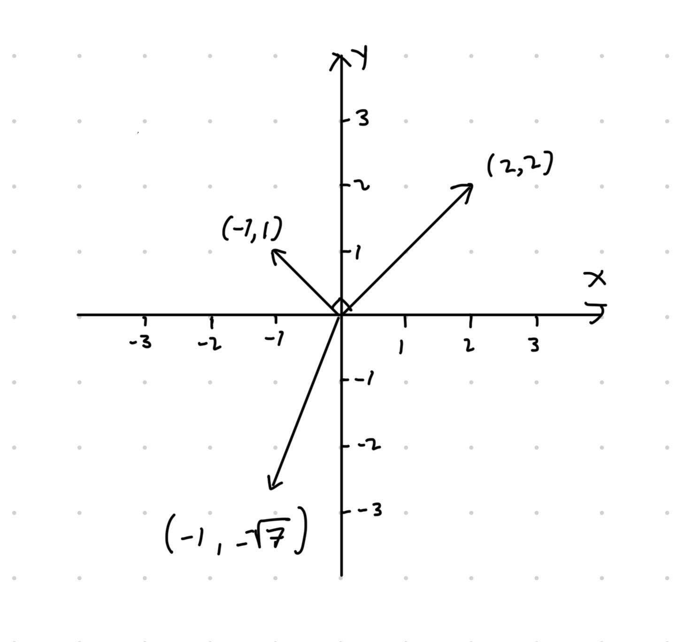

# Liitteet

## Vektoreista {#sec:vector}

Vektori ($d$-ulotteinen) on **järjestetty** lista lukuja $(x_1, x_2, \ldots, x_d)$, $x_i\in\mathbb{R}$. Eli vektori voidaan tulkita avaruuden $\mathbb{R}^d$ alkiona. Esimerkiksi $2$-ulotteiset vektorit voidaan piirtää pisteinä tai paikkavektoreina (nuoli lähtien nollasta päättyen vektorin määräämiin koordinaatteihin) tasossa $\mathbb{R}^2$ kuten kuvassa \@ref(fig:vec). Samoin $d$-ulotteiset vektorit voidaan tulkita pisteinä avaruudessa $\mathbb{R}^d$ mutta visualisointi muuttuu mahdottomaksi kun $d > 3$. Korostamme vielä, että vektorien alkioiden järjestyksellä on väliä eli esimerkiksi $(1, 2) \neq (2, 1)$.

::: {.remark name="Vektorinotaatioista"}

- Joskus vektorit erotetaan luvuista lihavoimalla vektorit. Tässä monisteessa käytämme kyseistä periaatetta eli $\boldsymbol x$ tulkitaan vektorina ja $x$ lukuna.

- Usein oletuksena vektorit tulkitaan pystyvektoreina. Sillä onko $\boldsymbol x$ pysty- vai vaakavektori on merkitystä vektoreiden välisissä laskutoimituksissa. Muista, että notaatio $\boldsymbol x^T$ tarkoittaa transpoosia, joka muuttaa vaakavektorin pystyvektoriksi ja toisinpäin. Eli esimerkiksi $(1, 4, 2.4)^T$ on $3$-ulotteinen pystyvektori
\begin{equation*}
\begin{pmatrix}
  1 \\ 4 \\ 2.4
\end{pmatrix},
\end{equation*}
joten monisteessa merkitsemme pystyvektoreita esimerkiksi notaatiolla $\boldsymbol y = (4, 1, 8, 2)^T$.
:::

Vektorin $\boldsymbol x = (x_1, x_2, \cdots, x_d)\in\mathbb{R}^d$ suuruutta tai pituutta voidaan mitata sen normin $\|\boldsymbol x\|$ avulla,
\begin{equation}
  \|\boldsymbol x\| = \sqrt{\sum_{i = 1}^d x_i^2}.
  (\#eq:euclidean)
\end{equation}
Yllä olevassa yhtälössä esitetty normi on nimeltään Euklidinen normi (eng: *Euclidean norm*), joka on yksi yleisimmistä normeista. Muitakin normeja on kuitenkin olemassa:

- $\|\boldsymbol x\|_1 = \sum_{i=1}^d |x_i|$
  -  Kyseiselle normille on useita nimityksiä kuten taksikuskin normi (eng: *taxicab norm*) ja Manhattanin normi (eng: *Manhattan norm*).

- Olkoon $A\in\mathbb{R}^{d\times d}$ positiivisesti definiitti matriisi. Tällöin matriisia vastaavan käänteismatriisin $\boldsymbol A^{-1}$ avulla voidaan määritellä normi $\|\boldsymbol x\|_{\boldsymbol A} = \sqrt{\boldsymbol x^T \boldsymbol A^{-1} \boldsymbol x}$.
  - Tätä jo hieman monimutkaisempaa normia käytetään esimerkiksi moniulotteisen normaalijakauman tiheysfunktion määritelmässä. Tällä kurssilla ei tarvitse tietää, mitä "positiivisesti definiitti" tarkoittaa. On kuitenkin hyvä huomata, että normin määritelmässä käytetty matriisi $\boldsymbol A$ ei voi olla aivan mikä tahansa matriisi. Kuitenkin esimerkiksi luvussa \@ref(sec:statistic) määritellyt kovarianssimatriisit ovat aina positiivisesti definiittejä. Kyseisen normin avulla laskettua vektoreiden $\boldsymbol x$ ja $\boldsymbol y$ välistä etäisyyttä $\|\boldsymbol x - \boldsymbol y\|_{\boldsymbol A}$ tilastotietelijät  kutsuvat usein Mahalanobisin etäisyydeksi (eng: *Mahalanobis distance*). Etäisyys on siis nimetty kuuluisan intialaisen tilastotieteilijän Prasanta Chandra Mahalanobisin mukaan.

Normin valinta riippuu kontekstista eikä tuttu Euklidinen normi ole välttämättä paras valinta kaikissa tilanteissa. Painotetaan myös vielä, että normin ($\|\boldsymbol x - \boldsymbol y\|$, $\|\boldsymbol x - \boldsymbol y\|_1$ tai $\|\boldsymbol x - \boldsymbol y\|_{\boldsymbol A}$) avulla voidaan mitata kahden vektorin $\boldsymbol x$ ja $\boldsymbol y$ välistä etäisyyttä. Etäisyys tulkitaan hieman eri tavalla riippuen valitusta normista.

Suuruuden lisäksi vektorilla on suunta. Työkalu vektorin suunnan määrittämiseen on pistetulo. Jos vektorin suuruutta mitataan Euklidisella normilla, niin kahden vektorin $\boldsymbol x\in\mathbb{R}^d$ ja $\boldsymbol y\in\mathbb{R}^d$ välinen pistetulo määritellään seuraavasti,
\begin{equation*}
  \langle \boldsymbol x, \boldsymbol y\rangle = \sum_{i = 1}^d x_i y_i.
\end{equation*}
Erityisesti kaksi vektoria $\boldsymbol x$ ja $\boldsymbol y$ ovat suorassa kulmassa toisiinsa nähden jos ja vain jos $\langle \boldsymbol x, \boldsymbol y\rangle = 0$.

::: {.example name="Vektorin suuruus ja suunta"}
- Kuvan \@ref(fig:vec) vektoreilla $(2,2)^T$ ja $(-1, \sqrt{7})^T$ on sama normi.

- Kuvan \@ref(fig:vec) vektoreiden $(2, 2)^T$ ja $(-1, 1)^T$ välinen pistetulo on nolla.
:::

(ref:vec-cap) Vektoreita karteesisessa koordinaatistossa.

```{r vec, echo=FALSE, fig.cap="(ref:vec-cap)"}

```


## Matriiseista {#sec:matrix}

